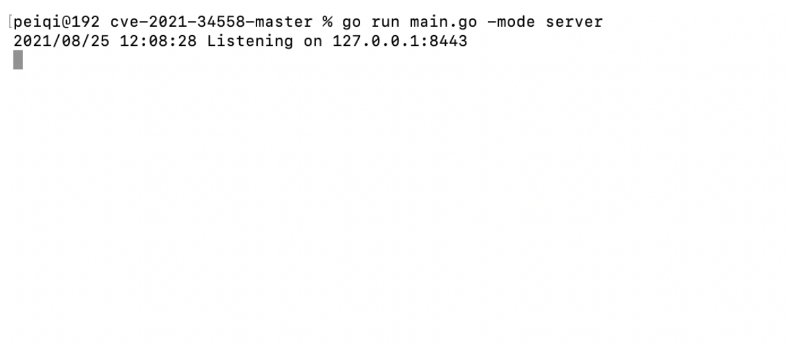
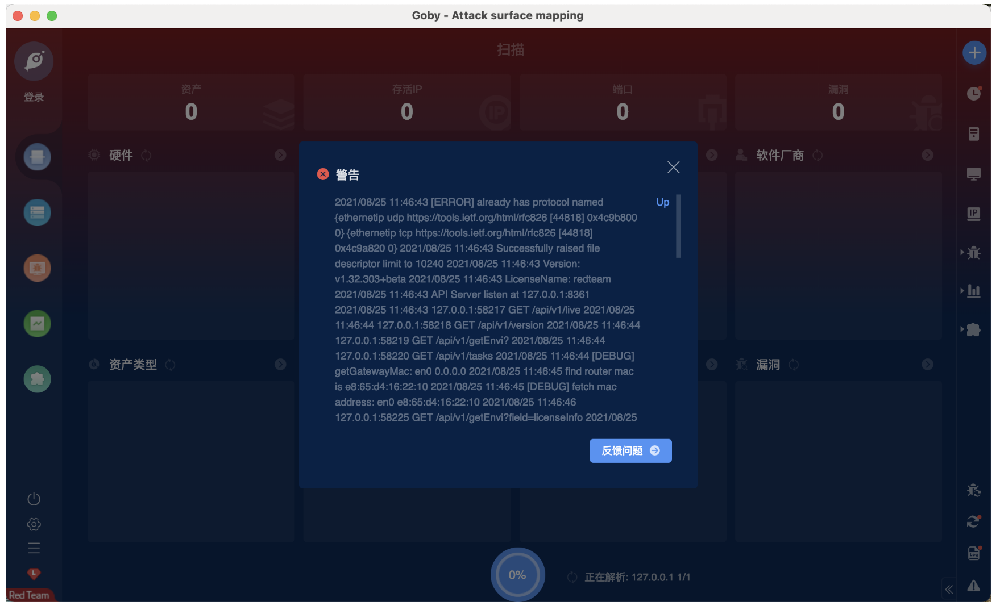

# GO TLS握手 崩溃漏洞 CVE-2021-34558

## 漏洞描述

There is a minor modification to ./vendor/github.com/refraction-networking/utls/handshake_server.go to enable the malicious handshake to be sent with a mismatching certificate/cipher.

## 漏洞影响

```
Go Version < (1.16.6+)
```

## 漏洞复现



将会生成 https 服务，此时当版本较低时就会产生崩溃，例如部分扫描器对目标进行扫描时

