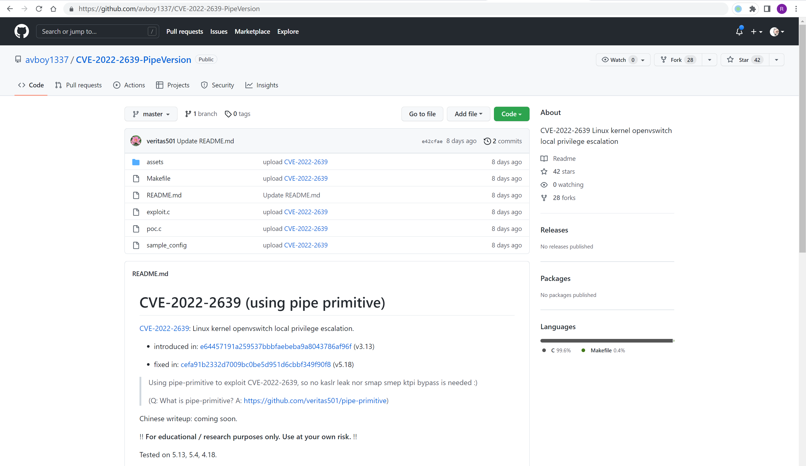

# Linux openvswitch 权限提升漏洞 CVE-2022-2639

## 漏洞描述

由于 openvswitch 模块在处理大量actions的情况下，可能存在越界写入漏洞，本地经过身份认证的攻击者可利用此漏洞获取root权限

## 漏洞影响

```
3.13 ≤ Linux Kernel < 5.18
```

## 漏洞复现

编译POC并运行获取Root权限


## 漏洞POC

https://github.com/avboy1337/CVE-2022-2639-PipeVersion


