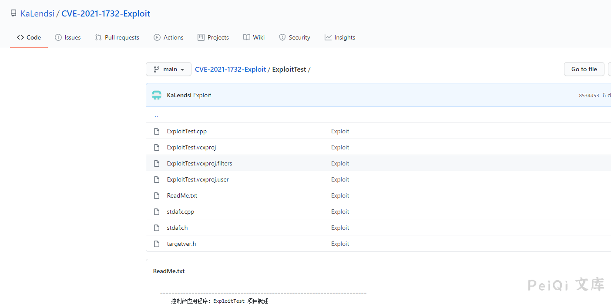

# Windows Win32k 本地提权漏洞 CVE-2021-1732

## 漏洞描述

2021年2月10日，微软每月的例行补丁包中修复了一个Windows系统本地提权漏洞，本地攻击者可以利用此漏洞提升到system权限，据称此漏洞被用于定向攻击活动。

奇安信息威胁情报中心红雨滴团队第一时间跟进该漏洞并确认其可用性，漏洞相应的利用程序已经公开，有可能被改造来执行大范围的攻击，已经构成现实的威胁。目前微软已经修补了此漏洞，奇安信息威胁情报中心提醒相关用户及时安装2月补丁。

## 漏洞影响

```
Windows Server, version 20H2 (Server Core Installation) 
Windows 10 Version 20H2 for ARM64-based Systems 
Windows 10 Version 20H2 for 32-bit Systems 
Windows 10 Version 20H2 for x64-based Systems 
Windows Server, version 2004 (Server Core installation) 
Windows 10 Version 2004 for x64-based Systems 
Windows 10 Version 2004 for ARM64-based Systems 
Windows 10 Version 2004 for 32-bit Systems 
Windows Server, version 1909 (Server Core installation) 
Windows 10 Version 1909 for ARM64-based Systems 
Windows 10 Version 1909 for x64-based Systems 
Windows 10 Version 1909 for 32-bit Systems 
Windows Server 2019 (Server Core installation) 
Windows Server 2019 
Windows 10 Version 1809 for ARM64-based Systems 
Windows 10 Version 1809 for x64-based Systems 
Windows 10 Version 1809 for 32-bit Systems 
Windows 10 Version 1803 for ARM64-based Systems 
Windows 10 Version 1803 for x64-based Systems
```

## 漏洞复现

这里使用腾讯云的Windows 2019 Server 搭建环境


目前EXP已经公开了

**Github公开地址:**[**https://github.com/KaLendsi/CVE-2021-1732-Exploit**](https://github.com/KaLendsi/CVE-2021-1732-Exploit)

**厉害的师傅可以做一下免杀，现在一上传就会被杀了**



上传到服务器运行, 此时是以**System权限**运行

注意有蓝屏概率

```
CVE-2021-1723 whoami
```

